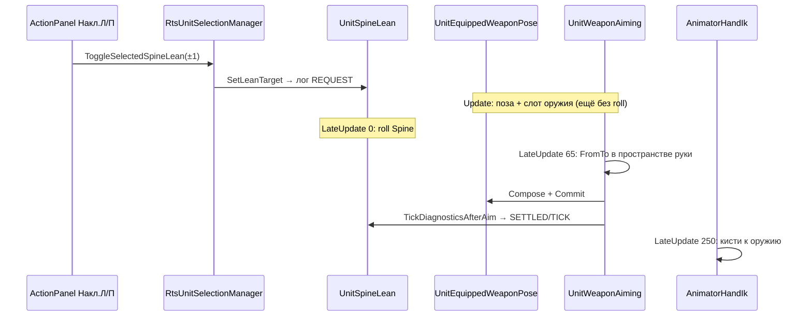

# Система наклона корпуса (Spine Lean / Peek)

Документ для диагностики **в другой среде / другим человеком**: как устроен peek влево/вправо, какие скрипты за что отвечают, в каком порядке они крутятся, как читать `[SpineLean]` логи, какие баги уже ловили и какие ложные срабатывания не чинить.

Связанные документы:

- [WeaponHoldAimingSystem.md](WeaponHoldAimingSystem.md) — поза, AimPitch, fire gate, отдача, WeaponSpin.

Дата снимка: **2026-08-16**. Если код разъехался — сверять execution order и методы по файлам ниже, не по памяти.

**Тексты скриптов — не в начале этого файла.** Открой отдельно:

- [`SpineLeanSystem_Scripts.md`](SpineLeanSystem_Scripts.md) — все исходники целиком (UnitSpineLean, калибровка, UnitWeaponAiming, UI, поза)
- или прокрути этот файл до [§15](#15-полные-исходники-снимок-2026-08-15) (~строка 627)
- или `Assets/_Docs/SpineLean/SourceSnapshot/*.cs.txt`

---

## 0. Что это за система (одна фраза)

Юнит **не сдвигается корнем** и **не шагает в сторону**. Peek — это **roll двух костей позвоночника** (`Spine_01` / `Spine_02`) вокруг горизонтального forward юнита, из‑за чего плечи, руки, IK и ствол уезжают влево/вправо. Боевой AI пока **не вызывает** наклон: вход только debug-кнопками нижней панели (и выключенным автотестом по L).

Наклон корпуса и доворот ствола на цель — **две разные подсистемы**. Если корпус наклонён, а `ствол→цель` красный — сначала смотреть aiming, не `MaxLeanDegrees`.

---

## 1. Карта файлов

| Роль | Файл | Что делает |
|------|------|------------|
| Ядро наклона | `Assets/_Scripts/Unit/UnitSpineLean.cs` | Цель −1…+1, SmoothDamp, roll костей, блоки, логи `[SpineLean]` |
| Доворот ствола при lean | `Assets/_Scripts/Inventory/UnitWeaponAiming.cs` | После lean: FromTo ствол→цель в пространстве руки |
| Слот позы оружия | `Assets/_Scripts/Inventory/UnitEquippedWeaponPose.cs` | Authored local TRS + `ComposeAimLocalRotation` |
| Commit слота в Update | `Assets/_Scripts/Inventory/WeaponPose/UnitEquippedWeaponPoseCommit.cs` | Пишет weapon TRS после aim Update (order 68) |
| Руки IK | `Assets/_Scripts/Inventory/AnimatorHandIk.cs` | LateUpdate 250 — **после** lean и lean-aim |
| Выбор юнита | `Assets/_Scripts/Unit/RtsUnitSelectionManager.cs` | `ToggleSelectedSpineLean`, `GetPrimarySelectedSpineLean` |
| Нижняя панель | `Assets/_Scripts/UI/ActionPanelController.cs` | Кнопки **Накл.Л** / **Накл.П** (индексы 28 / 29) |
| Автокалибровка (выкл.) | `Assets/_Scripts/Unit/UnitSpineLeanCalibrationTest.cs` | Клавиша L, логи `[SpineLeanCalib]` |
| Префаб | `Assets/Prefabs/Unit.prefab` (или актуальный Unit) | `UnitSpineLean` включён (`m_Enabled: 1`) |
| Снимок исходников | `Assets/_Docs/SpineLean/SourceSnapshot/` | `.cs.txt` — полный текст на дату документа |

Других gameplay-вызовов `SetLeanTarget` **нет**. #13.7 tactical peek вызывает **`SetLeanLevel`** через `UnitSpineLeanExecutor` (не второй LeanController). Debug-кнопки панели по-прежнему живы.

Тексты скриптов целиком: **§15** (`UnitSpineLean`, калибровка, commit позы, lean-ветка и полный `UnitWeaponAiming`, UI, selection).

---

## 2. Компоненты на юните (ожидаемый набор)

На корне юнита (тот же GO, что `RtsUnitMember` / `UnitEquipment`):

- `UnitSpineLean` — **включён**
- `UnitWeaponAiming` (order 65)
- `UnitEquippedWeaponPose` (order 64)
- `UnitEquippedWeaponPoseCommit` (order 68)
- `AnimatorHandIk` (order 250)
- `UnitAnimatorStance`, `UnitBusyState`, `TargetSelector`, `UnitEquipment`
- опционально `UnitSpineLeanCalibrationTest` с `m_EnableKeyboardStart = false`

Кости:

- `m_Spine01` ← `Animator.GetBoneTransform(HumanBodyBones.Spine)` или поиск `Spine_01`
- `m_Spine02` ← `HumanBodyBones.Chest` или `Spine_02`

Если кости не резолвятся — lean **всегда blocked**, в логе `blocked=True`, наклон визуально ноль.

Ствол для логов и aim:

```
EquippedWeapon.BarrelTransform
  ?? FireOriginTransform
  ?? UnitEquipment.MainWeaponRoot
```

Оружие parented к кисти. **Local rotation оружия** принадлежит позе/aiming, не аниматору. Аниматор крутит руку (parent). Lean крутит spine → рука едет в мире → ствол едет, local оружия сам по себе не меняется, пока aiming его не довернёт.

---

## 3. Порядок кадра (критично для диагностики)

`[DefaultExecutionOrder]`:

| Order | Компонент | Когда | Что пишет |
|------:|-----------|-------|-----------|
| 64 | `UnitEquippedWeaponPose.Update` | Update | Сбрасывает compose-слоты, считает authored base |
| 65 | `UnitWeaponAiming.Update` | Update | Обычный aim **или** при lean+цели кладёт в слот `m_LastLeanAimLocal` / base |
| 68 | `UnitEquippedWeaponPoseCommit.Update` | Update | `weaponRoot.localRotation = composed \|\| base` |
| *(Animator)* | Mecanim | между Update и LateUpdate | Кости тела/рук. **Не** local оружия |
| **0** | `UnitSpineLean.LateUpdate` | LateUpdate | **Roll Spine_01/02 поверх аниматора** |
| **65** | `UnitWeaponAiming.LateUpdate` | LateUpdate | **Только если** `ShouldApplyLeanTargetAim()`: FromTo ствол→цель, commit, лог SETTLED/TICK |
| 250 | `AnimatorHandIk` | LateUpdate | IK кистей к грипам оружия |

Следствия:

1. Aim в Update **не видит** lean этого кадра. Если целиться до lean — ошибка ~8° и больше.
2. Логи `[SpineLean] SETTLED/TICK` при выбранной цели пишутся **из aiming LateUpdate**, уже после FromTo. Без цели — из `UnitSpineLean.LateUpdate` (ствол ещё без lean-aim, это нормально: lean-aim без цели не работает).
3. `REQUEST` пишется сразу в `SetLeanTarget` (клик UI, Update) — **до** SmoothDamp и до lean этого кадра. В REQUEST почти всегда `leanDeg=0` или старый угол, `lateralDelta=0`, `ожидаем settle`. Это не баг.



---

## 4. `UnitSpineLean` — устройство ядра

### 4.1. Публичный API

| Член | Смысл |
|------|--------|
| `SetLeanTarget(float lean01)` | −1 влево, 0 нейтраль, +1 вправо. Clamp. Если значение не изменилось — **тишина** (нет REQUEST). |
| `CurrentLean01` | **Запрошенная** цель, не сглаженная. Aiming смотрит на это для skip body-align. |
| `CurrentLeanDegrees` | Сглаженный угол, **+ вправо**, уже с `m_RightLeanScale`. |
| `CurrentLateralMeters` | Сглаженный world-сдвиг костей. При дефолте профилей **всегда 0**. |
| `IsLeanSettled` | `|smoothed − target| ≤ 1 − SettleTargetRatio` (дефолт 0.08) и `\|velocity\| < 0.5`. Если blocked при ненулевой цели — **не settled**. |
| `IsLeanBlockedNow` | Сейчас нельзя держать наклон (см. §4.5). |
| `IsIdlePeekProfile` | StandingIdle или CrouchIdle (предпочтение для будущего AI). |
| `ActiveProfileKind` | Какой профиль сейчас. |
| `GetProfile(kind)` | Копия serialized-профиля. |
| `TickDiagnosticsAfterAim()` | Публичная обёртка: лог после lean-aim. Зовёт только `UnitWeaponAiming.LateUpdate`. |

Семантика знака:

- `target01 < 0` → Left
- `target01 > 0` → Right
- около 0 → Off

Визуально **+lean = торс к +right юнита**. Реализация: `Quaternion.AngleAxis(−totalRoll * weight, forwardXZ) * bone.rotation` (минус, чтобы roll совпал с «вправо»).

### 4.2. Сглаживание

`Update` → `EvaluateLean()`:

```
target01 = blocked ? 0 : m_LeanTarget01
smoothed01 = SmoothDamp(smoothed01, target01, vel, profile.SmoothTime)
```

При блоке цель сглаживания = 0: юнит **выпрямляется**, запрошенный `CurrentLean01` при этом остаётся ±1. В логе будет `target01=-1` и `blocked=True`, `leanDeg` падает к 0.

Правая сторона: `GetScaledLean01` умножает **положительный** smoothed на `m_RightLeanScale` (дефолт **1.18**). Поэтому standing right в логе `leanDeg=49.6/49.6` при профиле 42°: `42 × 1.18 ≈ 49.6`. Левая сторона без множителя: `42/42`.

### 4.3. Профили (дефолты кода)

`MaxLateralMeters = 0` **намеренно**. World-сдвиг `Spine.position` ломает hand IK и отрывает грипы. Peek только roll. Боковой уход ствола — побочный эффект геометрии скелета, его меряют логи, а не этот параметр.

| Профиль | MaxLeanDegrees | MaxLateralMeters | Spine01Weight | SmoothTime |
|---------|---------------:|-----------------:|--------------:|-----------:|
| StandingIdle | 42 | 0 | 0.25 | 0.13 |
| StandingWalk | 36 | 0 | 0.30 | 0.15 |
| CrouchIdle | 38 | 0 | 0.25 | 0.14 |
| CrouchWalk | 30 | 0 | 0.30 | 0.16 |

Выбор: crouch? (`UnitAnimatorStance.CurrentStance == Crouch`) × moving? (`HasMoveIntent` или горизонтальная скорость NavMeshAgent > `m_MoveSpeedEpsilon` 0.08).

Walk-профиль слабее idle — так задумано.

**Не крутить MaxLeanDegrees «чтобы ствол лучше целился»**. Углов 38–50° уже хватает для порога смещения ствола. Если `OK в сторону` и `WEAK ствол→цель` — чинить aiming.

### 4.4. Применение костей (`ApplySpineLean`)

Только в `LateUpdate`, **после** Animator:

1. `forwardXZ` / `rightXZ` от корня юнита (Y=0).
2. `totalRoll = scaled01 * MaxLeanDegrees`
3. `w1 = Spine01Weight`, остаток на Spine_02
4. `Spine_01.rotation = AngleAxis(−totalRoll * w1, forwardXZ) * current`
5. то же для Spine_02 с `(1 − w1)`
6. если `MaxLateralMeters > 0`: `position += rightXZ * lateral` (сейчас выкл.)

Это **аддитивный** world-roll поверх позы аниматора. Не local Euler кости. Не Animation Rigging. Не root motion.

Если `|scaled01| < 0.0001` — выход без записи (нейтраль = чистый аниматор).

### 4.5. Блоки (`IsLeanBlocked`) — наклон принудительно к 0

Любое true → `target01` сглаживания = 0:

| Условие | Зачем |
|---------|--------|
| Кости не найдены | Нечем крутить |
| Ragdoll `ShouldBlockWeaponPoseScripts` | Труп |
| `VehiclePassengerState.IsVehicleReady` | В машине |
| Drag раненого / fireman carry | Другая анимация торса |
| Граната: aiming или throw clip | Руки/торс заняты |
| `BusyReason.StanceTransition` (если `m_BlockDuringStanceTransition`) | Присед/вставание. **Ожидаемый** кадр `BLOCKED` |
| `LocomotionStance.Prone` | Лёжа peek нет |
| Run / Sprint (`IsRunMoveMode` / `IsSprintMoveMode`) | Не peek на бегу |

Walk (не run) **не** блок — слабее профиль.

### 4.6. Baseline ствола (для логов, не для физики)

При `SetLeanTarget` на ненулевую цель: `TryCaptureBarrelBaseline()` запоминает:

- `barrelLocalX` — проекция `(barrel.pos − unit.pos)` на `unit.right` (XZ)
- `barrelYaw` — SignedAngle(unit.forward XZ, barrel.forward XZ, up)
- `barrelPitch` — `asin(barrel.forward.y)` в градусах

При цели 0 baseline сбрасывается.

**Важно:** baseline снимается в момент клика (ещё **до** settle и часто до lean-aim). `yawDrift` / `pitchDrift` = насколько ствол уехал от **того кадра**, не от «идеальной ready-позы». Если в REQUEST уже `barrelPitch=33°` (AimPitch аниматора), drift на SETTLED будет огромный даже при хорошем `ствол→цель`. Смотреть drift как «ствол сломался» можно только вместе с `ствол→цель`.

Пороги drift (логи, не clamp aiming):

- yaw ≤ **18°**
- pitch ≤ **15°**

Пороги бокового смещения ствола (не кости):

| Профиль | need lateral |
|---------|-------------:|
| StandingIdle | 0.16 m |
| CrouchIdle | 0.10 m |
| Walk | 0.07 m |

Считается `alongLean = (currentLocalX − baselineLocalX) * sign(target01)`. Нужен **положительный** alongLean (ствол ушёл в ту же сторону, что lean).

---

## 5. Вход от игрока / debug

### 5.1. Нижняя панель

`ActionPanelController`:

- индекс 28 `Накл.Л` → `OnClickDebugLeanLeft` → `ToggleSelectedSpineLean(-1)`
- индекс 29 `Накл.П` → `ToggleSelectedSpineLean(+1)`
- подпись `Накл.Л ON` / `Накл.П ON` если `|CurrentLean01|` у **primary** выбранного > 0.05

Это **debug**, не боевая команда. Повтор той же стороны = выкл (0).

### 5.2. `RtsUnitSelectionManager.ToggleSelectedSpineLean`

1. Если у primary уже та же сторона — `wanted = 0` (toggle off).
2. Нет выбранных → warning `[SpineLean] нет выбранного юнита.`
3. По **всем** выбранным: нет компонента → warning; `enabled==false` → включает и warning; затем `SetLeanTarget(wanted)`.

**Ловушка:** два выбранных юнита = две пачки логов с одним `unit=Unit(Clone)`. Для диагностики всегда **один** юнит.

### 5.3. Калибровка L

`UnitSpineLeanCalibrationTest.m_EnableKeyboardStart = false` после калибровки. Не путать с боевым lean. Префикс логов `[SpineLeanCalib]`. Гоняет Standing/Crouch × idle/walk × Left/Right, меряет barrel local-X vs порог. Walk soft: WEAK допустим.

---

## 6. Связь с прицеливанием (`UnitWeaponAiming`)

### 6.1. Зачем отдельный путь

Обычный aim:

- Animator `AimPitch` + слой `Aim_Point_U90-D90`
- `UnitSpineHorizontalAim` (yaw торса)
- `ApplyWeaponModelAimCorrection` — **world yaw/pitch** относительно up, лимиты ~yaw 5°, pitch up 18°, **pitch down 10°**

После spine **roll** мировые оси yaw/pitch больше не совпадают с «горизонт/вертикаль винтовки». Коррекция пытается **снять кант** (выпрямить ружьё против наклона) → pitch улетает на **~40°**, ошибка **45°**, осцилляция 1° ↔ 45°.

Поэтому при активном lean + цели используется **другой** метод: `ApplyLeanParentSpaceFromToCorrection`.

### 6.2. Когда aiming считает, что lean активен

`IsSpineLeanActiveForBodyAlignSkip()`:

```
|CurrentLean01| >= m_SkipBodyAlignWhenLeanAbove (0.05)
|| |CurrentLeanDegrees| >= 1
```

Эффект:

- **не** крутить body-align ствола к корпусу (иначе peek съедается)
- при цели — ветка lean-aim вместо обычного local yaw/pitch

Без цели: оружие = authored слот позы. В логе `цель нет`, yaw/pitch drift около 0 — **норма**.

### 6.3. `ShouldApplyLeanTargetAim()` — LateUpdate-aim вообще не стартует, если false

Все должны быть true / не сработать ранний return:

| Проверка | Если ломается |
|----------|----------------|
| `m_EnableWeaponModelAimCorrection` | Нет коррекции модели вообще |
| `IsSpineLeanActiveForBodyAlignSkip` | Цель 0 или компонент выкл |
| Есть `SelectedTarget` и `m_AimAtVisibleTarget` | Без цели lean-aim не нужен |
| Не ragdoll | — |
| Не stance transition / не reload busy | На приседе кадр без lean-aim |
| Не settle после reload | — |
| `GetHipFirePoseWeight() < 0.999` | **Полный HipFire → lean-aim выкл** |
| `GetShoulderedAimingPoseWeight() < 0.999` | **Полный Aiming (плечо) → lean-aim выкл** |
| Не locomotion moving | На шаге lean-aim выкл |

Практический вывод для тестов: надёжный режим — **High ready / Pre-aim / Point aim**, цель выбрана, юнит стоит. В чистом **Aiming** или **HipFire** LateUpdate-ветка может **не работать**, тогда SETTLED/TICK с целью тоже не придут из aiming (lean сам логи откладывает, пока есть цель). Если логов нет при цели — проверить позу, не только lean.

`ShouldHoldWeaponModelAim(hand)` внутри lean-FromTo: если рука дернулась ≥ 2.5° или идёт/только что была стрельба — **замораживает** прошлый `m_LastLeanAimLocal` и **не** пересчитывает FromTo. На время hold ошибка `ствол→цель` может временно вырасти.

### 6.4. Что делает Update при lean+цели

Не считает world yaw/pitch. Кладёт в слот:

- если уже был успешный lean-aim кадр → `m_LastLeanAimLocal`
- иначе authored `BaseWeaponLocalRotation`

Чтобы commit 68 **не затирал** доворот каждый кадр в base (это оставляло вечные 10°).

### 6.5. Что делает LateUpdate (после roll)

`ApplyLeanParentSpaceFromToCorrection`:

1. Смена знака lean (−1/0/+1) сбрасывает сглаженные yaw/pitch обычного aim (чтобы не тащить старый offset).
2. Направления ствола и цели → **в пространство parent руки** (`InverseTransformDirection`).
3. `Quaternion.FromToRotation(barrelParent, desiredParent)` — минимальный поворот, **без twist вокруг ствола**, кант от lean на parent сохраняется.
4. Угол клампится `m_LeanAimYawLimitDegrees` (**36°** в коде; это 3D-угол FromTo, не только yaw).
5. `finalLocal = remainingQ * currentLocal` (доворот **текущего** local, не `fix * base`).
6. Мёртвая зона 0.12° — не трогать.
7. Compose + `CommitWeaponTransformForFrame` сразу в LateUpdate (не ждать следующий Update/68).
8. `TickDiagnosticsAfterAim()`.

Поля, которые **больше не являются** лимитами этого пути (остались serialized с прошлой итерации): `m_LeanAimPitchUpLimitDegrees`, `m_LeanAimPitchDownLimitDegrees`, `m_LeanAimCorrectionSmoothTime`. Актуальный стоп — `m_LeanAimYawLimitDegrees = 36`.

### 6.6. Цепочка compose

`ComposeAimLocalRotation` **только запоминает** quaternion в `UnitEquippedWeaponPose`. На трансформ пишет `CommitFinalWeaponTransform`:

```
localRotation = hasComposedAim ? composed : base
```

Update-64 в начале кадра делает `ClearCompositionOverrides()`. Поэтому LateUpdate **обязан** commit'ить сам, иначе до IK уйдёт base.

---

## 7. Формат лога `[SpineLean]` — поле за полем

Одна строка, префикс `[SpineLean]`. Теги:

| Тег | Когда | Что уже произошло |
|-----|--------|-------------------|
| `REQUEST` | `SetLeanTarget` изменил цель | Lean этого кадра ещё нет. Baseline только что снят (если не Off). |
| `SETTLED` | Первый кадр `IsLeanSettled` для этой цели | С целью: **после** lean-aim. Один раз на цель, пока не новый REQUEST. |
| `TICK` | Периодически (`m_LogIntervalSeconds` = 0.45) | С целью: тоже после aim. |

Фильтр Console: `SpineLean`.

### 7.1. Поля

| Поле | Пример | Как читать |
|------|--------|------------|
| `unit` | `Unit(Clone)` | Имя GO. Клоны неразличимы — не выделять двоих. |
| `side` | `Left` / `Right` / `Off` | По `target01`, не по smoothed. |
| `target01` | `-1.00` | Запрос. |
| `smoothed01` | `-0.96` | SmoothDamp без RightLeanScale. |
| `leanDeg` | `-40.4/42.0` | Факт / максимум этой стороны (справа max уже ×1.18). |
| `(вердикт наклона)` | см. §7.2 | |
| `profile` | `StandingIdle` | Активный профиль. |
| `blocked` | `False` | `IsLeanBlocked`. |
| `settled` | `True` | `IsLeanSettled`. |
| `barrelLocalX` | `-0.107m` | Проекция ствола на right юнита. |
| `lateralDelta` | `-0.254m` | vs baseline. На REQUEST всегда 0. |
| `(вердикт стороны)` | см. §7.2 | |
| `barrelYaw` / `barrelPitch` | углы ствола vs корпус / горизонт | Мировые, не local оружия. |
| `(вердикт направления)` | drift vs baseline | |
| `(вердикт цели)` | `ствол→цель` или `цель нет` | **Главный** критерий aim. |
| `bodyAlignSkip` | `yes`/`no` | `|target01|≥0.05`. Должен быть yes во время peek. |
| `lateralMetersProfile` | `0.000` | Параметр профиля, не факт смещения ствола. 0 = норма. |

Scene view на 0.2 с: жёлтый луч ствола 2.5 м, голубая ось «в сторону lean» от груди.

### 7.2. Словарь вердиктов

**Наклон (`leanDeg=… (…)`):**

| Текст | Смысл | Действие |
|-------|--------|----------|
| `запрошен` | Только REQUEST | Ждать SETTLED |
| `OK наклон` | `\|leanDeg\|/max ≥ 0.92` | Корпус дошёл |
| `WEAK — ещё не дошёл до цели` | Ещё SmoothDamp / сменился профиль | Подождать; на TICK после settle не должен висеть |
| `BLOCKED` / `BLOCKED — наклон сброшен` | §4.5 | На StanceTransition — ждать конец приседа |

**Сторона (`lateralDelta`):**

| Текст | Смысл | Действие |
|-------|--------|----------|
| `ожидаем settle` | REQUEST | Игнор |
| `нейтраль` | Off | Игнор |
| `OK в сторону X m >= порог` | Ствол ушёл куда надо | Наклона хватает, **не** крутить угол |
| `WEAK мало в сторону` | Roll слабый для порога | Тогда уже MaxLeanDegrees / скелет / не та стойка |
| `FAIL ствол не ушёл в сторону lean` | Ушёл в другую сторону или 0 | Знак roll, кости, IK, не тот barrel |
| `FAIL нет ствола` | Нет EquippedWeapon / barrel | Снаряжение |

**Направление ствола (drift от baseline клика):**

| Текст | Смысл | Действие |
|-------|--------|----------|
| `OK направление yawDrift pitchDrift` | В пределах 18° / 15° | Норма или drift мал |
| `WEAK ствол уехал yawDrift=…/18° pitchDrift=…/15°` | Ствол сильно изменился с момента клика | Смотреть **вместе** с `ствол→цель`. Если цель OK — часто ложный (baseline с AimPitch 30°+). Если цель WEAK и pitch~40 — регресс world yaw/pitch |

**Цель:**

| Текст | Смысл | Действие |
|-------|--------|----------|
| `цель нет` | TargetSelector пуст | Ожидаемо; lean-aim не работает |
| `OK ствол→цель N°` | `N ≤ 8` | Aim догнал lean |
| `WEAK ствол→цель N° > 8° — aiming не догоняет lean` | После (или без) lean-aim угол большой | Чинить `UnitWeaponAiming`, order, позу, лимит 36°, hold |

Порог 8° — **только лог**. Выстрел живёт своим допуском (~3° стоя) в `UnitWeaponFireController.IsAimedEnoughToFire`. Можно иметь OK в SpineLean (7°) и всё равно `NotAimed` для огня.

---

## 8. Как гонять тест в другой среде

1. Play, выбрать **одного** юнита.
2. Оружие в руках, high ready (кнопка панели) или Point aim. Не HipFire / не полный Aiming, пока проверяешь lean-aim.
3. Выбрать видимую цель (чтобы в логе не было `цель нет`).
4. Console filter: `SpineLean`.
5. **Накл.Л**, дождаться SETTLED, два TICK. Потом **Накл.П**. Потом снова Л (toggle off через повтор или через другую сторону).
6. То же в приседе (после `BLOCKED` на StanceTransition подождать).
7. Повторить **без** цели — корпус должен наклоняться, `цель нет`, drift маленький.

Ожидание на SETTLED / TICK (idle, стоит, есть цель, поза не HipFire/не полный Aiming):

| Проверка | Ок | Плохо |
|----------|----|--------|
| Наклон | `OK наклон`, standing ~42° left / ~50° right, crouch ~38° / ~45° | WEAK после settle, 0°, blocked без причины |
| Смещение ствола | standing ≥ 0.16 m, crouch ≥ 0.10 m | FAIL / WEAK мало |
| `ствол→цель` | **1–4°** (допуск лога 8°) | > 8° стабильно; 40–45°; мигание 1↔45 |
| `bodyAlignSkip` | `yes` | `no` при `|target01|=1` |
| `lateralMetersProfile` | `0.000` | Не баг |

Без цели: наклон и сторона те же; aim-вердикт `цель нет`.

---

## 9. История проблем (с сигнатурами логов)

Писать в таком виде, чтобы в новой ветке узнать регресс за 10 секунд.

### 9.1. Lean был на префабе, но «не работал»

**Симптом:** юнит всегда прямой.  
**Причина:** `SetLeanTarget` никто не звал, кроме выключенного калибратора L.  
**Фикс:** кнопки Накл.Л / Накл.П + `ToggleSelectedSpineLean`.  
**Не чинить:** сам `UnitSpineLean.enabled`.

### 9.2. Наклона «мало» (ложное)

**Симптом:** визуально мало / хочется поднять угол.  
**Лог:** `OK в сторону 0.21–0.50m >= 0.16m`, `OK наклон`.  
**Решение:** **не** поднимать `MaxLeanDegrees`. World lateral костей = 0 специально (IK). Смещение ствола 20–50 см — это и есть peek.

### 9.3. Aim считался до lean (~8°)

**Симптом:** `WEAK ствол→цель ~8°` стабильно, наклон OK.  
**Причина:** `UnitWeaponAiming` в Update, lean в LateUpdate 0. Roll после aim съедает угол; pitch-down лимит 10° < ~13° опускания при left lean.  
**Фикс:** при lean+цели не aim'ить в Update; перенаводить в LateUpdate 65 после lean.  
**Сигнатура стека SETTLED:** `UnitWeaponAiming:LateUpdate` → `TickDiagnosticsAfterAim`. Если SETTLED идёт из `UnitSpineLean:LateUpdate` при живой цели — диагностика снова раньше aim.

### 9.4. Left lean: ствол на 40°, осцилляция 1° ↔ 45°

**Симптом (реальные логи):**

- Right SETTLED: `ствол→цель 3°` нормально.
- Left SETTLED сначала 0.8°, потом `barrelPitch≈40°`, `WEAK ствол→цель 45°`, кадр через кадр 1 и 45.

**Причина:** `ApplyWeaponModelAimCorrection` world yaw/pitch относительно Vector3.up пытается снять roll (кант).  
**Фикс:** FromTo **в пространстве руки** (`parent.InverseTransformDirection` + `FromToRotation`), не world-up.  
**Регресс:** если снова появился pitch ~40 и мигание — кто-то вернул world yaw/pitch на lean-ветку.

### 9.5. Первое стояние: вечные 10–13° после FromTo от base

**Симптом:**

```
REQUEST ... barrelPitch=33,2° ... WEAK ствол→цель 34,4°
SETTLED Left ... leanDeg=-40,4/42,0 (OK) ... lateralDelta=-0,254m (OK)
  barrelPitch=7,1° ... pitchDrift=-26,1°/15° ... WEAK ствол→цель 10,5°
SETTLED Right ... yawDrift=16,2° ... WEAK ствол→цель 13,5°
```

Присед и **повторное** стояние уже `OK ствол→цель 0–2.4°`.

**Причина (две сразу):**

1. FromTo меряли от **authored base**, клеили `fix * base`, лимит **22°**. Нужно было ~32° (в REQUEST ствол уже с AimPitch ~33°) → навсегда ~10°.
2. Update каждый кадр писал **base** в слот → LateUpdate начинал с нуля, экспоненциальный smooth не накапливался.

**Фикс:** мерить remaining от **текущего** ствола; `remainingQ * currentLocal`; Update сохраняет `m_LastLeanAimLocal`; лимит 36°.  
**Как отличить от 9.4:** нет pitch 40° и нет осцилляции 1↔45; ошибка **стабильные** 10–13° при OK наклоне.

`pitchDrift=-26°` в том логе — сравнение с REQUEST, где pitch был 33°, а стал 7°. Само по себе не доказывает сломанный aim; смотреть `ствол→цель`.

### 9.6. Два юнита в логе

**Симптом:** вперемешку StandingIdle и CrouchIdle, разные `barrelLocalX`, один `Unit(Clone)`.  
**Причина:** мультиселект.  
**Фикс:** не чинить код — выбрать одного.

### 9.7. StanceTransition BLOCKED

**Симптом:** при приседе на кадр `BLOCKED — наклон сброшен`, smoothed едет к 0, потом профиль `CrouchIdle` и снова settle.  
**Это штатно.** Не снимать блок без нужды — иначе roll на клипе смены стойки.

### 9.8. Hold FromTo при дёрге руки

В текущем коде, если `ShouldHoldWeaponModelAim` (стрельба или рука ≥2.5° за кадр), LateUpdate **повторяет старый** local и не закрывает новую ошибку. На агрессивном lean-roll за кадр это может дать краткий WEAK. Если WEAK висит **после** settle при стоячем idle без стрельбы — это уже не hold, а 9.3/9.4/9.5 или поза из §6.3.

---

## 10. Чеклист «куда смотреть», если принесли свежий лог

1. **Один** `unit`? Нет → переснять.
2. Есть `REQUEST`? Нет → UI/selection/`SetLeanTarget` не дошёл; warning в Console.
3. `blocked=True` без приседа/бега/машины/гранаты? → кости, ragdoll, busy flags.
4. После settle `OK наклон`? Нет → SmoothTime / профиль / RightLeanScale / блок.
5. `OK в сторону`? Нет при OK наклоне → не тот barrel, знак roll, IK утащил оружие.
6. `цель нет` при тесте aim? → сначала дать цель.
7. `ствол→цель` > 8°:
   - стек SETTLED из `UnitSpineLean.LateUpdate`, не из aiming → диагностика/aim снова до lean;
   - pitch ~40 + мигание → world yaw/pitch (§9.4);
   - стабильные 10–13° standing first lean → base+clamp 22 (§9.5);
   - нет SETTLED вообще при цели → `ShouldApplyLeanTargetAim` false (HipFire / Aiming / reload / move).
8. `bodyAlignSkip=no` при side=Left/Right → `CurrentLean01` сброшен или порог skip.
9. Не предлагать поднять `MaxLeanDegrees`, если сторона уже OK.

---

## 11. Методы по файлам (навигация)

### `UnitSpineLean`

| Метод | Когда | Суть |
|-------|--------|------|
| `SetLeanTarget` | UI / калибр / будущий AI | Цель, baseline, REQUEST |
| `EvaluateLean` | Update | SmoothDamp, debug-поля |
| `ApplySpineLean` | LateUpdate 0 | Roll (+ optional shift) |
| `IsLeanBlocked` | Evaluate + логи | Список блоков |
| `GetActiveProfile` | много где | Stance × move |
| `GetScaledLean01` | углы/сдвиг | Right × 1.18 |
| `TickLeanDiagnostics` | LateUpdate или после aim | SETTLED once + TICK throttle |
| `LogLeanSnapshot` | REQUEST/SETTLED/TICK | Сборка строки |
| `TrySampleBarrel` | логи / baseline | localX, yaw, pitch |
| `ShouldDeferDiagnosticsToAiming` | LateUpdate lean | true если есть SelectedTarget |

### `UnitWeaponAiming` (только lean)

| Метод | Суть |
|-------|------|
| `IsSpineLeanActiveForBodyAlignSkip` | Порог 0.05 / 1° |
| `ShouldApplyLeanTargetAim` | Разрешение LateUpdate-ветки |
| `ApplyLeanParentSpaceFromToCorrection` | FromTo в parent руки |
| `TryGetReadyBodyAlignContext` | Early-out если lean (не выпрямлять к корпусу) |
| `LateUpdate` | FromTo → commit → `TickDiagnosticsAfterAim` |

### `RtsUnitSelectionManager`

`GetPrimarySelectedSpineLean`, `ToggleSelectedSpineLean`.

### `ActionPanelController`

`c_LeanLeftButtonIndex=28`, `c_LeanRightButtonIndex=29`, `UpdateLeanButtonPresentation`, `OnClickDebugLeanLeft/Right`.

### `UnitEquippedWeaponPose`

`ComposeAimLocalRotation`, `ClearCompositionOverrides` (Update 64), `CommitFinalWeaponTransform` / `CommitWeaponTransformForFrame`.

---

## 12. Инспектор: что смотреть на `UnitSpineLean`

В Play:

- `m_DebugLeanTarget01` — запрос
- `m_DebugSmoothedLeanDegrees` — факт угла
- `m_DebugSmoothedLateralMeters` — будет 0 при текущих профилях
- `m_DebugActiveProfile`
- `m_DebugBlocked`
- `m_LogLeanDiagnostics` — выкл, если Console забит (TICK каждые 0.45 с на юнит)

На `UnitWeaponAiming`:

- `m_SpineLean` ссылка
- `m_SkipBodyAlignWhenLeanAbove` = 0.05
- `m_LeanAimYawLimitDegrees` = 36
- `m_EnableWeaponModelAimCorrection` должен быть true, иначе нет FromTo
- debug yaw/pitch error в инспекторе во время lean — remaining FromTo **до** записи; после commit смотреть лог `ствол→цель`

---

## 13. Чего система намеренно не делает

- Нет смещения **корня** / капсулы / NavMeshAgent в сторону укрытия.
- Нет IK-only peek без костей spine.
- Нет автоматического peek от AI и от укрытий.
- Нет lean в prone / run / sprint / технике.
- Нет доворота ствола к цели **без** SelectedTarget.
- `MaxLateralMeters` не должен стать «лёгким способом усилить peek» без переделки IK.

---

## 14. Минимальный контракт для будущего боевого AI

```
var lean = unit.GetComponent<UnitSpineLean>();
if (lean == null || lean.IsLeanBlockedNow) { /* другой план */ return; }
lean.SetLeanTarget(peekLeft ? -1f : 1f);
// ждать lean.IsLeanSettled
// стрельба: не полагаться на лог 8° — смотреть FireController.IsAimedEnoughToFire
lean.SetLeanTarget(0f);
```

Предпочтительные профили: idle (`IsIdlePeekProfile`). На шаге peek слабее и lean-aim может быть выключен (`IsLocomotionMovingNow`).

---

## 15. Полные исходники (снимок 2026-08-15)

Ниже — **verbatim** содержимое скриптов на дату документа. Отдельные копии без markdown: `Assets/_Docs/SpineLean/SourceSnapshot/*.cs.txt` (расширение `.txt`, чтобы Unity не компилировал снимок).

`UnitWeaponAiming.cs` большой (~2300 строк): в снимок входит **весь файл**. В этом разделе для навигации сначала ядро lean целиком, затем lean-ветка aiming, UI, поза, калибровка, и в конце полный `UnitWeaponAiming`.

### 15.1. `UnitSpineLean.cs` (весь файл)

```csharp
using System;
using UnityEngine;
using UnityEngine.AI;

/// <summary>
/// Наклон корпуса влево/вправо (peek) через Spine_01 / Spine_02.
/// Roll + боковой сдвиг. Профили Standing/Crouch × idle/walk. API для будущего боевого AI.
/// </summary>
[DisallowMultipleComponent]
[DefaultExecutionOrder(0)]
public sealed class UnitSpineLean : MonoBehaviour
{
	#region Types
	public enum LeanProfileKind
	{
		StandingIdle = 0,
		StandingWalk = 1,
		CrouchIdle = 2,
		CrouchWalk = 3
	}

	[Serializable]
	public struct LeanProfile
	{
		[Tooltip("Суммарный угол roll при |lean|=1 (градусы).")]
		[Min(1f)] public float MaxLeanDegrees;
		[Tooltip("Суммарный боковой сдвиг костей при |lean|=1 (метры, вдоль right юнита).")]
		[Min(0f)] public float MaxLateralMeters;
		[Tooltip("Доля на Spine_01 (остальное — Spine_02).")]
		[Range(0f, 1f)] public float Spine01Weight;
		[Tooltip("Сглаживание наклона (сек).")]
		[Min(0.01f)] public float SmoothTime;

		public static LeanProfile Create(
			float _maxLeanDegrees,
			float _maxLateralMeters,
			float _spine01Weight,
			float _smoothTime)
		{
			return new LeanProfile
			{
				MaxLeanDegrees = _maxLeanDegrees,
				MaxLateralMeters = _maxLateralMeters,
				Spine01Weight = _spine01Weight,
				SmoothTime = _smoothTime
			};
		}
	}
	#endregion

	#region Serialized Fields
	[SerializeField] private Animator m_Animator;
	[SerializeField] private UnitAnimatorStance m_Stance;
	[SerializeField] private UnitBusyState m_BusyState;
	[SerializeField] private UnitRagdollController m_RagdollController;
	[SerializeField] private UnitGrenadeThrowController m_GrenadeThrowController;
	[SerializeField] private UnitFallenDragController m_FallenDragController;
	[SerializeField] private UnitFiremanCarryController m_FiremanCarryController;
	[SerializeField] private VehiclePassengerState m_VehiclePassengerState;
	[SerializeField] private UnitClickToMove m_ClickToMove;
	[SerializeField] private UnitNavLocomotionDriver m_LocomotionDriver;
	[SerializeField] private NavMeshAgent m_Agent;
	[SerializeField] private UnitEquipment m_Equipment;
	[SerializeField] private TargetSelector m_TargetSelector;

	[Header("Bones")]
	[SerializeField] private Transform m_Spine01;
	[SerializeField] private Transform m_Spine02;

	[Header("Profiles")]
	// Lateral meters = 0: world-сдвиг Spine ломает IK рук/оружие. Peek только roll.
	[SerializeField] private LeanProfile m_StandingIdle = LeanProfile.Create(42f, 0f, 0.25f, 0.13f);
	[SerializeField] private LeanProfile m_StandingWalk = LeanProfile.Create(36f, 0f, 0.30f, 0.15f);
	[SerializeField] private LeanProfile m_CrouchIdle = LeanProfile.Create(38f, 0f, 0.25f, 0.14f);
	[SerializeField] private LeanProfile m_CrouchWalk = LeanProfile.Create(30f, 0f, 0.30f, 0.16f);

	[Header("Asymmetry")]
	[Tooltip("Оружие справа: lean вправо усиливается этим множителем (компенсация асимметрии ready-позы).")]
	[SerializeField, Range(1f, 1.5f)] private float m_RightLeanScale = 1.18f;

	[Header("Settle")]
	[Tooltip("|smoothedLean01 - target01| <= 1 - SettleTargetRatio считается достигнутым.")]
	[SerializeField, Range(0.5f, 1f)] private float m_SettleTargetRatio = 0.92f;
	[SerializeField, Min(0.01f)] private float m_MoveSpeedEpsilon = 0.08f;
	[SerializeField] private bool m_BlockDuringStanceTransition = true;

	[Header("Debug")]
	[SerializeField] private float m_DebugLeanTarget01;
	[SerializeField] private float m_DebugSmoothedLeanDegrees;
	[SerializeField] private float m_DebugSmoothedLateralMeters;
	[SerializeField] private LeanProfileKind m_DebugActiveProfile;
	[SerializeField] private bool m_DebugBlocked;

	[Header("Debug Log")]
	[SerializeField] private bool m_LogLeanDiagnostics = true;
	[SerializeField, Min(0.1f)] private float m_LogIntervalSeconds = 0.45f;
	[Tooltip("Idle standing: минимальный боковой сдвиг ствола (м) для peek.")]
	[SerializeField, Min(0f)] private float m_MinLateralIdleStanding = 0.16f;
	[Tooltip("Idle crouch: минимальный боковой сдвиг ствола (м).")]
	[SerializeField, Min(0f)] private float m_MinLateralIdleCrouch = 0.10f;
	[Tooltip("Walk: мягкий порог бокового сдвига ствола (м).")]
	[SerializeField, Min(0f)] private float m_MinLateralWalk = 0.07f;
	[Tooltip("Допустимый увод yaw ствола от базовой ready-позы (градусы).")]
	[SerializeField, Min(1f)] private float m_MaxBarrelYawDriftDegrees = 18f;
	[Tooltip("Допустимый увод pitch ствола от базовой ready-позы (градусы).")]
	[SerializeField, Min(1f)] private float m_MaxBarrelPitchDriftDegrees = 15f;
	[Tooltip("Если есть цель: макс. угол ствол→цель после наклона.")]
	[SerializeField, Min(1f)] private float m_MaxTargetAimErrorDegrees = 8f;
	#endregion

	#region Private Fields
	private float m_LeanTarget01;
	private float m_SmoothedLean01;
	private float m_Lean01Velocity;
	private bool m_BonesResolved;
	private bool m_HasBarrelBaseline;
	private float m_BaselineBarrelLocalX;
	private float m_BaselineBarrelYaw;
	private float m_BaselineBarrelPitch;
	private bool m_LoggedSettledForTarget;
	private float m_LastDiagnosticLogTime = -999f;
	#endregion

	#region Public Properties
	/// <summary>-1 left … 0 … +1 right (запрошенная цель).</summary>
	public float CurrentLean01 => m_LeanTarget01;

	/// <summary>Текущий сглаженный угол (градусы), + вправо (с учётом RightLeanScale).</summary>
	public float CurrentLeanDegrees
	{
		get
		{
			LeanProfile profile = GetActiveProfile(out _);
			return GetScaledLean01(m_SmoothedLean01) * Mathf.Max(1f, profile.MaxLeanDegrees);
		}
	}

	/// <summary>Текущий сглаженный боковой сдвиг (м), + вправо.</summary>
	public float CurrentLateralMeters
	{
		get
		{
			LeanProfile profile = GetActiveProfile(out _);
			return GetScaledLean01(m_SmoothedLean01) * Mathf.Max(0f, profile.MaxLateralMeters);
		}
	}

	public bool IsLeanBlockedNow => IsLeanBlocked();

	/// <summary>Idle-профиль активен — предпочтительный режим peek для боевого AI.</summary>
	public bool IsIdlePeekProfile
	{
		get
		{
			LeanProfileKind kind = ActiveProfileKind;
			return kind == LeanProfileKind.StandingIdle || kind == LeanProfileKind.CrouchIdle;
		}
	}

	public bool IsLeanSettled
	{
		get
		{
			// Запрошен наклон, но сейчас блок — ещё не «достигли» цели.
			if (IsLeanBlocked() && Mathf.Abs(m_LeanTarget01) > 0.001f)
				return false;

			float target01 = IsLeanBlocked() ? 0f : m_LeanTarget01;
			float delta = Mathf.Abs(m_SmoothedLean01 - target01);
			float settle01 = 1f - m_SettleTargetRatio;
			if (Mathf.Abs(target01) < 0.001f)
				return delta <= 0.02f && Mathf.Abs(m_Lean01Velocity) < 0.5f;

			return delta <= settle01 && Mathf.Abs(m_Lean01Velocity) < 0.5f;
		}
	}

	public LeanProfileKind ActiveProfileKind
	{
		get
		{
			GetActiveProfile(out LeanProfileKind kind);
			return kind;
		}
	}
	#endregion

	#region Public Methods
	/// <summary>Задать наклон: -1 влево, 0 нейтраль, +1 вправо.</summary>
	public void SetLeanTarget(float _lean01)
	{
		float clamped = Mathf.Clamp(_lean01, -1f, 1f);
		bool changed = Mathf.Abs(clamped - m_LeanTarget01) > 0.001f;
		m_LeanTarget01 = clamped;
		m_DebugLeanTarget01 = m_LeanTarget01;
		if (!changed)
			return;

		m_LoggedSettledForTarget = false;
		if (Mathf.Abs(clamped) < 0.001f)
			m_HasBarrelBaseline = false;
		else
			TryCaptureBarrelBaseline();

		if (m_LogLeanDiagnostics)
			LogLeanSnapshot("REQUEST", _force: true);
	}

	public LeanProfile GetProfile(LeanProfileKind _kind)
	{
		return _kind switch
		{
			LeanProfileKind.StandingWalk => m_StandingWalk,
			LeanProfileKind.CrouchIdle => m_CrouchIdle,
			LeanProfileKind.CrouchWalk => m_CrouchWalk,
			_ => m_StandingIdle
		};
	}

	public void TickDiagnosticsAfterAim()
	{
		TickLeanDiagnostics();
	}
	#endregion

	#region Unity Lifecycle
	private void Awake()
	{
		ResolveReferences();
		ResolveBones();
	}

	private void OnDisable()
	{
		m_LeanTarget01 = 0f;
		m_SmoothedLean01 = 0f;
		m_Lean01Velocity = 0f;
		m_DebugLeanTarget01 = 0f;
		m_DebugSmoothedLeanDegrees = 0f;
		m_DebugSmoothedLateralMeters = 0f;
		m_DebugBlocked = false;
		m_HasBarrelBaseline = false;
		m_LoggedSettledForTarget = false;
	}

	private void Update()
	{
		EvaluateLean();
	}

	private void LateUpdate()
	{
		if (!m_BonesResolved)
			ResolveBones();
		if (!m_BonesResolved)
			return;

		ApplySpineLean(m_SmoothedLean01);
		if (!ShouldDeferDiagnosticsToAiming())
			TickLeanDiagnostics();
	}
	#endregion

	#region Private Methods
	private void ResolveReferences()
	{
		if (m_Animator == null)
			m_Animator = GetComponentInChildren<Animator>();
		if (m_Stance == null)
			m_Stance = GetComponent<UnitAnimatorStance>();
		if (m_BusyState == null)
			m_BusyState = GetComponent<UnitBusyState>();
		if (m_RagdollController == null)
			m_RagdollController = GetComponent<UnitRagdollController>();
		if (m_GrenadeThrowController == null)
			m_GrenadeThrowController = GetComponent<UnitGrenadeThrowController>();
		if (m_FallenDragController == null)
			m_FallenDragController = GetComponent<UnitFallenDragController>();
		if (m_FiremanCarryController == null)
			m_FiremanCarryController = GetComponent<UnitFiremanCarryController>();
		if (m_VehiclePassengerState == null)
			m_VehiclePassengerState = GetComponent<VehiclePassengerState>();
		if (m_ClickToMove == null)
			m_ClickToMove = GetComponent<UnitClickToMove>();
		if (m_LocomotionDriver == null)
			m_LocomotionDriver = GetComponent<UnitNavLocomotionDriver>();
		if (m_Agent == null)
			m_Agent = GetComponent<NavMeshAgent>();
		if (m_Equipment == null)
			m_Equipment = GetComponent<UnitEquipment>();
		if (m_TargetSelector == null)
			m_TargetSelector = GetComponent<TargetSelector>();
	}

	private void ResolveBones()
	{
		m_BonesResolved = false;
		if (m_Animator == null)
			return;

		if (m_Spine01 == null)
		{
			m_Spine01 = m_Animator.GetBoneTransform(HumanBodyBones.Spine);
			if (m_Spine01 == null)
				m_Spine01 = FindChildRecursive(transform, "Spine_01");
		}

		if (m_Spine02 == null)
		{
			m_Spine02 = m_Animator.GetBoneTransform(HumanBodyBones.Chest);
			if (m_Spine02 == null)
				m_Spine02 = FindChildRecursive(transform, "Spine_02");
		}

		m_BonesResolved = m_Spine01 != null && m_Spine02 != null;
	}

	private void EvaluateLean()
	{
		bool blocked = IsLeanBlocked();
		m_DebugBlocked = blocked;

		LeanProfile profile = GetActiveProfile(out LeanProfileKind kind);
		m_DebugActiveProfile = kind;

		float target01 = blocked ? 0f : m_LeanTarget01;
		float smooth = Mathf.Max(0.0001f, profile.SmoothTime);
		m_SmoothedLean01 = Mathf.SmoothDamp(
			m_SmoothedLean01,
			target01,
			ref m_Lean01Velocity,
			smooth,
			Mathf.Infinity,
			Time.deltaTime);

		float scaled01 = GetScaledLean01(m_SmoothedLean01);
		m_DebugSmoothedLeanDegrees = scaled01 * Mathf.Max(1f, profile.MaxLeanDegrees);
		m_DebugSmoothedLateralMeters = scaled01 * Mathf.Max(0f, profile.MaxLateralMeters);
		m_DebugLeanTarget01 = m_LeanTarget01;
	}

	/// <summary>Положительный lean (вправо) усиливается <see cref="m_RightLeanScale"/>.</summary>
	private float GetScaledLean01(float _lean01)
	{
		if (_lean01 > 0f)
			return _lean01 * m_RightLeanScale;
		return _lean01;
	}

	private LeanProfile GetActiveProfile(out LeanProfileKind _kind)
	{
		bool crouch = m_Stance != null && m_Stance.CurrentStance == LocomotionStance.Crouch;
		bool moving = IsMovingForLeanProfile();

		if (crouch)
		{
			_kind = moving ? LeanProfileKind.CrouchWalk : LeanProfileKind.CrouchIdle;
			return moving ? m_CrouchWalk : m_CrouchIdle;
		}

		_kind = moving ? LeanProfileKind.StandingWalk : LeanProfileKind.StandingIdle;
		return moving ? m_StandingWalk : m_StandingIdle;
	}

	private bool IsMovingForLeanProfile()
	{
		if (m_ClickToMove != null && m_ClickToMove.isActiveAndEnabled && m_ClickToMove.HasMoveIntent)
			return true;
		if (m_LocomotionDriver != null && m_LocomotionDriver.isActiveAndEnabled && m_LocomotionDriver.HasMoveIntent)
			return true;

		if (m_Agent == null || !m_Agent.isOnNavMesh)
			return false;

		Vector3 vel = m_Agent.velocity;
		vel.y = 0f;
		return vel.sqrMagnitude > m_MoveSpeedEpsilon * m_MoveSpeedEpsilon;
	}

	private bool IsLeanBlocked()
	{
		if (!m_BonesResolved && m_Animator != null)
			ResolveBones();
		if (!m_BonesResolved)
			return true;

		if (m_RagdollController != null && m_RagdollController.ShouldBlockWeaponPoseScripts)
			return true;
		if (m_VehiclePassengerState != null && m_VehiclePassengerState.IsVehicleReady)
			return true;
		if (m_FallenDragController != null && m_FallenDragController.IsDragging)
			return true;
		if (m_FiremanCarryController != null && m_FiremanCarryController.IsCarryingFallen)
			return true;
		if (m_GrenadeThrowController != null &&
		    (m_GrenadeThrowController.IsAiming || m_GrenadeThrowController.IsThrowAnimPlaying))
			return true;
		if (m_BlockDuringStanceTransition &&
		    m_BusyState != null &&
		    m_BusyState.IsBusy &&
		    (m_BusyState.Reasons & UnitBusyState.BusyReason.StanceTransition) != 0)
			return true;
		if (m_Stance != null && m_Stance.CurrentStance == LocomotionStance.Prone)
			return true;
		if (IsRunOrSprintActive())
			return true;

		return false;
	}

	private void ApplySpineLean(float _lean01)
	{
		float scaled01 = GetScaledLean01(_lean01);
		if (Mathf.Abs(scaled01) < 0.0001f)
			return;

		Vector3 forwardXZ = transform.forward;
		forwardXZ.y = 0f;
		if (forwardXZ.sqrMagnitude < 1e-6f)
			return;
		forwardXZ.Normalize();

		Vector3 rightXZ = transform.right;
		rightXZ.y = 0f;
		if (rightXZ.sqrMagnitude < 1e-6f)
			return;
		rightXZ.Normalize();

		LeanProfile profile = GetActiveProfile(out _);
		float w1 = Mathf.Clamp01(profile.Spine01Weight);
		float totalRoll = scaled01 * Mathf.Max(1f, profile.MaxLeanDegrees);
		float totalLateral = scaled01 * Mathf.Max(0f, profile.MaxLateralMeters);

		// +lean = вправо: negative AngleAxis around forward tipит торс к +right.
		float roll1 = -totalRoll * w1;
		float roll2 = -totalRoll * (1f - w1);

		if (m_Spine01 != null && Mathf.Abs(roll1) > 0.0001f)
			m_Spine01.rotation = Quaternion.AngleAxis(roll1, forwardXZ) * m_Spine01.rotation;
		if (m_Spine02 != null && Mathf.Abs(roll2) > 0.0001f)
			m_Spine02.rotation = Quaternion.AngleAxis(roll2, forwardXZ) * m_Spine02.rotation;

		// Опциональный сдвиг (по умолчанию 0). Не включать без нужды — ломает IK.
		if (Mathf.Abs(totalLateral) > 1e-6f)
		{
			float lat1 = totalLateral * w1;
			float lat2 = totalLateral * (1f - w1);
			if (m_Spine01 != null && Mathf.Abs(lat1) > 1e-6f)
				m_Spine01.position += rightXZ * lat1;
			if (m_Spine02 != null && Mathf.Abs(lat2) > 1e-6f)
				m_Spine02.position += rightXZ * lat2;
		}
	}

	private bool IsRunOrSprintActive()
	{
		if (m_ClickToMove != null && m_ClickToMove.isActiveAndEnabled)
			return m_ClickToMove.IsRunMoveMode || m_ClickToMove.IsSprintMoveMode;
		if (m_LocomotionDriver != null && m_LocomotionDriver.isActiveAndEnabled)
			return m_LocomotionDriver.IsRunMoveMode || m_LocomotionDriver.IsSprintMoveMode;
		return false;
	}

	private bool ShouldDeferDiagnosticsToAiming()
	{
		return m_TargetSelector != null && m_TargetSelector.SelectedTarget != null;
	}

	private void TickLeanDiagnostics()
	{
		if (!m_LogLeanDiagnostics)
			return;

		bool active = Mathf.Abs(m_LeanTarget01) > 0.001f || Mathf.Abs(m_SmoothedLean01) > 0.001f;
		if (!active)
			return;

		if (!m_LoggedSettledForTarget && IsLeanSettled)
		{
			m_LoggedSettledForTarget = true;
			LogLeanSnapshot("SETTLED", _force: true);
			return;
		}

		LogLeanSnapshot("TICK", _force: false);
	}

	private void TryCaptureBarrelBaseline()
	{
		if (!TrySampleBarrel(out float localX, out float yaw, out float pitch, out _))
		{
			m_HasBarrelBaseline = false;
			return;
		}

		m_BaselineBarrelLocalX = localX;
		m_BaselineBarrelYaw = yaw;
		m_BaselineBarrelPitch = pitch;
		m_HasBarrelBaseline = true;
	}

	private void LogLeanSnapshot(string _tag, bool _force)
	{
		if (!_force && Time.unscaledTime - m_LastDiagnosticLogTime < m_LogIntervalSeconds)
			return;

		m_LastDiagnosticLogTime = Time.unscaledTime;

		LeanProfile profile = GetActiveProfile(out LeanProfileKind kind);
		float leanDeg = CurrentLeanDegrees;
		float maxDeg = Mathf.Max(1f, profile.MaxLeanDegrees) * (m_SmoothedLean01 > 0f ? m_RightLeanScale : 1f);
		float leanRatio = maxDeg > 0.01f ? Mathf.Abs(leanDeg) / maxDeg : 0f;
		string leanVerdict;
		if (_tag == "REQUEST")
			leanVerdict = IsLeanBlocked() ? "BLOCKED" : "запрошен";
		else if (IsLeanBlocked())
			leanVerdict = "BLOCKED — наклон сброшен";
		else if (leanRatio >= m_SettleTargetRatio)
			leanVerdict = "OK наклон";
		else
			leanVerdict = "WEAK — ещё не дошёл до цели";

		bool hasBarrel = TrySampleBarrel(out float barrelLocalX, out float barrelYaw, out float barrelPitch, out Transform barrel);
		float lateralDelta = m_HasBarrelBaseline ? barrelLocalX - m_BaselineBarrelLocalX : 0f;
		float yawDrift = m_HasBarrelBaseline ? Mathf.DeltaAngle(m_BaselineBarrelYaw, barrelYaw) : 0f;
		float pitchDrift = m_HasBarrelBaseline ? Mathf.DeltaAngle(m_BaselineBarrelPitch, barrelPitch) : 0f;

		float needLateral = ResolveNeededLateralMeters(kind);
		float leanSign = m_LeanTarget01 < 0f ? -1f : (m_LeanTarget01 > 0f ? 1f : 0f);
		float alongLean = lateralDelta * leanSign;
		string sideVerdict;
		if (!hasBarrel)
			sideVerdict = "FAIL нет ствола";
		else if (_tag == "REQUEST" || Mathf.Abs(m_LeanTarget01) < 0.001f)
			sideVerdict = _tag == "REQUEST" ? "ожидаем settle" : "нейтраль";
		else if (alongLean >= needLateral)
			sideVerdict = $"OK в сторону {alongLean:F3}m >= {needLateral:F2}m";
		else if (alongLean > 0.01f)
			sideVerdict = $"WEAK мало в сторону {alongLean:F3}m < {needLateral:F2}m — крути MaxLeanDegrees (сейчас {profile.MaxLeanDegrees:F0}°)";
		else
			sideVerdict = $"FAIL ствол не ушёл в сторону lean (delta={lateralDelta:F3}m, ждали sign={leanSign:F0})";

		string weaponVerdict;
		if (!hasBarrel)
		{
			weaponVerdict = "FAIL нет ствола";
		}
		else
		{
			bool yawOk = !m_HasBarrelBaseline || Mathf.Abs(yawDrift) <= m_MaxBarrelYawDriftDegrees;
			bool pitchOk = !m_HasBarrelBaseline || Mathf.Abs(pitchDrift) <= m_MaxBarrelPitchDriftDegrees;
			weaponVerdict = yawOk && pitchOk
				? $"OK направление yawDrift={yawDrift:F1}° pitchDrift={pitchDrift:F1}°"
				: $"WEAK ствол уехал yawDrift={yawDrift:F1}°/{m_MaxBarrelYawDriftDegrees:F0}° pitchDrift={pitchDrift:F1}°/{m_MaxBarrelPitchDriftDegrees:F0}°";
		}

		string aimVerdict = "цель нет";
		if (hasBarrel && m_TargetSelector != null && m_TargetSelector.SelectedTarget != null)
		{
			Vector3 aimPoint = m_TargetSelector.GetEngageableAimPointWorld();
			Vector3 toTarget = aimPoint - barrel.position;
			if (toTarget.sqrMagnitude > 1e-4f)
			{
				float aimErr = Vector3.Angle(barrel.forward, toTarget);
				aimVerdict = aimErr <= m_MaxTargetAimErrorDegrees
					? $"OK ствол→цель {aimErr:F1}°"
					: $"WEAK ствол→цель {aimErr:F1}° > {m_MaxTargetAimErrorDegrees:F0}° — aiming не догоняет lean";
			}
		}

		string sideName = m_LeanTarget01 < -0.05f ? "Left" : (m_LeanTarget01 > 0.05f ? "Right" : "Off");
		Debug.Log(
			$"[SpineLean] {_tag} unit={name} side={sideName} target01={m_LeanTarget01:F2} " +
			$"smoothed01={m_SmoothedLean01:F2} leanDeg={leanDeg:F1}/{maxDeg:F1} ({leanVerdict}) " +
			$"profile={kind} blocked={IsLeanBlocked()} settled={IsLeanSettled} " +
			$"barrelLocalX={barrelLocalX:F3}m lateralDelta={lateralDelta:F3}m ({sideVerdict}) " +
			$"barrelYaw={barrelYaw:F1}° barrelPitch={barrelPitch:F1}° ({weaponVerdict}) {aimVerdict} " +
			$"bodyAlignSkip={(Mathf.Abs(m_LeanTarget01) >= 0.05f ? "yes" : "no")} " +
			$"lateralMetersProfile={profile.MaxLateralMeters:F3}",
			this);

		if (hasBarrel)
		{
			Debug.DrawRay(barrel.position, barrel.forward * 2.5f, Color.yellow, 0.2f);
			Vector3 rightXZ = Flatten(transform.right);
			Debug.DrawRay(transform.position + Vector3.up * 1.2f, rightXZ * 0.8f * (leanSign == 0f ? 1f : leanSign), Color.cyan, 0.2f);
		}
	}

	private float ResolveNeededLateralMeters(LeanProfileKind _kind)
	{
		return _kind switch
		{
			LeanProfileKind.CrouchIdle => m_MinLateralIdleCrouch,
			LeanProfileKind.StandingWalk => m_MinLateralWalk,
			LeanProfileKind.CrouchWalk => m_MinLateralWalk,
			_ => m_MinLateralIdleStanding
		};
	}

	private bool TrySampleBarrel(out float _localX, out float _yaw, out float _pitch, out Transform _barrel)
	{
		_localX = 0f;
		_yaw = 0f;
		_pitch = 0f;
		_barrel = null;

		if (m_Equipment == null)
			m_Equipment = GetComponent<UnitEquipment>();
		if (m_Equipment == null)
			return false;

		EquippedWeapon weapon = m_Equipment.EquippedWeapon;
		if (weapon == null)
			return false;

		_barrel = weapon.BarrelTransform != null ? weapon.BarrelTransform : weapon.FireOriginTransform;
		if (_barrel == null)
			_barrel = m_Equipment.MainWeaponRoot;
		if (_barrel == null)
			return false;

		Vector3 rightXZ = Flatten(transform.right);
		if (rightXZ.sqrMagnitude > 1e-6f)
			_localX = Vector3.Dot(_barrel.position - transform.position, rightXZ);

		Vector3 bodyFwd = Flatten(transform.forward);
		Vector3 barrelFwd = _barrel.forward;
		Vector3 barrelFwdXZ = Flatten(barrelFwd);
		if (bodyFwd.sqrMagnitude > 1e-6f && barrelFwdXZ.sqrMagnitude > 1e-6f)
			_yaw = Vector3.SignedAngle(bodyFwd, barrelFwdXZ, Vector3.up);

		_pitch = Mathf.Asin(Mathf.Clamp(barrelFwd.y, -1f, 1f)) * Mathf.Rad2Deg;
		return true;
	}

	private static Vector3 Flatten(Vector3 _v)
	{
		_v.y = 0f;
		if (_v.sqrMagnitude < 1e-6f)
			return Vector3.zero;
		return _v.normalized;
	}

	private static Transform FindChildRecursive(Transform _root, string _name)
	{
		if (_root == null || string.IsNullOrEmpty(_name))
			return null;
		if (_root.name == _name)
			return _root;

		for (int i = 0; i < _root.childCount; i++)
		{
			Transform found = FindChildRecursive(_root.GetChild(i), _name);
			if (found != null)
				return found;
		}

		return null;
	}
	#endregion
}
```

### 15.2. `UnitSpineLeanCalibrationTest.cs` (весь файл)

```csharp
using System.Collections;
using System.Collections.Generic;
using System.Text;
using UnityEngine;
using UnityEngine.InputSystem;
using UnityEngine.InputSystem.Controls;

/// <summary>
/// Автокалибровка spine lean: клавиша L на выбранном юните.
/// Логирует боковой сдвиг ствола относительно корня юнита до/после наклона.
/// </summary>
[DisallowMultipleComponent]
public sealed class UnitSpineLeanCalibrationTest : MonoBehaviour
{
	#region Types
	private struct SampleResult
	{
		public string PoseName;
		public string Side;
		public float OffsetMeters;
		public float PeakOffsetMeters;
		public float LeanDegrees;
		public float ThresholdMeters;
		public bool Pass;
		public bool Soft; // walk: не обязателен для боевого AI
	}
	#endregion

	#region Serialized Fields
	[SerializeField] private UnitSpineLean m_Lean;
	[SerializeField] private UnitAnimatorStance m_Stance;
	[SerializeField] private UnitClickToMove m_ClickToMove;
	[SerializeField] private UnitEquipment m_Equipment;
	[SerializeField] private UnitWeaponReadyHandsLayer m_ReadyHands;
	[SerializeField] private UnitBusyState m_BusyState;
	[SerializeField] private RtsUnitMember m_RtsMember;

	[Header("Input")]
	[Tooltip("Выключено после калибровки: механику lean не трогает, только автотест по L.")]
	[SerializeField] private bool m_EnableKeyboardStart = false;
	[SerializeField] private Key m_StartTestKey = Key.L;
	[SerializeField] private bool m_RequireSelected = true;

	[Header("Timing")]
	[SerializeField, Min(0.05f)] private float m_SettleTimeoutSeconds = 4f;
	[SerializeField, Min(0f)] private float m_HoldAfterSettleSeconds = 0.35f;
	[Tooltip("Окно замера barrel local-X.")]
	[SerializeField, Min(0.05f)] private float m_SampleWindowSeconds = 0.55f;
	[SerializeField, Min(0.1f)] private float m_StanceWaitTimeoutSeconds = 5f;
	[SerializeField, Min(1f)] private float m_WalkDistanceMeters = 8f;
	[SerializeField, Min(0.5f)] private float m_WalkStartTimeoutSeconds = 3f;

	[Header("Pass thresholds (barrel lateral meters vs unit root)")]
	[Tooltip("Обязательные для AI peek (idle).")]
	[SerializeField, Min(0f)] private float m_StandingIdleMinOffset = 0.16f;
	[SerializeField, Min(0f)] private float m_CrouchIdleMinOffset = 0.10f;
	[Tooltip("Мягкие (walk): для AI peek не обязательны — логируются как WEAK/OK.")]
	[SerializeField, Min(0f)] private float m_StandingWalkMinOffset = 0.07f;
	[SerializeField, Min(0f)] private float m_CrouchWalkMinOffset = 0.07f;
	[SerializeField] private bool m_StandingWalkIsSoft = true;
	[SerializeField] private bool m_CrouchWalkIsSoft = true;
	#endregion

	#region Private Fields
	private Coroutine m_TestRoutine;
	private readonly List<SampleResult> m_Results = new List<SampleResult>(8);
	private float m_LastSampleAverage;
	private float m_LastSamplePeakDelta;
	private int m_LastSampleCount;
	#endregion

	#region Public Properties
	public bool IsRunning => m_TestRoutine != null;
	#endregion

	#region Unity Lifecycle
	private void Awake()
	{
		ResolveReferences();
	}

	private void OnDisable()
	{
		if (m_TestRoutine != null)
		{
			StopCoroutine(m_TestRoutine);
			m_TestRoutine = null;
		}

		if (m_Lean != null)
			m_Lean.SetLeanTarget(0f);
	}

	private void Update()
	{
		if (!m_EnableKeyboardStart)
			return;
		if (m_TestRoutine != null)
			return;
		if (!WasKeyPressedThisFrame(m_StartTestKey))
			return;
		if (m_RequireSelected && (m_RtsMember == null || !m_RtsMember.IsSelected))
			return;

		StartCalibration();
	}
	#endregion

	#region Public Methods
	public void StartCalibration()
	{
		if (m_TestRoutine != null)
			return;

		ResolveReferences();
		m_TestRoutine = StartCoroutine(CoRunCalibration());
	}
	#endregion

	#region Private Methods
	private void ResolveReferences()
	{
		if (m_Lean == null)
			m_Lean = GetComponent<UnitSpineLean>();
		if (m_Stance == null)
			m_Stance = GetComponent<UnitAnimatorStance>();
		if (m_ClickToMove == null)
			m_ClickToMove = GetComponent<UnitClickToMove>();
		if (m_Equipment == null)
			m_Equipment = GetComponent<UnitEquipment>();
		if (m_ReadyHands == null)
			m_ReadyHands = GetComponent<UnitWeaponReadyHandsLayer>();
		if (m_BusyState == null)
			m_BusyState = GetComponent<UnitBusyState>();
		if (m_RtsMember == null)
			m_RtsMember = GetComponent<RtsUnitMember>();
	}

	private IEnumerator CoRunCalibration()
	{
		m_Results.Clear();
		Debug.Log($"[SpineLeanCalib] START unit={name}", this);

		if (m_Lean == null)
		{
			Debug.LogError("[SpineLeanCalib] ABORT: UnitSpineLean missing.", this);
			m_TestRoutine = null;
			yield break;
		}

		if (m_ReadyHands == null || !m_ReadyHands.IsWeaponEquippedAndReady())
		{
			Debug.LogError("[SpineLeanCalib] ABORT: need high ready + equipped weapon.", this);
			m_TestRoutine = null;
			yield break;
		}

		if (!TryGetBarrel(out _))
		{
			Debug.LogError("[SpineLeanCalib] ABORT: barrel transform not found.", this);
			m_TestRoutine = null;
			yield break;
		}

		m_Lean.SetLeanTarget(0f);

		yield return CoRunPose("StandingIdle", LocomotionStance.Standing, false, m_StandingIdleMinOffset, false);
		yield return CoRunPose("StandingWalk", LocomotionStance.Standing, true, m_StandingWalkMinOffset, m_StandingWalkIsSoft);
		yield return CoRunPose("CrouchIdle", LocomotionStance.Crouch, false, m_CrouchIdleMinOffset, false);
		yield return CoRunPose("CrouchWalk", LocomotionStance.Crouch, true, m_CrouchWalkMinOffset, m_CrouchWalkIsSoft);

		if (m_Stance != null)
			m_Stance.RequestStanding();
		if (m_ClickToMove != null)
			m_ClickToMove.HardStop();
		m_Lean.SetLeanTarget(0f);

		LogSummary();
		Debug.Log($"[SpineLeanCalib] DONE unit={name}", this);
		m_TestRoutine = null;
	}

	private IEnumerator CoRunPose(
		string _poseName,
		LocomotionStance _stance,
		bool _walk,
		float _thresholdMeters,
		bool _soft)
	{
		Debug.Log($"[SpineLeanCalib] POSE begin {_poseName} soft={_soft}", this);

		if (m_Stance != null)
		{
			if (_stance == LocomotionStance.Crouch)
				m_Stance.RequestCrouch();
			else
				m_Stance.RequestStanding();
		}

		yield return CoWaitStance(_stance);
		yield return CoWaitStanceTransitionClear();

		m_Lean.SetLeanTarget(0f);
		yield return CoWaitLeanSettled();

		if (_walk)
		{
			if (m_ClickToMove == null)
			{
				Debug.LogWarning($"[SpineLeanCalib] SKIP {_poseName}: no UnitClickToMove.", this);
				yield break;
			}

			yield return CoEnsureWalking();
		}
		else if (m_ClickToMove != null)
		{
			m_ClickToMove.HardStop();
			yield return new WaitForSeconds(0.15f);
		}

		yield return CoSampleSide(_poseName, "Left", -1f, _thresholdMeters, _walk, _soft);
		if (_walk)
			yield return CoEnsureWalking();
		yield return CoSampleSide(_poseName, "Right", 1f, _thresholdMeters, _walk, _soft);

		m_Lean.SetLeanTarget(0f);
		yield return CoWaitLeanSettled();

		if (_walk && m_ClickToMove != null)
			m_ClickToMove.HardStop();

		Debug.Log($"[SpineLeanCalib] POSE end {_poseName}", this);
	}

	private IEnumerator CoEnsureWalking()
	{
		m_ClickToMove.ForceWalkMoveMode();
		Vector3 dest = transform.position + Flatten(transform.forward) * m_WalkDistanceMeters;
		if (!m_ClickToMove.IssueNavOrder(dest, UnitClickToMove.MoveTier.Walk))
		{
			Debug.LogWarning("[SpineLeanCalib] IssueNavOrder failed.", this);
			yield break;
		}

		yield return CoWaitWalkStarted();
		// Дать шагу стабилизироваться, чтобы walk-профиль точно активен.
		yield return new WaitForSeconds(0.35f);
	}

	private IEnumerator CoSampleSide(
		string _poseName,
		string _side,
		float _lean01,
		float _thresholdMeters,
		bool _walk,
		bool _soft)
	{
		m_Lean.SetLeanTarget(0f);
		yield return CoWaitLeanSettled();
		yield return null;

		float sampleWindow = _walk ? m_SampleWindowSeconds : Mathf.Max(0.2f, Mathf.Min(0.25f, m_SampleWindowSeconds));
		yield return CoSampleBarrelLocalX(sampleWindow, 0f, 0f);
		if (m_LastSampleCount <= 0)
		{
			Debug.LogError($"[SpineLeanCalib] {_poseName}/{_side} ABORT: baseline sample failed.", this);
			yield break;
		}

		float beforeLocal = m_LastSampleAverage;
		int beforeSamples = m_LastSampleCount;

		Debug.Log(
			$"[SpineLeanCalib] BEFORE pose={_poseName} side={_side} walk={_walk} soft={_soft} " +
			$"barrelLocalX={beforeLocal:F3}m samples={beforeSamples} leanDeg={m_Lean.CurrentLeanDegrees:F2} " +
			$"blocked={m_Lean.IsLeanBlockedNow} profile={m_Lean.ActiveProfileKind}",
			this);

		m_Lean.SetLeanTarget(_lean01);
		yield return CoWaitLeanSettled();
		if (m_HoldAfterSettleSeconds > 0f)
			yield return new WaitForSeconds(m_HoldAfterSettleSeconds);

		float leanSign = _lean01 < 0f ? -1f : 1f;
		yield return CoSampleBarrelLocalX(sampleWindow, beforeLocal, leanSign);
		if (m_LastSampleCount <= 0)
		{
			Debug.LogError($"[SpineLeanCalib] {_poseName}/{_side} ABORT: lean sample failed.", this);
			yield break;
		}

		float meanOffset = m_LastSampleAverage - beforeLocal;
		float peakOffset = m_LastSamplePeakDelta;
		// Idle: mean стабильнее; walk: peak только в сторону наклона.
		float scoreOffset = _walk ? peakOffset : meanOffset;
		float leanDeg = m_Lean.CurrentLeanDegrees;
		bool pass = Mathf.Abs(scoreOffset) >= _thresholdMeters;

		m_Results.Add(new SampleResult
		{
			PoseName = _poseName,
			Side = _side,
			OffsetMeters = meanOffset,
			PeakOffsetMeters = peakOffset,
			LeanDegrees = leanDeg,
			ThresholdMeters = _thresholdMeters,
			Pass = pass,
			Soft = _soft
		});

		string verdict = pass ? "PASS" : (_soft ? "WEAK" : "FAIL");
		Debug.Log(
			$"[SpineLeanCalib] AFTER pose={_poseName} side={_side} " +
			$"mean={meanOffset:F3}m peak={peakOffset:F3}m score={scoreOffset:F3}m leanDeg={leanDeg:F1} " +
			$"samples={m_LastSampleCount} threshold={_thresholdMeters:F2}m result={verdict} " +
			$"blocked={m_Lean.IsLeanBlockedNow} profile={m_Lean.ActiveProfileKind}",
			this);

		m_Lean.SetLeanTarget(0f);
		yield return CoWaitLeanSettled();
	}

	/// <param name="_leanSign">0 = только average; ±1 = peak только в сторону наклона.</param>
	private IEnumerator CoSampleBarrelLocalX(float _seconds, float _baselineLocal, float _leanSign)
	{
		m_LastSampleAverage = 0f;
		m_LastSamplePeakDelta = 0f;
		m_LastSampleCount = 0;
		float sum = 0f;
		int count = 0;
		float peakAlongLean = 0f;
		bool trackPeak = Mathf.Abs(_leanSign) > 0.5f;
		float t = 0f;
		float duration = Mathf.Max(0.05f, _seconds);

		while (t < duration)
		{
			if (TryGetBarrel(out Transform barrel))
			{
				Vector3 rightXZ = Flatten(transform.right);
				if (rightXZ.sqrMagnitude > 1e-6f)
				{
					float local = Vector3.Dot(barrel.position - transform.position, rightXZ);
					sum += local;
					count++;

					if (trackPeak)
					{
						float delta = local - _baselineLocal;
						float along = delta * _leanSign; // >0 если смещение в сторону lean
						if (along > peakAlongLean)
						{
							peakAlongLean = along;
							m_LastSamplePeakDelta = delta;
						}
					}
				}
			}

			t += Time.deltaTime;
			yield return null;
		}

		m_LastSampleCount = count;
		m_LastSampleAverage = count > 0 ? sum / count : 0f;
		if (!trackPeak)
			m_LastSamplePeakDelta = 0f;
	}

	private IEnumerator CoWaitStance(LocomotionStance _stance)
	{
		if (m_Stance == null)
			yield break;

		float t = 0f;
		while (t < m_StanceWaitTimeoutSeconds)
		{
			if (m_Stance.CurrentStance == _stance)
				yield break;
			t += Time.deltaTime;
			yield return null;
		}

		Debug.LogWarning(
			$"[SpineLeanCalib] stance wait timeout want={_stance} have={m_Stance.CurrentStance}",
			this);
	}

	private IEnumerator CoWaitStanceTransitionClear()
	{
		float t = 0f;
		while (t < m_StanceWaitTimeoutSeconds)
		{
			bool busy = m_BusyState != null &&
			            m_BusyState.IsBusy &&
			            (m_BusyState.Reasons & UnitBusyState.BusyReason.StanceTransition) != 0;
			if (!busy)
				yield break;
			t += Time.deltaTime;
			yield return null;
		}
	}

	private IEnumerator CoWaitLeanSettled()
	{
		float t = 0f;
		while (t < m_SettleTimeoutSeconds)
		{
			if (m_Lean != null && m_Lean.IsLeanSettled)
				yield break;
			t += Time.deltaTime;
			yield return null;
		}

		Debug.LogWarning(
			$"[SpineLeanCalib] lean settle timeout target01={m_Lean.CurrentLean01:F2} " +
			$"deg={m_Lean.CurrentLeanDegrees:F1} blocked={m_Lean.IsLeanBlockedNow}",
			this);
	}

	private IEnumerator CoWaitWalkStarted()
	{
		float t = 0f;
		while (t < m_WalkStartTimeoutSeconds)
		{
			if (m_ClickToMove != null && m_ClickToMove.HasMoveIntent)
				yield break;
			t += Time.deltaTime;
			yield return null;
		}

		Debug.LogWarning("[SpineLeanCalib] walk start timeout.", this);
	}

	private bool TryGetBarrel(out Transform _barrel)
	{
		_barrel = null;
		if (m_Equipment == null)
			return false;

		EquippedWeapon weapon = m_Equipment.EquippedWeapon;
		if (weapon == null)
			return false;

		_barrel = weapon.BarrelTransform != null ? weapon.BarrelTransform : weapon.FireOriginTransform;
		if (_barrel == null)
			_barrel = m_Equipment.MainWeaponRoot;
		return _barrel != null;
	}

	private void LogSummary()
	{
		var sb = new StringBuilder(512);
		sb.AppendLine($"[SpineLeanCalib] SUMMARY unit={name}");
		int requiredPass = 0;
		int requiredTotal = 0;
		int softPass = 0;
		int softTotal = 0;

		for (int i = 0; i < m_Results.Count; i++)
		{
			SampleResult r = m_Results[i];
			string verdict = r.Pass ? "PASS" : (r.Soft ? "WEAK" : "FAIL");
			if (r.Soft)
			{
				softTotal++;
				if (r.Pass)
					softPass++;
			}
			else
			{
				requiredTotal++;
				if (r.Pass)
					requiredPass++;
			}

			sb.AppendLine(
				$"  {r.PoseName}/{r.Side}: mean={r.OffsetMeters:F3}m peak={r.PeakOffsetMeters:F3}m " +
				$"lean={r.LeanDegrees:F1}° min={r.ThresholdMeters:F2}m {verdict}" +
				(r.Soft ? " (soft/walk)" : " (required/idle)"));
		}

		sb.AppendLine($"  required idle: {requiredPass}/{requiredTotal} PASS");
		sb.Append($"  soft walk: {softPass}/{softTotal} OK (WEAK допустим для AI peek)");
		Debug.Log(sb.ToString(), this);
	}

	private static Vector3 Flatten(Vector3 _v)
	{
		_v.y = 0f;
		if (_v.sqrMagnitude < 1e-6f)
			return Vector3.zero;
		return _v.normalized;
	}

	private static bool WasKeyPressedThisFrame(Key _key)
	{
		for (int i = 0; i < InputSystem.devices.Count; i++)
		{
			if (InputSystem.devices[i] is not Keyboard kb)
				continue;

			KeyControl key = kb[_key];
			if (key != null && key.wasPressedThisFrame)
				return true;
		}

		return false;
	}
	#endregion
}
```

### 15.3. `UnitEquippedWeaponPoseCommit.cs` (весь файл)

```csharp
using UnityEngine;

/// <summary>
/// Commits weapon TRS after Aim (65) and Recoil (66) in the same Update frame, before OnAnimatorIK.
/// </summary>
[DisallowMultipleComponent]
[RequireComponent(typeof(UnitEquippedWeaponPose))]
[DefaultExecutionOrder(68)]
internal sealed class UnitEquippedWeaponPoseCommit : MonoBehaviour
{
	private UnitEquippedWeaponPose m_Pose;

	private void Awake() => m_Pose = GetComponent<UnitEquippedWeaponPose>();

	private void Update()
	{
		if (m_Pose == null)
			m_Pose = GetComponent<UnitEquippedWeaponPose>();
		m_Pose?.CommitWeaponTransformForFrame();
	}
}
```

### 15.4. `UnitWeaponAiming.cs` — lean-поля, Update/LateUpdate, гейты, FromTo

Файл целиком: §15.8 и `SourceSnapshot/UnitWeaponAiming.cs.txt`.

#### Execution order и lean-поля (фрагмент)

```csharp
[DisallowMultipleComponent]
[DefaultExecutionOrder(65)]
public sealed class UnitWeaponAiming : MonoBehaviour
	[SerializeField] private UnitSpineLean m_SpineLean;
	[SerializeField] private UnitSpineHorizontalAim m_SpineHorizontalAim;
	[Tooltip("Не выравнивать ствол на корпус, пока активен spine lean (иначе lean съедается).")]
	[SerializeField, Range(0.01f, 0.5f)] private float m_SkipBodyAlignWhenLeanAbove = 0.05f;
	[Tooltip("После spine lean: макс. FromTo ствол→цель (градусы).")]
	[SerializeField, Min(1f)] private float m_LeanAimYawLimitDegrees = 36f;
	private float m_HoldWeaponModelAimUntil = -1f;
	private float m_HoldModelAimAfterFireUntil = -1f;
	private Quaternion m_HeldModelAimLocal = Quaternion.identity;
	private bool m_HasHeldModelAimLocal;
	private Quaternion m_LastAimHandWorld = Quaternion.identity;
	private bool m_HasLastAimHandWorld;
	private int m_LastLeanAimSign;
	private Quaternion m_LastLeanAimLocal = Quaternion.identity;
	private bool m_HasLastLeanAimLocal;
```

#### `Update` / `LateUpdate` (ветка lean)

```csharp
	private void Update()
	{
		if (IsBlockedByRagdoll())
			return;

		try
		{
			TickModelAimGate();
			TickReloadExitAimSettle();

		if (m_Animator != null)
		{
			bool rocketLauncherNeedsAimLayer = ShouldHoldAimLayerForRocketLauncher();
			if (m_UnitEquipment != null || rocketLauncherNeedsAimLayer)
			{
				Transform weaponRoot = m_UnitEquipment != null ? m_UnitEquipment.MainWeaponRoot : null;
				ItemDefinition def = m_UnitEquipment != null ? m_UnitEquipment.EquippedDefinition : null;
				if (rocketLauncherNeedsAimLayer || (weaponRoot != null && def != null))
				{
					if (rocketLauncherNeedsAimLayer || TrySyncWeaponDefinition(weaponRoot, def))
						ApplyAnimatorAimParameters();
				}
				else
					ResetAimAnimatorParameters();
			}
		}

		if (m_UnitEquipment == null || m_UnitForwardSource == null)
			return;

		if (IsRuntimePoseTuningActive())
			return;

		if (m_UnitEquipment.IsWeaponHeldForBoltCycle)
			return;

		Transform aimWeaponRoot = m_UnitEquipment.MainWeaponRoot;
		ItemDefinition aimDef = m_UnitEquipment.EquippedDefinition;
		if (aimWeaponRoot == null || aimDef == null)
			return;

		if (!TrySyncWeaponDefinition(aimWeaponRoot, aimDef) || m_BarrelTransform == null)
			return;

		Quaternion baseForAim = ResolveAimBaseLocalRotation();
		if (ShouldApplyLeanTargetAim())
		{
			Quaternion keep = m_HasLastLeanAimLocal ? m_LastLeanAimLocal : baseForAim;
			if (m_EquippedWeaponPose != null)
				m_EquippedWeaponPose.ComposeAimLocalRotation(keep);
			else
				aimWeaponRoot.localRotation = keep;
		}
		else if (ShouldApplyWeaponLocalOnlyForAim())
		{
			Transform aimHand = aimWeaponRoot.parent;
			if (ShouldHoldWeaponModelAim(aimHand) && m_HasHeldModelAimLocal)
			{
				if (m_EquippedWeaponPose != null)
					m_EquippedWeaponPose.ComposeAimLocalRotation(m_HeldModelAimLocal);
				else
					aimWeaponRoot.localRotation = m_HeldModelAimLocal;
			}
			else
			{
				Vector3 aimPoint = GetTargetAimPointWorld(m_TargetSelector != null ? m_TargetSelector.SelectedTarget : null);
				ApplyWeaponModelAimCorrection(
					aimWeaponRoot,
					aimPoint,
					IsFiringForSteadyAim(),
					baseForAim,
					_alignStrength: GetModelAimAlignStrength(),
					_measureFromBasePose: true);
				m_HeldModelAimLocal = m_EquippedWeaponPose != null
					? m_EquippedWeaponPose.ComposedAimLocalRotation
					: aimWeaponRoot.localRotation;
				m_HasHeldModelAimLocal = true;
			}

			if (aimHand != null)
			{
				m_LastAimHandWorld = aimHand.rotation;
				m_HasLastAimHandWorld = true;
			}
		}
		else
		{
			m_HasLastLeanAimLocal = false;
			m_HasHeldModelAimLocal = false;
			m_HasLastAimHandWorld = false;
			ApplyNoTargetAuthoredWeaponRotation(aimWeaponRoot, baseForAim);
		}

		if (m_DrawBarrelForwardRay)
			Debug.DrawRay(m_BarrelTransform.position, m_BarrelTransform.forward * m_BarrelForwardRayLength, m_BarrelForwardRayColor);
		}
		finally
		{
			TickPoseAimTransitionLog();
			TickReloadAimMixLog();
			TickHipFireAimMixLog();
		}
	}

	private void LateUpdate()
	{
		try
		{
			if (!ShouldApplyLeanTargetAim())
				return;

			if (m_UnitEquipment == null || m_UnitEquipment.IsWeaponHeldForBoltCycle)
				return;
			if (IsRuntimePoseTuningActive())
				return;

			Transform weaponRoot = m_UnitEquipment.MainWeaponRoot;
			if (weaponRoot == null || m_BarrelTransform == null || weaponRoot.parent == null)
				return;

			Vector3 aimPoint = GetTargetAimPointWorld(m_TargetSelector.SelectedTarget);
			ApplyLeanParentSpaceFromToCorrection(weaponRoot, aimPoint);

			if (m_EquippedWeaponPose != null)
				m_EquippedWeaponPose.CommitWeaponTransformForFrame();

			if (m_SpineLean == null)
				m_SpineLean = GetComponent<UnitSpineLean>();
			m_SpineLean?.TickDiagnosticsAfterAim();

			if (m_DrawBarrelForwardRay)
				Debug.DrawRay(m_BarrelTransform.position, m_BarrelTransform.forward * m_BarrelForwardRayLength, m_BarrelForwardRayColor);
		}
		finally
		{
			TickWeaponSpinLog();
		}
	}
```

#### Гейты lean-aim

```csharp
	private bool ShouldApplyWeaponLocalOnlyForAim()
	{
		if (!m_RequireReadyAndTarget)
			return false;

		if (GetModelAimAlignStrength() <= 0.001f)
			return false;

		bool hasTarget = m_TargetSelector != null && m_TargetSelector.SelectedTarget != null;
		if (!hasTarget || !m_AimAtVisibleTarget)
			return false;

		if (IsAimBlockedByStanceOrReload())
			return false;

		if (IsHoldingWeaponModelAimAfterReload())
			return false;

		if (IsLocomotionMovingNow())
			return false;

		return true;
	}

	/// <summary>
	/// Spine lean крутит торс в LateUpdate после обычного aim. Доворот ствола — тоже после lean,
	/// иначе roll съедает 8–13° и лимит pitch-down 10° не хватает.
	/// </summary>
	private bool ShouldApplyLeanTargetAim()
	{
		if (!m_EnableWeaponModelAimCorrection)
			return false;
		if (!IsSpineLeanActiveForBodyAlignSkip())
			return false;
		if (m_TargetSelector == null || m_TargetSelector.SelectedTarget == null || !m_AimAtVisibleTarget)
			return false;
		if (IsBlockedByRagdoll())
			return false;
		if (IsAimBlockedByStanceOrReload())
			return false;
		if (IsHoldingWeaponModelAimAfterReload())
			return false;
		if (GetHipFirePoseWeight() >= 0.999f)
			return false;
		if (GetShoulderedAimingPoseWeight() >= 0.999f)
			return false;
		if (IsLocomotionMovingNow())
			return false;
		return true;
	}
	private bool ShouldHoldWeaponModelAim(Transform _hand)
	{
		if (IsLocomotionMovingNow())
			return false;

		if (IsFiringForSteadyAim())
		{
			m_HoldModelAimAfterFireUntil = Time.time + 0.22f;
			return true;
		}

		if (Time.time < m_HoldModelAimAfterFireUntil)
			return true;

		if (_hand != null && m_HasLastAimHandWorld)
		{
			float handDelta = Quaternion.Angle(m_LastAimHandWorld, _hand.rotation);
			if (handDelta >= 2.5f)
				return true;
		}

		return false;
	}

	private bool IsLocomotionMovingNow()
	{
		if (m_Animator != null && m_Animator.GetFloat(s_NavSpeed) >= c_MoveNavSpeedAnimatorThreshold)
			return true;
		if (m_ClickToMove != null && m_ClickToMove.isActiveAndEnabled &&
		    (m_ClickToMove.IsRunMoveMode || m_ClickToMove.IsSprintMoveMode))
			return true;
		if (m_LocomotionDriver != null && m_LocomotionDriver.isActiveAndEnabled &&
		    (m_LocomotionDriver.IsRunMoveMode || m_LocomotionDriver.IsSprintMoveMode))
			return true;
		return false;
	}

	private float GetModelAimAlignStrength() =>
		GetFireCapableAimBlend01()
		* GetPointAimCorrectionWeight()
		* (1f - GetHipFirePoseWeight())
		* m_ModelAimGate01;

	/// <summary>
	/// 1 = HipFire (authored hip slot, no local barrel twist).
	/// 0 = not HipFire.
	/// </summary>
	private float GetHipFirePoseWeight()
	{
		if (m_EquippedWeaponPose == null)
		{
			return m_ReadyHands != null && m_ReadyHands.EffectivePoseState == WeaponPoseState.HipFire
				? 1f
				: 0f;
		}

		float from = m_EquippedWeaponPose.CurrentPose == WeaponPoseState.HipFire ? 1f : 0f;
		float to = m_EquippedWeaponPose.TargetPose == WeaponPoseState.HipFire ? 1f : 0f;
		if (!m_EquippedWeaponPose.IsPoseBlendAnimating)
			return to;

		return Mathf.Lerp(from, to, m_EquippedWeaponPose.PoseBlend01);
	}

	/// <summary>
	/// 1 = Aiming (authored shoulder slot + AimPitch). FromTo in Hand_R twists the rifle and IK-yanks the support arm.
	/// </summary>
	private float GetShoulderedAimingPoseWeight()
	{
		if (m_EquippedWeaponPose == null)
		{
			return m_ReadyHands != null && m_ReadyHands.EffectivePoseState == WeaponPoseState.Aiming
				? 1f
				: 0f;
		}

		float from = m_EquippedWeaponPose.CurrentPose == WeaponPoseState.Aiming ? 1f : 0f;
		float to = m_EquippedWeaponPose.TargetPose == WeaponPoseState.Aiming ? 1f : 0f;
		if (!m_EquippedWeaponPose.IsPoseBlendAnimating)
			return to;

		return Mathf.Lerp(from, to, m_EquippedWeaponPose.PoseBlend01);
	}
	private bool IsAimBlockedByStanceOrReload()
	{
		if (m_BlockAimDuringStanceTransition && m_BusyState != null && m_BusyState.IsBusy &&
		    (m_BusyState.Reasons & UnitBusyState.BusyReason.StanceTransition) != 0)
			return true;

		if (m_BlockCombatAimDuringReload &&
		    m_ReloadController != null &&
		    m_ReloadController.IsReloadBusy)
			return true;

		return false;
	}

	private bool IsSpineLeanActiveForBodyAlignSkip()
	{
		if (m_SpineLean == null)
			m_SpineLean = GetComponent<UnitSpineLean>();
		if (m_SpineLean == null)
			return false;

		return Mathf.Abs(m_SpineLean.CurrentLean01) >= m_SkipBodyAlignWhenLeanAbove
		       || Mathf.Abs(m_SpineLean.CurrentLeanDegrees) >= 1f;
	}
```

#### `ApplyLeanParentSpaceFromToCorrection`

```csharp
	/// <summary>
	/// После lean: FromTo оставшейся ошибки ствол→цель в пространстве руки (уже с roll).
	/// Считаем от текущего ствола и доворачиваем текущий local, иначе лимит от authored-позы
	/// оставляет 10°+ навсегда, а world yaw/pitch выпрямляет винтовку против наклона.
	/// </summary>
	private void ApplyLeanParentSpaceFromToCorrection(Transform _weaponRoot, Vector3 _aimPointWorld)
	{
		if (!m_EnableWeaponModelAimCorrection || _weaponRoot == null || _weaponRoot.parent == null || m_BarrelTransform == null)
			return;

		int leanSign = 0;
		if (m_SpineLean != null)
			leanSign = m_SpineLean.CurrentLean01 < -0.05f ? -1 : (m_SpineLean.CurrentLean01 > 0.05f ? 1 : 0);
		if (leanSign != m_LastLeanAimSign)
		{
			m_LastLeanAimSign = leanSign;
			m_SmoothedWeaponYawDegrees = 0f;
			m_SmoothedWeaponPitchDegrees = 0f;
			m_SmoothedPointAimDegrees = 0f;
		}

		Transform parent = _weaponRoot.parent;
		if (ShouldHoldWeaponModelAim(parent) && m_HasLastLeanAimLocal)
		{
			if (m_EquippedWeaponPose != null)
				m_EquippedWeaponPose.ComposeAimLocalRotation(m_LastLeanAimLocal);
			else
				_weaponRoot.localRotation = m_LastLeanAimLocal;
			return;
		}

		Vector3 origin = m_BarrelTransform.position;
		Vector3 barrelWorld = m_BarrelTransform.forward;
		Vector3 desiredWorld = _aimPointWorld - origin;
		if (desiredWorld.sqrMagnitude < 1e-6f || barrelWorld.sqrMagnitude < 1e-6f)
			return;

		Vector3 barrelParent = parent.InverseTransformDirection(barrelWorld.normalized);
		Vector3 desiredParent = parent.InverseTransformDirection(desiredWorld.normalized);
		if (barrelParent.sqrMagnitude < 1e-8f || desiredParent.sqrMagnitude < 1e-8f)
			return;
		barrelParent.Normalize();
		desiredParent.Normalize();

		Quaternion remainingQ = Quaternion.FromToRotation(barrelParent, desiredParent);
		float remainingDeg = Quaternion.Angle(Quaternion.identity, remainingQ);
		float maxDeg = Mathf.Max(1f, m_LeanAimYawLimitDegrees);
		if (remainingDeg > maxDeg)
			remainingQ = Quaternion.Slerp(Quaternion.identity, remainingQ, maxDeg / remainingDeg);

		Quaternion currentLocal = _weaponRoot.localRotation;
		Quaternion finalLocal = remainingDeg < 0.12f ? currentLocal : remainingQ * currentLocal;

		m_LastLeanAimLocal = finalLocal;
		m_HasLastLeanAimLocal = true;

		if (m_EquippedWeaponPose != null)
			m_EquippedWeaponPose.ComposeAimLocalRotation(finalLocal);
		else
			_weaponRoot.localRotation = finalLocal;

		m_DebugWeaponYawErrorDegrees = remainingDeg;
		m_DebugWeaponPitchErrorDegrees = Vector3.Angle(barrelWorld, desiredWorld.normalized);
		m_DebugWeaponYawAppliedDegrees = 0f;
		m_DebugWeaponPitchAppliedDegrees = remainingDeg < 0.12f ? 0f : Mathf.Min(remainingDeg, maxDeg);
	}
```

### 15.5. `RtsUnitSelectionManager.cs` — lean API

```csharp
	public UnitSpineLean GetPrimarySelectedSpineLean()
	{
		List<RtsUnitMember> valid = GetValidSelectedUnits();
		if (valid == null || valid.Count == 0 || valid[0] == null)
			return null;
		return valid[0].GetComponent<UnitSpineLean>();
	}

	/// <summary>Отладка peek: -1 влево, +1 вправо. Повтор той же стороны сбрасывает в 0.</summary>
	public void ToggleSelectedSpineLean(float _lean01)
	{
		float wanted = Mathf.Clamp(_lean01, -1f, 1f);
		UnitSpineLean primary = GetPrimarySelectedSpineLean();
		if (primary != null && Mathf.Abs(primary.CurrentLean01 - wanted) < 0.05f)
			wanted = 0f;

		List<RtsUnitMember> valid = GetValidSelectedUnits();
		if (valid == null || valid.Count == 0)
		{
			Debug.LogWarning("[SpineLean] нет выбранного юнита.");
			return;
		}

		for (int i = 0; i < valid.Count; i++)
		{
			RtsUnitMember unit = valid[i];
			if (unit == null)
				continue;

			UnitSpineLean lean = unit.GetComponent<UnitSpineLean>();
			if (lean == null)
			{
				Debug.LogWarning($"[SpineLean] {unit.name}: UnitSpineLean отсутствует.", unit);
				continue;
			}

			if (!lean.isActiveAndEnabled)
			{
				Debug.LogWarning($"[SpineLean] {unit.name}: UnitSpineLean был выключен — включаю.", unit);
				lean.enabled = true;
			}

			lean.SetLeanTarget(wanted);
		}
	}
```

### 15.6. `ActionPanelController.cs` — кнопки Накл.Л / Накл.П

```csharp
	private const int c_LeanLeftButtonIndex = 28;
	private const int c_LeanRightButtonIndex = 29;
	#endregion

			new Entry { Label = "Накл.Л", KeyDisplay = "dbg", OnClick = OnClickDebugLeanLeft },
			new Entry { Label = "Накл.П", KeyDisplay = "dbg", OnClick = OnClickDebugLeanRight },
		};

	{
		RtsUnitSelectionManager manager = RtsUnitSelectionManager.Instance;
		UnitSpineLean lean = manager != null ? manager.GetPrimarySelectedSpineLean() : null;
		float current = lean != null ? lean.CurrentLean01 : 0f;

		SetLeanButtonLabel(c_LeanLeftButtonIndex, current < -0.05f ? "Накл.Л ON" : "Накл.Л");
		SetLeanButtonLabel(c_LeanRightButtonIndex, current > 0.05f ? "Накл.П ON" : "Накл.П");
	}

	private void SetLeanButtonLabel(int _index, string _text)
	{
		if (m_ButtonLabels == null || _index < 0 || _index >= m_ButtonLabels.Length)
			return;
		TextMeshProUGUI label = m_ButtonLabels[_index];
		if (label == null)
			return;
		label.text = _text;
		label.fontSize = 12f;
	}

	private static void OnClickDebugLeanLeft()
	{
		RtsUnitSelectionManager manager = RtsUnitSelectionManager.Instance;
		manager?.ToggleSelectedSpineLean(-1f);
	}

	private static void OnClickDebugLeanRight()
	{
		RtsUnitSelectionManager manager = RtsUnitSelectionManager.Instance;
		manager?.ToggleSelectedSpineLean(1f);
	}
```

### 15.7. `UnitEquippedWeaponPose.cs` — compose / commit (lean пишет сюда)

```csharp
	private void Update()
	{
		if (IsBlockedByRagdoll())
			return;

		EnsureVehiclePassengerSubscription();
		WeaponPoseState desired = ComputeDesiredPose();
		if (desired != m_TargetPose)
		{
			BeginPoseTransition(desired);
		}

		AdvancePoseBlend();
		NotifyIkPoseSideIfChanged();
		ClearCompositionOverrides();
		ApplyWeaponLocalPose();
	}

	public void CommitWeaponTransformForFrame()
	{
		if (IsBlockedByRagdoll())
			return;
		CommitFinalWeaponTransform();
	}
	#endregion

	#region Public Methods
	public void OnWeaponReadyStateChanged()
	{
		EnsureVehiclePassengerSubscription();
		WeaponPoseState desired = ComputeDesiredPose();
		BeginPoseTransition(desired);
		ApplyWeaponLocalPose();
		CommitFinalWeaponTransform();
	}

	public void ApplyImmediateFromEquipment()
	{
		SyncTargetPoseImmediate();
		m_CurrentPose = m_TargetPose;
		m_PoseBlend01 = 1f;
		StopPoseBlend();
		ClearCompositionOverrides();
		ApplyWeaponLocalPose();
		CommitFinalWeaponTransform();
		ReadyPoseBlendChanged?.Invoke();
		PoseChanged?.Invoke();
	}

	public void ComposeAimLocalRotation(Quaternion _localRotation)
	{
		m_ComposedAimLocalRotation = _localRotation;
		m_HasComposedAimRotation = true;
	}

	public void ComposeRecoilLocalPosition(Vector3 _localPosition)
	{
		m_ComposedRecoilLocalPosition = _localPosition;
		m_HasComposedRecoilPosition = true;
	}

	{
		m_HasComposedAimRotation = false;
		m_HasComposedRecoilPosition = false;
	}

	private void CommitFinalWeaponTransform()
	{
		if (IsRuntimeTuningSkipWrite())
			return;
		if (m_UnitEquipment != null && m_UnitEquipment.IsWeaponHeldForBoltCycle)
			return;

		Transform weaponRoot = m_PendingWeaponRoot;
		if (weaponRoot == null)
			return;

		weaponRoot.localPosition = m_HasComposedRecoilPosition
			? m_ComposedRecoilLocalPosition
			: m_CurrentBaseWeaponLocalPosition;
		weaponRoot.localRotation = m_HasComposedAimRotation
			? m_ComposedAimLocalRotation
			: m_CurrentBaseWeaponLocalRotation;

		if (ShouldLogHighReadyToPreAim)
			LogHighReadyPreAimCommit(weaponRoot);
		if (m_PendingStandingPoseEndLog)
		{
			m_PendingStandingPoseEndLog = false;
			LogStandingPoseSwitchCommit(weaponRoot);
		}
		if (!m_IsPoseBlendAnimating)
			m_HighReadyPreAimLogActive = false;
	}

```

### 15.8. `UnitWeaponAiming.cs` (весь файл)

```csharp
using UnityEngine;

/// <summary>
/// Вертикальное наведение: параметр <c>AimPitch</c> и слой <c>Aim_Point_U90-D90</c>.
/// Горизонталь в high ready — <see cref="UnitSpineHorizontalAim"/> (+ recenter корня при лимите); иначе корень (<see cref="UnitClickToMove"/>).
/// In high ready with a visible target the weapon root is only local from <see cref="ItemDefinition"/>; the vertical comes from the animation.
/// </summary>
[DisallowMultipleComponent]
[DefaultExecutionOrder(65)]
public sealed class UnitWeaponAiming : MonoBehaviour
{
	#region Constants
	private const string c_ParamAimPitch = "AimPitch";
	private const string c_AimLayerName = "Aim_Point_U90-D90";
	private const string c_ObsoleteAimCrouchLayerName = "Crouch_Aim_Point_U90-D90";
	private const float c_PitchDegreesMax = 90f;
	private static readonly int s_Stance = Animator.StringToHash(UnitAnimatorWeaponMode.ParamStance);
	private static readonly int s_NavSpeed = Animator.StringToHash(UnitClickToMove.ParamNavSpeed);
	/// <summary>Порог движения аниматора (idle &lt; 0.05, шаг &gt; 0.055) — как в <see cref="UnitAnimatorWeaponMode"/>.</summary>
	private const float c_MoveNavSpeedAnimatorThreshold = 0.055f;
	#endregion

	#region Serialized Fields
	[SerializeField] private UnitEquipment m_UnitEquipment;
	[SerializeField] private TargetSelector m_TargetSelector;
	[Tooltip("Forward — направление юнита (корень, бёдра).")]
	[SerializeField] private Transform m_UnitForwardSource;

	[SerializeField] private Animator m_Animator;
	[SerializeField] private UnitWeaponReadyHandsLayer m_ReadyHands;
	[SerializeField] private UnitEquippedWeaponPose m_EquippedWeaponPose;
	[SerializeField] private UnitBusyState m_BusyState;
	[SerializeField] private UnitWeaponReloadController m_ReloadController;
	[SerializeField] private UnitMagazineLoadingController m_MagazineLoadingController;
	[SerializeField] private UnitWeaponFireController m_FireController;
	[SerializeField] private UnitRagdollController m_RagdollController;
	[SerializeField] private UnitGrenadeThrowController m_GrenadeThrowController;
	[SerializeField] private UnitRocketLauncherOrderController m_RocketLauncherOrder;
	[SerializeField] private UnitEquippedWeaponPoseRuntimeTuner m_RuntimeTuner;
	[SerializeField] private UnitClickToMove m_ClickToMove;
	[SerializeField] private UnitNavLocomotionDriver m_LocomotionDriver;
	[SerializeField] private RtsUnitMember m_RtsMember;
	[SerializeField] private UnitSpineLean m_SpineLean;
	[SerializeField] private UnitSpineHorizontalAim m_SpineHorizontalAim;
	[Tooltip("Не выравнивать ствол на корпус, пока активен spine lean (иначе lean съедается).")]
	[SerializeField, Range(0.01f, 0.5f)] private float m_SkipBodyAlignWhenLeanAbove = 0.05f;

	[Header("Условия прицела")]
	[Tooltip("Only in high ready with a visible target; otherwise AimPitch and the layer go to zero.")]
	[SerializeField] private bool m_RequireReadyAndTarget = true;
	[Tooltip("Учитывать выбранную цель из TargetSelector для боевого прицела.")]
	[SerializeField] private bool m_AimAtVisibleTarget = true;

	[Header("Вертикаль (Animator)")]
	[SerializeField, Min(0f)] private float m_PitchSmoothTime = 0.08f;
	[Tooltip("При активной команде огня увеличить сглаживание AimPitch (меньше дёрганья от коллизий/анимации цели).")]
	[SerializeField] private bool m_SofterAimPitchWhileFiring = true;
	[SerializeField, Min(0f)] private float m_PitchSmoothTimeWhileFiring = 0.2f;
	[SerializeField, Min(0f)] private float m_LayerWeightSmoothSeconds = 0.08f;

	[Tooltip("Не наводить по вертикали во время смены стойки (UnitBusyState + StanceTransition).")]
	[SerializeField] private bool m_BlockAimDuringStanceTransition = true;
	[Tooltip("Не вести оружие на цель (AimPitch, локальная коррекция модели) во время перезарядки и передёргивания затвора. Вес слоя Aim_Point_U90-D90 при этом не обнуляется — нужно для клипов перезарядки/затвора на этом слое.")]
	[SerializeField] private bool m_BlockCombatAimDuringReload = true;
	[Tooltip("После конца перезарядки/затвора не включать FromTo-коррекцию модели, пока Aim_Point кроссфейдится в pitch-blend. Иначе SmoothDamp догоняет 20°+ ошибку клипа и даёт круговой рывок.")]
	[SerializeField, Min(0.05f)] private float m_ReloadExitAimSettleSeconds = 0.22f;

	[Header("Коррекция модели оружия")]
	[Tooltip("Если включено, PointAim стоя доворачивает модель FromTo ствол→цель. Aiming и HipFire — только authored-слот (FromTo в кисти ломает хват и через IK утаскивает руку). На ходу коррекции нет.")]
	[SerializeField] private bool m_EnableWeaponModelAimCorrection = true;
	[Tooltip("Максимальный локальный дововорот модели оружия по горизонту (yaw), в градусах.")]
	[SerializeField, Min(0f)] private float m_WeaponModelYawLimitDegrees = 5f;
	[Tooltip("Максимальный локальный подъём модели оружия вверх (pitch up), в градусах.")]
	[SerializeField, Min(0f)] private float m_WeaponModelPitchUpLimitDegrees = 18f;
	[Tooltip("Максимальный локальный увод модели оружия вниз (pitch down), в градусах.")]
	[SerializeField, Min(0f)] private float m_WeaponModelPitchDownLimitDegrees = 10f;
	[Tooltip("Сглаживание локальной коррекции модели оружия. Больше — мягче, меньше — точнее и быстрее.")]
	[SerializeField, Min(0f)] private float m_WeaponModelCorrectionSmoothTime = 0.04f;
	[Tooltip("При стрельбе — не ниже этого smooth time для коррекции модели (гасит мелкие колебания).")]
	[SerializeField] private bool m_SofterWeaponModelCorrectionWhileFiring = true;
	[SerializeField, Min(0f)] private float m_WeaponModelCorrectionSmoothTimeWhileFiring = 0.12f;
	[Tooltip("После spine lean: макс. FromTo ствол→цель (градусы).")]
	[SerializeField, Min(1f)] private float m_LeanAimYawLimitDegrees = 36f;
	[Tooltip("Устарело: без цели больше не доворачиваем ствол к корпусу — это ломало E-cycle (Aiming/HipFire vs PointAim). Оружие = слот позы, как в тюнере.")]
	[SerializeField] private bool m_AlignBarrelToBodyWhenReadyNoTarget = true;
	[Tooltip("Отдельный yaw-лимит для body-align (ready-поза может давать ~90° ошибку; боевой лимит 5° для этого мал).")]
	[SerializeField, Range(1f, 120f)] private float m_BodyAlignYawLimitDegrees = 90f;
	[Tooltip("Сглаживание world-yaw коррекции body-align. Меньше — быстрее подтягивает ствол при стрейфе.")]
	[SerializeField, Min(0f)] private float m_BodyAlignYawSmoothTime = 0.02f;
	[Tooltip("После HighReady→PreAim и после остановки шага коррекция ствола включается не сразу, а за это время.")]
	[SerializeField, Min(0.05f)] private float m_FireRaiseAimCorrectionEaseSeconds = 0.22f;
	[Tooltip("Логировать в Console состояние body-align (сила бленда, ошибка yaw до/после).")]
	[SerializeField] private bool m_LogReadyBodyAlign;
	[SerializeField, Min(0.05f)] private float m_LogReadyBodyAlignIntervalSeconds = 0.25f;
	[Tooltip("Консоль: START/BLEND/END перехода позы и режим доворота ствола. Выкл. — facing смотри [Facing].")]
	[SerializeField] private bool m_LogPoseAimTransitions;
	[SerializeField, Min(0.05f)] private float m_LogPoseAimTransitionIntervalSeconds = 0.2f;
	[Tooltip("Консоль [ReloadAim]: перезарядка любой позы и несколько секунд после.")]
	[SerializeField] private bool m_LogReloadAimMix;
	[SerializeField, Min(0.05f)] private float m_LogReloadAimIntervalSeconds = 0.12f;
	[SerializeField, Min(0.2f)] private float m_LogReloadAimAfterSeconds = 2.5f;
	[Tooltip("Консоль [HipFireAim]: переход в/из HipFire и перезарядка от бедра. Фильтр: HipFireAim.")]
	[SerializeField] private bool m_LogHipFireAimMix;
	[SerializeField, Min(0.05f)] private float m_LogHipFireAimIntervalSeconds = 0.12f;
	[SerializeField, Min(0.2f)] private float m_LogHipFireAimAfterSeconds = 2.5f;
	[Tooltip("Консоль [WeaponSpin]: все позы, шаг, поворот, перезарядка, смена позы. Строка SPIN — хаотичный поворот оружия в кисти. Фильтр: WeaponSpin")]
	[SerializeField] private bool m_LogWeaponSpin = true;
	[SerializeField, Min(0.05f)] private float m_LogWeaponSpinIntervalSeconds = 0.1f;
	[SerializeField, Min(0.2f)] private float m_LogWeaponSpinAfterSeconds = 3f;
	[Tooltip("SPIN, если локальный поворот оружия за кадр больше этого, а кисть повернулась заметно меньше.")]
	[SerializeField, Min(1f)] private float m_WeaponSpinLocalJumpDegrees = 4f;
	[Tooltip("SPIN, если мировой ствол за кадр повернулся больше этого без такого же поворота кисти.")]
	[SerializeField, Min(1f)] private float m_WeaponSpinBarrelJumpDegrees = 10f;
	[Tooltip("TURN, если корень за кадр повернулся больше этого.")]
	[SerializeField, Min(0.5f)] private float m_WeaponSpinRootTurnDegrees = 2.5f;

	[Header("Инспектор (только отображение)")]
	[Tooltip("Сейчас реально активен боевой vertical aim: есть оружие, включён ready, есть видимая цель и стойка не заблокирована переходом.")]
	[SerializeField] private bool m_DebugCombatAimActive;
	[Tooltip("Текущая стойка на Animator: 0 = Standing, 1 = Crouch, 2 = Prone.")]
	[SerializeField] private int m_DebugCurrentStance;
	[Tooltip("Мировая точка, в которую сейчас целится vertical aim.")]
	[SerializeField] private Vector3 m_DebugAimPointWorld;
	[Tooltip("Сырые градусы pitch до сглаживания Animator.")]
	[SerializeField] private float m_DebugRawPitchDegrees;
	[Tooltip("Сырая горизонтальная ошибка (yaw) между Barrel.forward и направлением на цель.")]
	[SerializeField] private float m_DebugWeaponYawErrorDegrees;
	[Tooltip("Сырая вертикальная ошибка (pitch) между Barrel.forward и направлением на цель.")]
	[SerializeField] private float m_DebugWeaponPitchErrorDegrees;
	[Tooltip("Сколько градусов yaw-коррекции сейчас реально приложено к модели оружия.")]
	[SerializeField] private float m_DebugWeaponYawAppliedDegrees;
	[Tooltip("Сколько градусов pitch-коррекции сейчас реально приложено к модели оружия.")]
	[SerializeField] private float m_DebugWeaponPitchAppliedDegrees;
	[Tooltip("Итоговое сглаженное значение AimPitch, которое уходит в Animator.")]
	[SerializeField] private float m_DebugSmoothedPitch01;
	[Tooltip("Текущий вес активного слоя прицела (стоя или присед).")]
	[SerializeField, Range(0f, 1f)] private float m_DebugAimLayerWeight;

	[Header("Отладка лучей")]
	[Tooltip("Scene Gizmos + Game view: куда смотрит ствол оружия (Barrel.forward).")]
	[SerializeField] private bool m_DrawBarrelForwardRay;
	[SerializeField, Min(0.1f)] private float m_BarrelForwardRayLength = 4f;
	[SerializeField] private Color m_BarrelForwardRayColor = new Color(1f, 0.85f, 0f, 0.95f);

	#endregion

	#region Private Fields
	private static readonly int s_AimPitch = Animator.StringToHash(c_ParamAimPitch);

	private ItemDefinition m_LastEquippedDefinition;
	private Quaternion m_BaseWeaponLocalRotation = Quaternion.identity;
	private Transform m_BarrelTransform;

	private int m_AimLayerIndex = -1;
	private int m_ObsoleteAimCrouchLayerIndex = -1;
	private float m_SmoothedPitch01;
	private float m_PitchVelocity;
	private float m_SmoothedLayerWeight;
	private float m_SmoothedWeaponYawDegrees;
	private float m_SmoothedWeaponPitchDegrees;
	private float m_WeaponYawVelocity;
	private float m_SmoothedPointAimDegrees;
	private Vector3 m_PointAimAxisWorld = Vector3.up;
	private float m_NextReadyBodyAlignLogTime;
	private float m_ModelAimGate01 = 1f;
	private bool m_WasLocomotionMovingForAim;
	private bool m_HasPoseAimLogBaseline;
	private WeaponPoseState m_LoggedPoseFrom;
	private WeaponPoseState m_LoggedPoseTo;
	private bool m_LoggedPoseBlending;
	private float m_NextPoseAimTransitionLogTime;
	private int m_PoseAimTransitionLogId;
	private bool m_LoggedReloadBusy;
	private float m_ReloadAimLogUntilTime = -1f;
	private float m_NextReloadAimLogTime;
	private int m_ReloadAimLogId;
	private bool m_WasReloadPresentationBusy;
	private float m_HoldWeaponModelAimUntil = -1f;
	private float m_HoldModelAimAfterFireUntil = -1f;
	private Quaternion m_HeldModelAimLocal = Quaternion.identity;
	private bool m_HasHeldModelAimLocal;
	private Quaternion m_LastAimHandWorld = Quaternion.identity;
	private bool m_HasLastAimHandWorld;
	private int m_LastLeanAimSign;
	private Quaternion m_LastLeanAimLocal = Quaternion.identity;
	private bool m_HasLastLeanAimLocal;
	private bool m_HasHipFirePoseLogBaseline;
	private WeaponPoseState m_HipFireLoggedFrom;
	private WeaponPoseState m_HipFireLoggedTo;
	private bool m_HipFireLoggedBlending;
	private bool m_LoggedHipFireReloadBusy;
	private bool m_HipFireReloadSession;
	private float m_HipFireAimLogUntilTime = -1f;
	private float m_NextHipFireAimLogTime;
	private int m_HipFireAimLogId;
	private bool m_HasWeaponSpinBaseline;
	private WeaponPoseState m_SpinLoggedFrom;
	private WeaponPoseState m_SpinLoggedTo;
	private bool m_SpinLoggedBlending;
	private bool m_SpinLoggedReloadBusy;
	private bool m_SpinLoggedMoving;
	private bool m_SpinLoggedFiring;
	private float m_SpinLogUntilTime = -1f;
	private float m_NextWeaponSpinLogTime;
	private int m_WeaponSpinLogId;
	private float m_SpinLastRootYaw;
	private Quaternion m_SpinLastWeaponLocal = Quaternion.identity;
	private Quaternion m_SpinLastHandWorld = Quaternion.identity;
	private Vector3 m_SpinLastBarrelFwd = Vector3.forward;
	private Vector3 m_SpinLastComposeEuler;
	private float m_SpinLastPitchErr;
	private float m_SpinLastYawErr;
	private bool m_HasSpinLastWeaponLocal;
	private bool m_HasSpinLastHandWorld;
	private bool m_HasSpinLastBarrelFwd;
	#endregion

	#region Unity Lifecycle
	private void Awake()
	{
		if (m_UnitEquipment == null)
			m_UnitEquipment = GetComponent<UnitEquipment>();
		if (m_TargetSelector == null)
			m_TargetSelector = GetComponent<TargetSelector>();
		if (m_UnitForwardSource == null)
			m_UnitForwardSource = transform;
		if (m_Animator == null)
			m_Animator = GetComponentInChildren<Animator>();
		if (m_ReadyHands == null)
			m_ReadyHands = GetComponent<UnitWeaponReadyHandsLayer>();
		if (m_EquippedWeaponPose == null)
			m_EquippedWeaponPose = GetComponent<UnitEquippedWeaponPose>();
		if (m_EquippedWeaponPose == null)
			m_EquippedWeaponPose = GetComponentInParent<UnitEquippedWeaponPose>();
		if (m_BusyState == null)
			m_BusyState = GetComponent<UnitBusyState>();
		if (m_ReloadController == null)
			m_ReloadController = GetComponent<UnitWeaponReloadController>();
		if (m_ReloadController == null)
			m_ReloadController = GetComponentInParent<UnitWeaponReloadController>();
		if (m_MagazineLoadingController == null)
			m_MagazineLoadingController = GetComponent<UnitMagazineLoadingController>();
		if (m_FireController == null)
			m_FireController = GetComponent<UnitWeaponFireController>();
		if (m_RagdollController == null)
			m_RagdollController = GetComponent<UnitRagdollController>();
		if (m_GrenadeThrowController == null)
			m_GrenadeThrowController = GetComponent<UnitGrenadeThrowController>();
		if (m_RocketLauncherOrder == null)
			m_RocketLauncherOrder = GetComponent<UnitRocketLauncherOrderController>();
		if (m_RuntimeTuner == null)
			m_RuntimeTuner = GetComponent<UnitEquippedWeaponPoseRuntimeTuner>();
		if (m_ClickToMove == null)
			m_ClickToMove = GetComponent<UnitClickToMove>();
		if (m_LocomotionDriver == null)
			m_LocomotionDriver = GetComponent<UnitNavLocomotionDriver>();
		if (m_RtsMember == null)
			m_RtsMember = GetComponent<RtsUnitMember>();
		if (m_SpineLean == null)
			m_SpineLean = GetComponent<UnitSpineLean>();
		if (m_SpineHorizontalAim == null)
			m_SpineHorizontalAim = GetComponent<UnitSpineHorizontalAim>();

		ResolveAimLayerIndices();
	}

	private void OnEnable()
	{
		if (m_ReloadController == null)
			m_ReloadController = GetComponent<UnitWeaponReloadController>();
		if (m_ReloadController == null)
			m_ReloadController = GetComponentInParent<UnitWeaponReloadController>();

		ResolveAimLayerIndices();
		m_SmoothedPitch01 = 0f;
		m_PitchVelocity = 0f;
		m_SmoothedLayerWeight = 0f;
		m_SmoothedWeaponYawDegrees = 0f;
		m_SmoothedWeaponPitchDegrees = 0f;
		m_WeaponYawVelocity = 0f;
		m_SmoothedPointAimDegrees = 0f;
		m_PointAimAxisWorld = Vector3.up;
		m_WasReloadPresentationBusy = false;
		m_HoldWeaponModelAimUntil = -1f;
		m_HoldModelAimAfterFireUntil = -1f;
		m_HasHeldModelAimLocal = false;
		m_HasLastAimHandWorld = false;
		m_WasLocomotionMovingForAim = false;
		m_ModelAimGate01 = 1f;
		m_LastLeanAimSign = 0;
		m_HasLastLeanAimLocal = false;
		m_HasPoseAimLogBaseline = false;
		m_HasHipFirePoseLogBaseline = false;
		m_LoggedHipFireReloadBusy = false;
		m_HipFireReloadSession = false;
		m_HipFireAimLogUntilTime = -1f;
		m_HasWeaponSpinBaseline = false;
		m_SpinLoggedReloadBusy = false;
		m_SpinLoggedMoving = false;
		m_SpinLoggedFiring = false;
		m_SpinLogUntilTime = -1f;
		m_HasSpinLastWeaponLocal = false;
		m_HasSpinLastHandWorld = false;
		m_HasSpinLastBarrelFwd = false;
		m_BarrelTransform = null;
		m_LastEquippedDefinition = null;
		if (m_Animator != null)
		{
			m_Animator.SetFloat(s_AimPitch, 0f);
			SetAimLayerWeights(0f);
		}
	}

	private void Update()
	{
		if (IsBlockedByRagdoll())
			return;

		try
		{
			TickModelAimGate();
			TickReloadExitAimSettle();

		if (m_Animator != null)
		{
			bool rocketLauncherNeedsAimLayer = ShouldHoldAimLayerForRocketLauncher();
			if (m_UnitEquipment != null || rocketLauncherNeedsAimLayer)
			{
				Transform weaponRoot = m_UnitEquipment != null ? m_UnitEquipment.MainWeaponRoot : null;
				ItemDefinition def = m_UnitEquipment != null ? m_UnitEquipment.EquippedDefinition : null;
				if (rocketLauncherNeedsAimLayer || (weaponRoot != null && def != null))
				{
					if (rocketLauncherNeedsAimLayer || TrySyncWeaponDefinition(weaponRoot, def))
						ApplyAnimatorAimParameters();
				}
				else
					ResetAimAnimatorParameters();
			}
		}

		if (m_UnitEquipment == null || m_UnitForwardSource == null)
			return;

		if (IsRuntimePoseTuningActive())
			return;

		if (m_UnitEquipment.IsWeaponHeldForBoltCycle)
			return;

		Transform aimWeaponRoot = m_UnitEquipment.MainWeaponRoot;
		ItemDefinition aimDef = m_UnitEquipment.EquippedDefinition;
		if (aimWeaponRoot == null || aimDef == null)
			return;

		if (!TrySyncWeaponDefinition(aimWeaponRoot, aimDef) || m_BarrelTransform == null)
			return;

		Quaternion baseForAim = ResolveAimBaseLocalRotation();
		if (ShouldApplyLeanTargetAim())
		{
			Quaternion keep = m_HasLastLeanAimLocal ? m_LastLeanAimLocal : baseForAim;
			if (m_EquippedWeaponPose != null)
				m_EquippedWeaponPose.ComposeAimLocalRotation(keep);
			else
				aimWeaponRoot.localRotation = keep;
		}
		else if (ShouldApplyWeaponLocalOnlyForAim())
		{
			Transform aimHand = aimWeaponRoot.parent;
			if (ShouldHoldWeaponModelAim(aimHand) && m_HasHeldModelAimLocal)
			{
				if (m_EquippedWeaponPose != null)
					m_EquippedWeaponPose.ComposeAimLocalRotation(m_HeldModelAimLocal);
				else
					aimWeaponRoot.localRotation = m_HeldModelAimLocal;
			}
			else
			{
				Vector3 aimPoint = GetTargetAimPointWorld(m_TargetSelector != null ? m_TargetSelector.SelectedTarget : null);
				ApplyWeaponModelAimCorrection(
					aimWeaponRoot,
					aimPoint,
					IsFiringForSteadyAim(),
					baseForAim,
					_alignStrength: GetModelAimAlignStrength(),
					_measureFromBasePose: true);
				m_HeldModelAimLocal = m_EquippedWeaponPose != null
					? m_EquippedWeaponPose.ComposedAimLocalRotation
					: aimWeaponRoot.localRotation;
				m_HasHeldModelAimLocal = true;
			}

			if (aimHand != null)
			{
				m_LastAimHandWorld = aimHand.rotation;
				m_HasLastAimHandWorld = true;
			}
		}
		else
		{
			m_HasLastLeanAimLocal = false;
			m_HasHeldModelAimLocal = false;
			m_HasLastAimHandWorld = false;
			ApplyNoTargetAuthoredWeaponRotation(aimWeaponRoot, baseForAim);
		}

		if (m_DrawBarrelForwardRay)
			Debug.DrawRay(m_BarrelTransform.position, m_BarrelTransform.forward * m_BarrelForwardRayLength, m_BarrelForwardRayColor);
		}
		finally
		{
			TickPoseAimTransitionLog();
			TickReloadAimMixLog();
			TickHipFireAimMixLog();
		}
	}

	private void LateUpdate()
	{
		try
		{
			if (!ShouldApplyLeanTargetAim())
				return;

			if (m_UnitEquipment == null || m_UnitEquipment.IsWeaponHeldForBoltCycle)
				return;
			if (IsRuntimePoseTuningActive())
				return;

			Transform weaponRoot = m_UnitEquipment.MainWeaponRoot;
			if (weaponRoot == null || m_BarrelTransform == null || weaponRoot.parent == null)
				return;

			Vector3 aimPoint = GetTargetAimPointWorld(m_TargetSelector.SelectedTarget);
			ApplyLeanParentSpaceFromToCorrection(weaponRoot, aimPoint);

			if (m_EquippedWeaponPose != null)
				m_EquippedWeaponPose.CommitWeaponTransformForFrame();

			if (m_SpineLean == null)
				m_SpineLean = GetComponent<UnitSpineLean>();
			m_SpineLean?.TickDiagnosticsAfterAim();

			if (m_DrawBarrelForwardRay)
				Debug.DrawRay(m_BarrelTransform.position, m_BarrelTransform.forward * m_BarrelForwardRayLength, m_BarrelForwardRayColor);
		}
		finally
		{
			TickWeaponSpinLog();
		}
	}

	/// <summary>One-line weapon-correction snapshot for <see cref="UnitFacingDebugLog"/>.</summary>
	public string FormatFacingDebugLine()
	{
		float pointAimW = GetPointAimCorrectionWeight();
		return $"weapon corr={FormatAimCorrectionMode(pointAimW)} localAim={(ShouldApplyWeaponLocalOnlyForAim() ? 1 : 0)} " +
		       $"combatAim={(m_DebugCombatAimActive ? 1 : 0)} fireBlend={GetFireCapableAimBlend01():F2} " +
		       $"yawErr={m_DebugWeaponYawErrorDegrees:F1}° appliedYaw={m_DebugWeaponYawAppliedDegrees:F1}° " +
		       $"pitchErr={m_DebugWeaponPitchErrorDegrees:F1}° appliedPitch={m_DebugWeaponPitchAppliedDegrees:F1}°";
	}

	private void OnDrawGizmos()
	{
		if (!m_DrawBarrelForwardRay || !TryGetBarrelGizmoRay(out Vector3 origin, out Vector3 direction))
			return;

		GizmoDirectionDrawUtility.DrawArrow(origin, direction, m_BarrelForwardRayLength, m_BarrelForwardRayColor, 0.1f);
	}
	#endregion

	#region Private Methods
	private bool TryGetBarrelGizmoRay(out Vector3 _origin, out Vector3 _direction)
	{
		_origin = Vector3.zero;
		_direction = Vector3.forward;

		if (m_UnitEquipment == null)
			m_UnitEquipment = GetComponent<UnitEquipment>();

		Transform weaponRoot = m_UnitEquipment != null ? m_UnitEquipment.MainWeaponRoot : null;
		if (weaponRoot == null)
			return false;

		Transform barrel = m_BarrelTransform;
		if (barrel == null)
		{
			EquippedWeapon equippedWeapon = m_UnitEquipment.EquippedWeapon;
			barrel = equippedWeapon != null ? equippedWeapon.BarrelTransform : weaponRoot;
		}

		if (barrel == null)
			return false;

		_origin = barrel.position;
		_direction = barrel.forward;
		return _direction.sqrMagnitude > 1e-8f;
	}

	private bool IsBlockedByRagdoll()
	{
		return m_RagdollController != null && m_RagdollController.ShouldBlockWeaponPoseScripts;
	}

	private bool IsRuntimePoseTuningActive()
	{
		if (m_RuntimeTuner == null)
			m_RuntimeTuner = GetComponent<UnitEquippedWeaponPoseRuntimeTuner>();
		if (m_RuntimeTuner == null)
			m_RuntimeTuner = GetComponentInParent<UnitEquippedWeaponPoseRuntimeTuner>();
		// Block aim overwrite for any tuner mode (incl. NotReady/Ready), not only Hands Frozen.
		return m_RuntimeTuner != null && m_RuntimeTuner.IsTuningActive;
	}

	/// <summary>
	/// Гранатомёт держит клипы aim/fire/reload на Aim_Point_U90-D90 — слой не должен гаситься боевым прицелом.
	/// </summary>
	private bool ShouldHoldAimLayerForRocketLauncher()
	{
		if (m_RocketLauncherOrder == null)
			m_RocketLauncherOrder = GetComponent<UnitRocketLauncherOrderController>();
		return m_RocketLauncherOrder != null && m_RocketLauncherOrder.ShouldHoldAimLayerVisible;
	}

	private bool IsRocketLauncherIkTuningActive()
	{
		if (m_RuntimeTuner == null)
			m_RuntimeTuner = GetComponent<UnitEquippedWeaponPoseRuntimeTuner>();
		if (m_RuntimeTuner == null)
			m_RuntimeTuner = GetComponentInParent<UnitEquippedWeaponPoseRuntimeTuner>();
		return m_RuntimeTuner != null &&
		       m_RuntimeTuner.IsTuningActive &&
		       m_RuntimeTuner.UsesRocketLauncherContext;
	}

	private bool TryResolveAimPitchOrigin(out Vector3 _origin)
	{
		_origin = Vector3.zero;

		if (m_RocketLauncherOrder == null)
			m_RocketLauncherOrder = GetComponent<UnitRocketLauncherOrderController>();

		if (m_RocketLauncherOrder != null &&
		    m_RocketLauncherOrder.ShouldHoldAimLayerVisible &&
		    m_RocketLauncherOrder.TryGetAimPitchOrigin(out _origin, out _))
			return true;

		if (m_BarrelTransform != null)
		{
			_origin = m_BarrelTransform.position;
			return true;
		}

		return false;
	}

	private bool ShouldApplyWeaponLocalOnlyForAim()
	{
		if (!m_RequireReadyAndTarget)
			return false;

		if (GetModelAimAlignStrength() <= 0.001f)
			return false;

		bool hasTarget = m_TargetSelector != null && m_TargetSelector.SelectedTarget != null;
		if (!hasTarget || !m_AimAtVisibleTarget)
			return false;

		if (IsAimBlockedByStanceOrReload())
			return false;

		if (IsHoldingWeaponModelAimAfterReload())
			return false;

		if (IsLocomotionMovingNow())
			return false;

		return true;
	}

	/// <summary>
	/// Spine lean крутит торс в LateUpdate после обычного aim. Доворот ствола — тоже после lean,
	/// иначе roll съедает 8–13° и лимит pitch-down 10° не хватает.
	/// </summary>
	private bool ShouldApplyLeanTargetAim()
	{
		if (!m_EnableWeaponModelAimCorrection)
			return false;
		if (!IsSpineLeanActiveForBodyAlignSkip())
			return false;
		if (m_TargetSelector == null || m_TargetSelector.SelectedTarget == null || !m_AimAtVisibleTarget)
			return false;
		if (IsBlockedByRagdoll())
			return false;
		if (IsAimBlockedByStanceOrReload())
			return false;
		if (IsHoldingWeaponModelAimAfterReload())
			return false;
		if (GetHipFirePoseWeight() >= 0.999f)
			return false;
		if (GetShoulderedAimingPoseWeight() >= 0.999f)
			return false;
		if (IsLocomotionMovingNow())
			return false;
		return true;
	}

	private Quaternion ResolveAimBaseLocalRotation()
	{
		if (m_EquippedWeaponPose != null)
			return m_EquippedWeaponPose.BaseWeaponLocalRotation;
		return m_BaseWeaponLocalRotation;
	}

	/// <summary>
	/// Combat aim overlay follows FireCapableBlend01 (0 in HighReady/PreAim, 1 in HipFire/PointAim/Aiming).
	/// </summary>
	private float GetFireCapableAimBlend01()
	{
		if (m_EquippedWeaponPose != null)
			return Mathf.Clamp01(m_EquippedWeaponPose.FireCapableBlend01);

		return m_ReadyHands != null && m_ReadyHands.IsWeaponEquippedAndReady() ? 1f : 0f;
	}

	private void TickModelAimGate()
	{
		if (IsLocomotionMovingNow())
		{
			m_ModelAimGate01 = 0f;
			m_WasLocomotionMovingForAim = true;
			m_HasHeldModelAimLocal = false;
			m_HasLastAimHandWorld = false;
			m_HoldModelAimAfterFireUntil = -1f;
			return;
		}

		if (!m_WasLocomotionMovingForAim)
		{
			m_ModelAimGate01 = 1f;
			return;
		}

		float ease = Mathf.Max(0.05f, m_FireRaiseAimCorrectionEaseSeconds);
		m_ModelAimGate01 = Mathf.MoveTowards(m_ModelAimGate01, 1f, Time.deltaTime / ease);
		if (m_ModelAimGate01 >= 0.999f)
		{
			m_ModelAimGate01 = 1f;
			m_WasLocomotionMovingForAim = false;
		}
	}

	/// <summary>
	/// Recoil rotates Hand_R. Recomputing PointAim FromTo in that parent space twists the gun in the fingers.
	/// Hold the last good local until the hand settles. Never across locomotion — walk changes the parent.
	/// </summary>
	private bool ShouldHoldWeaponModelAim(Transform _hand)
	{
		if (IsLocomotionMovingNow())
			return false;

		if (IsFiringForSteadyAim())
		{
			m_HoldModelAimAfterFireUntil = Time.time + 0.22f;
			return true;
		}

		if (Time.time < m_HoldModelAimAfterFireUntil)
			return true;

		if (_hand != null && m_HasLastAimHandWorld)
		{
			float handDelta = Quaternion.Angle(m_LastAimHandWorld, _hand.rotation);
			if (handDelta >= 2.5f)
				return true;
		}

		return false;
	}

	private bool IsLocomotionMovingNow()
	{
		if (m_Animator != null && m_Animator.GetFloat(s_NavSpeed) >= c_MoveNavSpeedAnimatorThreshold)
			return true;
		if (m_ClickToMove != null && m_ClickToMove.isActiveAndEnabled &&
		    (m_ClickToMove.IsRunMoveMode || m_ClickToMove.IsSprintMoveMode))
			return true;
		if (m_LocomotionDriver != null && m_LocomotionDriver.isActiveAndEnabled &&
		    (m_LocomotionDriver.IsRunMoveMode || m_LocomotionDriver.IsSprintMoveMode))
			return true;
		return false;
	}

	private float GetModelAimAlignStrength() =>
		GetFireCapableAimBlend01()
		* GetPointAimCorrectionWeight()
		* (1f - GetHipFirePoseWeight())
		* m_ModelAimGate01;

	/// <summary>
	/// 1 = HipFire (authored hip slot, no local barrel twist).
	/// 0 = not HipFire.
	/// </summary>
	private float GetHipFirePoseWeight()
	{
		if (m_EquippedWeaponPose == null)
		{
			return m_ReadyHands != null && m_ReadyHands.EffectivePoseState == WeaponPoseState.HipFire
				? 1f
				: 0f;
		}

		float from = m_EquippedWeaponPose.CurrentPose == WeaponPoseState.HipFire ? 1f : 0f;
		float to = m_EquippedWeaponPose.TargetPose == WeaponPoseState.HipFire ? 1f : 0f;
		if (!m_EquippedWeaponPose.IsPoseBlendAnimating)
			return to;

		return Mathf.Lerp(from, to, m_EquippedWeaponPose.PoseBlend01);
	}

	/// <summary>
	/// 1 = Aiming (authored shoulder slot + AimPitch). FromTo in Hand_R twists the rifle and IK-yanks the support arm.
	/// </summary>
	private float GetShoulderedAimingPoseWeight()
	{
		if (m_EquippedWeaponPose == null)
		{
			return m_ReadyHands != null && m_ReadyHands.EffectivePoseState == WeaponPoseState.Aiming
				? 1f
				: 0f;
		}

		float from = m_EquippedWeaponPose.CurrentPose == WeaponPoseState.Aiming ? 1f : 0f;
		float to = m_EquippedWeaponPose.TargetPose == WeaponPoseState.Aiming ? 1f : 0f;
		if (!m_EquippedWeaponPose.IsPoseBlendAnimating)
			return to;

		return Mathf.Lerp(from, to, m_EquippedWeaponPose.PoseBlend01);
	}

	private static bool PoseWantsAimPointOverlay(WeaponPoseState _pose) =>
		_pose == WeaponPoseState.Aiming
		|| _pose == WeaponPoseState.PointAim;

	private static bool PoseWantsBarrelFromToCorrection(WeaponPoseState _pose) =>
		_pose == WeaponPoseState.PointAim;

	/// <summary>
	/// 1 = FromTo in the barrel→target plane (PointAim only, standing).
	/// Aiming keeps the authored slot; the Aim_Point layer still runs via <see cref="PoseWantsAimPointOverlay"/>.
	/// </summary>
	private float GetPointAimCorrectionWeight()
	{
		if (m_EquippedWeaponPose == null)
		{
			WeaponPoseState pose = m_ReadyHands != null
				? m_ReadyHands.EffectivePoseState
				: WeaponPoseState.NotReady;
			return PoseWantsBarrelFromToCorrection(pose) ? 1f : 0f;
		}

		float from = PoseWantsBarrelFromToCorrection(m_EquippedWeaponPose.CurrentPose) ? 1f : 0f;
		float to = PoseWantsBarrelFromToCorrection(m_EquippedWeaponPose.TargetPose) ? 1f : 0f;
		if (!m_EquippedWeaponPose.IsPoseBlendAnimating)
			return to;

		return Mathf.Max(from, to);
	}

	private WeaponPoseState ResolveAimPointPose()
	{
		if (m_EquippedWeaponPose != null)
			return m_EquippedWeaponPose.TargetPose;
		if (m_ReadyHands != null)
			return m_ReadyHands.EffectivePoseState;
		return WeaponPoseState.LowReady;
	}

	private float ResolveAimPointLayerWeight()
	{
		if (m_EquippedWeaponPose == null || !m_EquippedWeaponPose.IsPoseBlendAnimating)
			return 1f;

		bool fromWants = PoseWantsAimPointOverlay(m_EquippedWeaponPose.CurrentPose);
		bool toWants = PoseWantsAimPointOverlay(m_EquippedWeaponPose.TargetPose);
		return Mathf.Lerp(fromWants ? 1f : 0f, toWants ? 1f : 0f, m_EquippedWeaponPose.PoseBlend01);
	}

	private bool TryGetReadyBodyAlignContext(out float _strength)
	{
		_strength = 0f;

		if (!m_AlignBarrelToBodyWhenReadyNoTarget || !m_EnableWeaponModelAimCorrection)
			return false;

		if (IsSpineLeanActiveForBodyAlignSkip())
			return false;

		if (IsManualBarrelFacingOverrideActive())
			return false;

		float fireBlend = GetFireCapableAimBlend01();
		if (fireBlend <= 0.001f)
			return false;

		bool hasTarget = m_TargetSelector != null && m_TargetSelector.SelectedTarget != null;
		if (hasTarget && m_AimAtVisibleTarget)
			return false;

		if (IsAimBlockedByStanceOrReload())
			return false;

		if (m_EquippedWeaponPose != null && m_EquippedWeaponPose.IsPoseBlendAnimating)
			return false;

		if (GetPointAimCorrectionWeight() > 0.001f)
			return false;

		_strength = GetReadyBodyAlignStrength() * m_ModelAimGate01;
		return _strength > 0.001f;
	}

	private float GetReadyBodyAlignStrength()
	{
		if (m_EquippedWeaponPose == null)
			return 1f;

		return Mathf.Clamp01(m_EquippedWeaponPose.ReadyPoseBlend01);
	}

	private bool IsAimBlockedByStanceOrReload()
	{
		if (m_BlockAimDuringStanceTransition && m_BusyState != null && m_BusyState.IsBusy &&
		    (m_BusyState.Reasons & UnitBusyState.BusyReason.StanceTransition) != 0)
			return true;

		if (m_BlockCombatAimDuringReload &&
		    m_ReloadController != null &&
		    m_ReloadController.IsReloadBusy)
			return true;

		return false;
	}

	private bool IsSpineLeanActiveForBodyAlignSkip()
	{
		if (m_SpineLean == null)
			m_SpineLean = GetComponent<UnitSpineLean>();
		if (m_SpineLean == null)
			return false;

		return Mathf.Abs(m_SpineLean.CurrentLean01) >= m_SkipBodyAlignWhenLeanAbove
		       || Mathf.Abs(m_SpineLean.CurrentLeanDegrees) >= 1f;
	}

	private bool IsManualBarrelFacingOverrideActive()
	{
		if (m_RtsMember == null)
			m_RtsMember = GetComponent<RtsUnitMember>();
		if (m_RtsMember != null && m_RtsMember.ShouldYieldRouteFacingToCombatTarget)
			return false;
		if (m_RtsMember != null && m_RtsMember.IsManualBarrelFacingActive)
			return true;

		if (m_ClickToMove == null)
			m_ClickToMove = GetComponent<UnitClickToMove>();
		if (m_ClickToMove != null && m_ClickToMove.OverrideFacingAngle.HasValue)
			return true;

		if (m_LocomotionDriver == null)
			m_LocomotionDriver = GetComponent<UnitNavLocomotionDriver>();
		if (m_LocomotionDriver != null && m_LocomotionDriver.OverrideFacingAngle.HasValue)
			return true;

		return false;
	}

	private Vector3 GetBodyForwardXZ()
	{
		Transform forwardSource = m_UnitForwardSource != null ? m_UnitForwardSource : transform;
		return ProjectOnHorizontalPlane(forwardSource.forward);
	}

	/// <summary>
	/// No target: keep the authored pose slot. Ease leftover yaw/pitch/FromTo to zero
	/// with the same axes as combat correction, so losing a target does not snap.
	/// </summary>
	private void ApplyNoTargetAuthoredWeaponRotation(Transform _weaponRoot, Quaternion _baseLocalRotation)
	{
		DampWeaponModelCorrectionToZero();

		Quaternion finalLocal = _baseLocalRotation;
		if (_weaponRoot != null && _weaponRoot.parent != null)
		{
			Transform parent = _weaponRoot.parent;
			Vector3 worldUpParent = ToParentAxis(parent, Vector3.up);
			Quaternion yawRotation = Quaternion.AngleAxis(m_SmoothedWeaponYawDegrees, worldUpParent);
			Vector3 barrelWorld = m_BarrelTransform != null
				? m_BarrelTransform.forward
				: parent.TransformDirection(Vector3.forward);
			Vector3 pitchAxisParent = ResolveWorldHorizontalPitchAxisParent(
				parent,
				parent.TransformDirection(yawRotation * parent.InverseTransformDirection(barrelWorld)));
			Quaternion uprightCorrection =
				Quaternion.AngleAxis(m_SmoothedWeaponPitchDegrees, pitchAxisParent) * yawRotation;
			Quaternion pointAimCorrection = Mathf.Abs(m_SmoothedPointAimDegrees) > 0.0001f
				? Quaternion.AngleAxis(m_SmoothedPointAimDegrees, ToParentAxis(parent, m_PointAimAxisWorld))
				: Quaternion.identity;
			Quaternion localCorrection = Quaternion.Slerp(
				uprightCorrection,
				pointAimCorrection,
				GetPointAimCorrectionWeight());
			finalLocal = localCorrection * _baseLocalRotation;
		}

		if (m_EquippedWeaponPose != null)
			m_EquippedWeaponPose.ComposeAimLocalRotation(finalLocal);
		else if (_weaponRoot != null)
			_weaponRoot.localRotation = finalLocal;

		m_DebugWeaponYawErrorDegrees = 0f;
		m_DebugWeaponPitchErrorDegrees = 0f;
		m_DebugWeaponYawAppliedDegrees = m_SmoothedWeaponYawDegrees;
		m_DebugWeaponPitchAppliedDegrees = Mathf.Lerp(
			m_SmoothedWeaponPitchDegrees,
			m_SmoothedPointAimDegrees,
			GetPointAimCorrectionWeight());
	}

	private void DampWeaponModelCorrectionToZero()
	{
		float smoothTime = Mathf.Max(0.0001f, m_WeaponModelCorrectionSmoothTime);
		if (smoothTime <= 0.0001f)
		{
			ClearWeaponModelCorrectionVelocities();
			m_SmoothedWeaponYawDegrees = 0f;
			m_SmoothedWeaponPitchDegrees = 0f;
			m_SmoothedPointAimDegrees = 0f;
			return;
		}

		m_SmoothedWeaponYawDegrees = SmoothExpAngle(m_SmoothedWeaponYawDegrees, 0f, smoothTime);
		m_SmoothedWeaponPitchDegrees = SmoothExpAngle(m_SmoothedWeaponPitchDegrees, 0f, smoothTime);
		m_SmoothedPointAimDegrees = SmoothExp(m_SmoothedPointAimDegrees, 0f, smoothTime);
		ClearWeaponModelCorrectionVelocities();

		if (Mathf.Abs(m_SmoothedWeaponYawDegrees) < 0.01f)
			m_SmoothedWeaponYawDegrees = 0f;
		if (Mathf.Abs(m_SmoothedWeaponPitchDegrees) < 0.01f)
			m_SmoothedWeaponPitchDegrees = 0f;
		if (Mathf.Abs(m_SmoothedPointAimDegrees) < 0.01f)
			m_SmoothedPointAimDegrees = 0f;
	}

	private void ApplyWorldBodyBarrelYawAlignment(
		Transform _weaponRoot,
		Quaternion _baseLocalRotation,
		float _alignStrength)
	{
		if (_weaponRoot == null || m_BarrelTransform == null || _weaponRoot.parent == null)
		{
			ResetWeaponModelCorrectionDebug();
			return;
		}

		// Compute as if weapon were at base pose — do not write localRotation (PoseController owns that).
		Transform parent = _weaponRoot.parent;
		Quaternion baseWorld = parent.rotation * _baseLocalRotation;
		Vector3 barrelLocalDir = Quaternion.Inverse(_weaponRoot.rotation) * m_BarrelTransform.forward;
		Vector3 barrelFwd = ProjectOnHorizontalPlane(baseWorld * barrelLocalDir);
		Vector3 bodyFwd = GetBodyForwardXZ();
		if (bodyFwd.sqrMagnitude < 1e-6f || barrelFwd.sqrMagnitude < 1e-6f)
		{
			ResetWeaponModelCorrectionDebug();
			if (m_EquippedWeaponPose != null)
				m_EquippedWeaponPose.ComposeAimLocalRotation(_baseLocalRotation);
			return;
		}

		float alignStrength = Mathf.Clamp01(_alignStrength);
		float rawWorldYawError = Vector3.SignedAngle(barrelFwd, bodyFwd, Vector3.up);
		float targetYaw = Mathf.Clamp(rawWorldYawError * alignStrength, -m_BodyAlignYawLimitDegrees, m_BodyAlignYawLimitDegrees);

		float smoothTime = Mathf.Max(0.0001f, m_BodyAlignYawSmoothTime);
		if (m_BodyAlignYawSmoothTime <= 0.0001f)
		{
			m_SmoothedWeaponYawDegrees = targetYaw;
			m_SmoothedWeaponPitchDegrees = 0f;
			m_WeaponYawVelocity = 0f;
			m_SmoothedPointAimDegrees = 0f;
		}
		else
		{
			m_SmoothedWeaponYawDegrees = Mathf.SmoothDampAngle(
				m_SmoothedWeaponYawDegrees,
				targetYaw,
				ref m_WeaponYawVelocity,
				smoothTime,
				Mathf.Infinity,
				Time.deltaTime);
			m_SmoothedWeaponPitchDegrees = 0f;
			m_SmoothedPointAimDegrees = 0f;
		}

		Quaternion finalWorld = baseWorld;
		if (Mathf.Abs(m_SmoothedWeaponYawDegrees) > 0.0001f)
			finalWorld = Quaternion.AngleAxis(m_SmoothedWeaponYawDegrees, Vector3.up) * baseWorld;

		Quaternion finalLocal = Quaternion.Inverse(parent.rotation) * finalWorld;
		if (m_EquippedWeaponPose != null)
			m_EquippedWeaponPose.ComposeAimLocalRotation(finalLocal);
		else
			_weaponRoot.localRotation = finalLocal;

		m_DebugWeaponYawErrorDegrees = rawWorldYawError;
		m_DebugWeaponPitchErrorDegrees = 0f;
		m_DebugWeaponYawAppliedDegrees = m_SmoothedWeaponYawDegrees;
		m_DebugWeaponPitchAppliedDegrees = 0f;
	}

	private static Vector3 ProjectOnHorizontalPlane(Vector3 _vector)
	{
		Vector3 projected = _vector;
		projected.y = 0f;
		if (projected.sqrMagnitude < 1e-6f)
			return Vector3.zero;

		return projected.normalized;
	}

	private void LogReadyBodyAlignIfNeeded(float _alignStrength)
	{
		if (!m_LogReadyBodyAlign || Time.unscaledTime < m_NextReadyBodyAlignLogTime)
			return;
		if (m_BarrelTransform == null)
			return;

		Transform forwardSource = m_UnitForwardSource != null ? m_UnitForwardSource : transform;
		Vector3 bodyFwd = forwardSource.forward;
		bodyFwd.y = 0f;
		if (bodyFwd.sqrMagnitude < 1e-6f)
			return;
		bodyFwd.Normalize();

		Vector3 barrelFwd = m_BarrelTransform.forward;
		barrelFwd.y = 0f;
		if (barrelFwd.sqrMagnitude < 1e-6f)
			return;
		barrelFwd.Normalize();

		float bodyBarrelDelta = Vector3.SignedAngle(bodyFwd, barrelFwd, Vector3.up);
		float blend = m_EquippedWeaponPose != null ? m_EquippedWeaponPose.ReadyPoseBlend01 : 1f;

		m_NextReadyBodyAlignLogTime = Time.unscaledTime + Mathf.Max(0.05f, m_LogReadyBodyAlignIntervalSeconds);
		Debug.Log(
			$"[ReadyBodyAlign] unit={name} blend={blend:F2} strength={_alignStrength:F2} " +
			$"body↔barrel={bodyBarrelDelta:F1}° worldYawErr={m_DebugWeaponYawErrorDegrees:F1}° " +
			$"appliedWorldYaw={m_DebugWeaponYawAppliedDegrees:F1}° limit={m_BodyAlignYawLimitDegrees:F0}°",
			this);
	}

	private void TickPoseAimTransitionLog()
	{
		if (!m_LogPoseAimTransitions)
			return;
		if (m_EquippedWeaponPose == null)
			return;

		WeaponPoseState from = m_EquippedWeaponPose.CurrentPose;
		WeaponPoseState to = m_EquippedWeaponPose.TargetPose;
		bool blending = m_EquippedWeaponPose.IsPoseBlendAnimating;
		if (!m_HasPoseAimLogBaseline)
		{
			m_HasPoseAimLogBaseline = true;
			m_LoggedPoseFrom = from;
			m_LoggedPoseTo = to;
			m_LoggedPoseBlending = blending;
			return;
		}

		bool pairChanged = from != m_LoggedPoseFrom || to != m_LoggedPoseTo;
		bool blendEnded = m_LoggedPoseBlending && !blending;
		string label = null;
		if (blendEnded)
			label = "END";
		else if (pairChanged && blending && m_LoggedPoseBlending)
			label = "INVERT";
		else if (pairChanged && blending)
			label = "START";
		else if (pairChanged)
			label = "SNAP";
		else if (blending && Time.unscaledTime >= m_NextPoseAimTransitionLogTime)
			label = "BLEND";

		if (label != null)
		{
			WeaponPoseState logFrom = from;
			WeaponPoseState logTo = to;
			if (blendEnded)
			{
				logFrom = m_LoggedPoseFrom;
				logTo = m_LoggedPoseTo;
			}
			else if (label == "SNAP")
			{
				logFrom = m_LoggedPoseFrom;
				logTo = from;
			}

			LogPoseAimTransition(label, logFrom, logTo, blending);
		}

		m_LoggedPoseFrom = from;
		m_LoggedPoseTo = to;
		m_LoggedPoseBlending = blending;
	}

	private void LogPoseAimTransition(string _label, WeaponPoseState _from, WeaponPoseState _to, bool _blending)
	{
		if (!m_LogPoseAimTransitions)
			return;
		if (m_RtsMember == null)
			m_RtsMember = GetComponent<RtsUnitMember>();
		if (m_RtsMember != null && !m_RtsMember.IsSelected)
			return;

		if (_label == "START" || _label == "SNAP" || _label == "INVERT")
			m_PoseAimTransitionLogId++;

		float pointAimW = GetPointAimCorrectionWeight();
		bool hasTarget = m_TargetSelector != null && m_TargetSelector.SelectedTarget != null;
		float barrelPitch = 0f;
		if (m_BarrelTransform != null)
		{
			Vector3 f = m_BarrelTransform.forward;
			float horiz = Mathf.Sqrt(f.x * f.x + f.z * f.z);
			barrelPitch = Mathf.Atan2(f.y, horiz) * Mathf.Rad2Deg;
		}

		m_NextPoseAimTransitionLogTime = Time.unscaledTime + Mathf.Max(0.05f, m_LogPoseAimTransitionIntervalSeconds);
		Debug.Log(
			$"[PoseAim #{m_PoseAimTransitionLogId}] {_label} unit={name} {_from}→{_to} " +
			$"t={m_EquippedWeaponPose.PoseBlend01:F3} blending={_blending} " +
			$"fireBlend={m_EquippedWeaponPose.FireCapableBlend01:F3} " +
			$"raisedBlend={m_EquippedWeaponPose.ReadyPoseBlend01:F3} " +
			$"corr={FormatAimCorrectionMode(pointAimW)} pointAimW={pointAimW:F2} " +
			$"hasTarget={hasTarget} modelAim={ShouldApplyWeaponLocalOnlyForAim()} " +
			$"aimGate={m_ModelAimGate01:F3} " +
			$"yawErr={m_DebugWeaponYawErrorDegrees:F1}° pitchErr={m_DebugWeaponPitchErrorDegrees:F1}° " +
			$"appliedYaw={m_DebugWeaponYawAppliedDegrees:F1}° appliedPitch={m_DebugWeaponPitchAppliedDegrees:F1}° " +
			$"fromTo={m_SmoothedPointAimDegrees:F1}° barrelPitch={barrelPitch:F1}° " +
			$"AimPitch={m_SmoothedPitch01:F3} layerW={m_SmoothedLayerWeight:F3}",
			this);
	}

	private string FormatAimCorrectionMode(float _pointAimWeight)
	{
		if (IsHoldingWeaponModelAimAfterReload())
			return "reloadSettle";
		if (IsLocomotionMovingNow() || (m_WasLocomotionMovingForAim && m_ModelAimGate01 < 0.999f))
			return "moveHold";
		if (GetShoulderedAimingPoseWeight() >= 0.999f)
			return "authoredAiming";
		if (IsFiringForSteadyAim() || Time.time < m_HoldModelAimAfterFireUntil)
			return "recoilHold";

		if (ShouldApplyWeaponLocalOnlyForAim())
		{
			if (_pointAimWeight >= 0.999f)
				return "barrel-FromTo";
			if (_pointAimWeight <= 0.001f)
				return "upright-yaw/pitch";
			return "blend-upright/FromTo";
		}

		return Mathf.Abs(m_SmoothedWeaponYawDegrees) > 0.01f
		       || Mathf.Abs(m_SmoothedWeaponPitchDegrees) > 0.01f
		       || Mathf.Abs(m_SmoothedPointAimDegrees) > 0.01f
			? "ease-out"
			: "none";
	}

	private void TickReloadAimMixLog()
	{
		if (!m_LogReloadAimMix)
			return;

		bool reloadBusy = m_ReloadController != null && m_ReloadController.IsReloadBusy;
		bool boltHeld = m_UnitEquipment != null && m_UnitEquipment.IsWeaponHeldForBoltCycle;
		bool magLoad = m_MagazineLoadingController != null && m_MagazineLoadingController.IsLoadingMagazine;
		bool busy = reloadBusy || boltHeld || magLoad;
		string edge = null;
		if (busy && !m_LoggedReloadBusy)
		{
			m_ReloadAimLogId++;
			m_ReloadAimLogUntilTime = float.PositiveInfinity;
			edge = "START";
		}
		else if (!busy && m_LoggedReloadBusy)
		{
			m_ReloadAimLogUntilTime = Time.unscaledTime + Mathf.Max(0.2f, m_LogReloadAimAfterSeconds);
			edge = "END";
		}

		m_LoggedReloadBusy = busy;
		if (!busy && Time.unscaledTime > m_ReloadAimLogUntilTime)
			return;

		if (edge == null && Time.unscaledTime < m_NextReloadAimLogTime)
			return;

		m_NextReloadAimLogTime = Time.unscaledTime + Mathf.Max(0.05f, m_LogReloadAimIntervalSeconds);
		LogAimMixSnapshot("ReloadAim", m_ReloadAimLogId, edge ?? (busy ? "RELOAD" : "AFTER"));
	}

	private void TickHipFireAimMixLog()
	{
		if (!m_LogHipFireAimMix)
			return;

		WeaponPoseState poseFrom = m_EquippedWeaponPose != null
			? m_EquippedWeaponPose.CurrentPose
			: WeaponPoseState.NotReady;
		WeaponPoseState poseTo = m_EquippedWeaponPose != null
			? m_EquippedWeaponPose.TargetPose
			: poseFrom;
		bool blending = m_EquippedWeaponPose != null && m_EquippedWeaponPose.IsPoseBlendAnimating;
		WeaponPoseState effective = m_ReadyHands != null ? m_ReadyHands.EffectivePoseState : poseTo;
		bool hipPose = InvolvesHipFire(poseFrom, poseTo) || effective == WeaponPoseState.HipFire;

		bool reloadBusy = m_ReloadController != null && m_ReloadController.IsReloadBusy;
		bool boltHeld = m_UnitEquipment != null && m_UnitEquipment.IsWeaponHeldForBoltCycle;
		bool magLoad = m_MagazineLoadingController != null && m_MagazineLoadingController.IsLoadingMagazine;
		bool busy = reloadBusy || boltHeld || magLoad;

		string edge = null;
		if (!m_HasHipFirePoseLogBaseline)
		{
			m_HasHipFirePoseLogBaseline = true;
			m_HipFireLoggedFrom = poseFrom;
			m_HipFireLoggedTo = poseTo;
			m_HipFireLoggedBlending = blending;
		}
		else
		{
			bool pairChanged = poseFrom != m_HipFireLoggedFrom || poseTo != m_HipFireLoggedTo;
			bool blendEnded = m_HipFireLoggedBlending && !blending;
			bool loggedHip = InvolvesHipFire(m_HipFireLoggedFrom, m_HipFireLoggedTo);
			bool nowHip = InvolvesHipFire(poseFrom, poseTo);
			if (blendEnded && loggedHip)
			{
				edge = "END";
				m_HipFireAimLogUntilTime = Time.unscaledTime + Mathf.Max(0.2f, m_LogHipFireAimAfterSeconds);
			}
			else if (pairChanged && blending && m_HipFireLoggedBlending && (loggedHip || nowHip))
			{
				edge = "INVERT";
				if (!nowHip)
					m_HipFireAimLogUntilTime = Time.unscaledTime + Mathf.Max(0.2f, m_LogHipFireAimAfterSeconds);
			}
			else if (pairChanged && blending && nowHip)
			{
				m_HipFireAimLogId++;
				edge = "START";
			}
			else if (pairChanged && nowHip)
			{
				m_HipFireAimLogId++;
				m_HipFireAimLogUntilTime = Time.unscaledTime + Mathf.Max(0.2f, m_LogHipFireAimAfterSeconds);
				edge = "SNAP";
			}
			else if (blending && nowHip && Time.unscaledTime >= m_NextHipFireAimLogTime)
				edge = "BLEND";

			m_HipFireLoggedFrom = poseFrom;
			m_HipFireLoggedTo = poseTo;
			m_HipFireLoggedBlending = blending;
		}

		if (busy && !m_LoggedHipFireReloadBusy)
		{
			if (hipPose)
			{
				m_HipFireReloadSession = true;
				m_HipFireAimLogId++;
				edge = "START";
			}
		}
		else if (!busy && m_LoggedHipFireReloadBusy && m_HipFireReloadSession)
		{
			m_HipFireAimLogUntilTime = Time.unscaledTime + Mathf.Max(0.2f, m_LogHipFireAimAfterSeconds);
			edge = "END";
		}

		m_LoggedHipFireReloadBusy = busy && (m_HipFireReloadSession || hipPose);
		if (!busy)
			m_HipFireReloadSession = false;

		bool poseWindow = blending && InvolvesHipFire(poseFrom, poseTo);
		bool afterWindow = Time.unscaledTime <= m_HipFireAimLogUntilTime;
		if (edge == null && !poseWindow && !afterWindow && !(busy && hipPose))
			return;

		if (edge == null && Time.unscaledTime < m_NextHipFireAimLogTime)
			return;

		m_NextHipFireAimLogTime = Time.unscaledTime + Mathf.Max(0.05f, m_LogHipFireAimIntervalSeconds);
		string phase = edge;
		if (phase == null)
		{
			if (busy && (hipPose || m_LoggedHipFireReloadBusy))
				phase = "RELOAD";
			else if (poseWindow)
				phase = "BLEND";
			else
				phase = "AFTER";
		}

		LogAimMixSnapshot("HipFireAim", m_HipFireAimLogId, phase);
	}

	private static bool InvolvesHipFire(WeaponPoseState _from, WeaponPoseState _to) =>
		_from == WeaponPoseState.HipFire || _to == WeaponPoseState.HipFire;

	private void TickWeaponSpinLog()
	{
		if (!m_LogWeaponSpin)
			return;

		WeaponPoseState pose = m_ReadyHands != null
			? m_ReadyHands.EffectivePoseState
			: WeaponPoseState.NotReady;
		WeaponPoseState poseFrom = m_EquippedWeaponPose != null ? m_EquippedWeaponPose.CurrentPose : pose;
		WeaponPoseState poseTo = m_EquippedWeaponPose != null ? m_EquippedWeaponPose.TargetPose : pose;
		bool blending = m_EquippedWeaponPose != null && m_EquippedWeaponPose.IsPoseBlendAnimating;
		float poseT = m_EquippedWeaponPose != null ? m_EquippedWeaponPose.PoseBlend01 : 1f;

		bool reloadBusy = m_ReloadController != null && m_ReloadController.IsReloadBusy;
		bool mag = m_ReloadController != null && m_ReloadController.IsReloadingWeapon;
		bool bolt = m_ReloadController != null && m_ReloadController.IsCyclingBolt;
		bool boltHeld = m_UnitEquipment != null && m_UnitEquipment.IsWeaponHeldForBoltCycle;
		bool magLoad = m_MagazineLoadingController != null && m_MagazineLoadingController.IsLoadingMagazine;
		bool busy = reloadBusy || boltHeld || magLoad;
		bool moving = IsLocomotionMovingNow();
		bool firing = IsFiringForSteadyAim();
		bool lean = IsSpineLeanActiveForBodyAlignSkip();

		Transform weaponRoot = m_UnitEquipment != null ? m_UnitEquipment.MainWeaponRoot : null;
		Transform hand = weaponRoot != null ? weaponRoot.parent : null;
		float rootYaw = transform.eulerAngles.y;
		float rootDelta = 0f;
		float weaponLocalDelta = 0f;
		float handDelta = 0f;
		float barrelDelta = 0f;
		Quaternion weaponLocal = weaponRoot != null ? weaponRoot.localRotation : Quaternion.identity;
		Quaternion handWorld = hand != null ? hand.rotation : Quaternion.identity;
		Vector3 barrelFwd = m_BarrelTransform != null ? m_BarrelTransform.forward : Vector3.forward;

		Vector3 composeEuler = Vector3.zero;
		if (m_EquippedWeaponPose != null)
		{
			Quaternion delta = Quaternion.Inverse(m_EquippedWeaponPose.CurrentBaseWeaponLocalRotation) *
			                   m_EquippedWeaponPose.ComposedAimLocalRotation;
			composeEuler = WrapEuler180(delta.eulerAngles);
		}

		if (m_HasWeaponSpinBaseline)
			rootDelta = Mathf.DeltaAngle(m_SpinLastRootYaw, rootYaw);
		if (m_HasSpinLastWeaponLocal)
			weaponLocalDelta = Quaternion.Angle(m_SpinLastWeaponLocal, weaponLocal);
		if (m_HasSpinLastHandWorld)
			handDelta = Quaternion.Angle(m_SpinLastHandWorld, handWorld);
		if (m_HasSpinLastBarrelFwd && barrelFwd.sqrMagnitude > 1e-8f && m_SpinLastBarrelFwd.sqrMagnitude > 1e-8f)
			barrelDelta = Vector3.Angle(m_SpinLastBarrelFwd, barrelFwd);

		string edge = null;
		if (!m_HasWeaponSpinBaseline)
		{
			m_HasWeaponSpinBaseline = true;
			m_SpinLoggedFrom = poseFrom;
			m_SpinLoggedTo = poseTo;
			m_SpinLoggedBlending = blending;
			m_SpinLoggedReloadBusy = busy;
			m_SpinLoggedMoving = moving;
			m_SpinLoggedFiring = firing;
			StoreWeaponSpinSample(rootYaw, weaponLocal, handWorld, barrelFwd, composeEuler);
			return;
		}

		bool pairChanged = poseFrom != m_SpinLoggedFrom || poseTo != m_SpinLoggedTo;
		bool blendEnded = m_SpinLoggedBlending && !blending;
		if (blendEnded)
			edge = "POSE-END";
		else if (pairChanged && blending)
		{
			m_WeaponSpinLogId++;
			edge = "POSE-START";
		}
		else if (pairChanged)
		{
			m_WeaponSpinLogId++;
			edge = "POSE-SNAP";
		}

		if (busy && !m_SpinLoggedReloadBusy)
		{
			m_WeaponSpinLogId++;
			edge = "RELOAD-START";
		}
		else if (!busy && m_SpinLoggedReloadBusy)
			edge = edge ?? "RELOAD-END";

		if (moving && !m_SpinLoggedMoving)
		{
			m_WeaponSpinLogId++;
			edge = edge ?? "MOVE-START";
		}
		else if (!moving && m_SpinLoggedMoving)
			edge = edge ?? "MOVE-STOP";

		if (firing && !m_SpinLoggedFiring)
			edge = edge ?? "FIRE-START";
		else if (!firing && m_SpinLoggedFiring)
			edge = edge ?? "FIRE-STOP";

		if (Mathf.Abs(rootDelta) >= m_WeaponSpinRootTurnDegrees)
			edge = edge ?? "TURN";

		float composeJump = m_HasSpinLastWeaponLocal
			? Quaternion.Angle(Quaternion.Euler(m_SpinLastComposeEuler), Quaternion.Euler(composeEuler))
			: 0f;
		bool authoredDrive = blending || busy;
		bool spinInHand = !authoredDrive &&
		                  weaponLocalDelta >= m_WeaponSpinLocalJumpDegrees &&
		                  weaponLocalDelta > handDelta + 3f;
		bool spinBarrel = !authoredDrive &&
		                  barrelDelta >= m_WeaponSpinBarrelJumpDegrees &&
		                  barrelDelta > handDelta + 5f;
		bool spinCompose = !authoredDrive &&
		                   composeJump >= m_WeaponSpinLocalJumpDegrees &&
		                   composeJump > handDelta + 3f;
		float pitchErrDelta = m_HasWeaponSpinBaseline
			? Mathf.Abs(m_DebugWeaponPitchErrorDegrees - m_SpinLastPitchErr)
			: 0f;
		float yawErrDelta = m_HasWeaponSpinBaseline
			? Mathf.Abs(m_DebugWeaponYawErrorDegrees - m_SpinLastYawErr)
			: 0f;
		bool spinErrSpike = !authoredDrive && (pitchErrDelta >= 10f || yawErrDelta >= 10f);
		bool atYawLimit = Mathf.Abs(m_DebugWeaponYawAppliedDegrees) >= m_WeaponModelYawLimitDegrees - 0.15f;
		bool atPitchLimit = m_DebugWeaponPitchAppliedDegrees >= m_WeaponModelPitchUpLimitDegrees - 0.15f
		                    || m_DebugWeaponPitchAppliedDegrees <= -m_WeaponModelPitchDownLimitDegrees + 0.15f;
		bool leftover = Mathf.Abs(m_DebugWeaponYawErrorDegrees) > m_WeaponModelYawLimitDegrees + 4f
		                || Mathf.Abs(m_DebugWeaponPitchErrorDegrees) > 12f;
		bool spinAttractor = !authoredDrive && atYawLimit && atPitchLimit && leftover;
		if (spinInHand || spinBarrel || spinCompose || spinErrSpike || spinAttractor)
		{
			string spinTag = spinInHand ? "SPIN-HAND"
				: spinBarrel ? "SPIN-BARREL"
				: spinCompose ? "SPIN-COMPOSE"
				: spinErrSpike ? "SPIN-ERR"
				: "SPIN-ATTRACTOR";
			if (edge == null)
			{
				m_WeaponSpinLogId++;
				edge = spinTag;
			}
			else if (edge.IndexOf("SPIN", System.StringComparison.Ordinal) < 0)
				edge = edge + "+" + spinTag;
		}

		if (edge != null)
			m_SpinLogUntilTime = Time.unscaledTime + Mathf.Max(0.2f, m_LogWeaponSpinAfterSeconds);

		bool live = blending || busy || moving || firing;
		bool afterWindow = Time.unscaledTime <= m_SpinLogUntilTime;
		bool quiet = weaponLocalDelta < 0.2f
		             && handDelta < 0.2f
		             && barrelDelta < 0.2f
		             && composeJump < 0.2f
		             && Mathf.Abs(rootDelta) < 0.2f
		             && pitchErrDelta < 1f;
		if (edge == null && (quiet || (!live && !afterWindow)))
		{
			m_SpinLoggedFrom = poseFrom;
			m_SpinLoggedTo = poseTo;
			m_SpinLoggedBlending = blending;
			m_SpinLoggedReloadBusy = busy;
			m_SpinLoggedMoving = moving;
			m_SpinLoggedFiring = firing;
			StoreWeaponSpinSample(rootYaw, weaponLocal, handWorld, barrelFwd, composeEuler);
			return;
		}

		bool isSpin = edge != null && edge.StartsWith("SPIN", System.StringComparison.Ordinal);
		if (edge == null && !isSpin && Time.unscaledTime < m_NextWeaponSpinLogTime)
		{
			m_SpinLoggedFrom = poseFrom;
			m_SpinLoggedTo = poseTo;
			m_SpinLoggedBlending = blending;
			m_SpinLoggedReloadBusy = busy;
			m_SpinLoggedMoving = moving;
			m_SpinLoggedFiring = firing;
			StoreWeaponSpinSample(rootYaw, weaponLocal, handWorld, barrelFwd, composeEuler);
			return;
		}

		m_NextWeaponSpinLogTime = Time.unscaledTime + Mathf.Max(0.05f, m_LogWeaponSpinIntervalSeconds);
		string phase = edge ?? (busy ? "RELOAD" : moving ? "MOVE" : blending ? "BLEND" : firing ? "FIRE" : "TICK");
		LogWeaponSpinLine(
			phase,
			pose,
			poseFrom,
			poseTo,
			poseT,
			blending,
			reloadBusy,
			mag,
			bolt,
			boltHeld,
			busy,
			moving,
			firing,
			lean,
			rootYaw,
			rootDelta,
			weaponLocalDelta,
			handDelta,
			barrelDelta,
			composeJump,
			weaponLocal,
			composeEuler);

		m_SpinLoggedFrom = poseFrom;
		m_SpinLoggedTo = poseTo;
		m_SpinLoggedBlending = blending;
		m_SpinLoggedReloadBusy = busy;
		m_SpinLoggedMoving = moving;
		m_SpinLoggedFiring = firing;
		StoreWeaponSpinSample(rootYaw, weaponLocal, handWorld, barrelFwd, composeEuler);
	}

	private void StoreWeaponSpinSample(
		float _rootYaw,
		Quaternion _weaponLocal,
		Quaternion _handWorld,
		Vector3 _barrelFwd,
		Vector3 _composeEuler)
	{
		m_SpinLastRootYaw = _rootYaw;
		m_SpinLastWeaponLocal = _weaponLocal;
		m_SpinLastHandWorld = _handWorld;
		m_SpinLastBarrelFwd = _barrelFwd;
		m_SpinLastComposeEuler = _composeEuler;
		m_SpinLastPitchErr = m_DebugWeaponPitchErrorDegrees;
		m_SpinLastYawErr = m_DebugWeaponYawErrorDegrees;
		m_HasSpinLastWeaponLocal = true;
		m_HasSpinLastHandWorld = true;
		m_HasSpinLastBarrelFwd = _barrelFwd.sqrMagnitude > 1e-8f;
	}

	private void LogWeaponSpinLine(
		string _phase,
		WeaponPoseState _pose,
		WeaponPoseState _from,
		WeaponPoseState _to,
		float _poseT,
		bool _blending,
		bool _reloadBusy,
		bool _mag,
		bool _bolt,
		bool _boltHeld,
		bool _busy,
		bool _moving,
		bool _firing,
		bool _lean,
		float _rootYaw,
		float _rootDelta,
		float _weaponLocalDelta,
		float _handDelta,
		float _barrelDelta,
		float _composeJump,
		Quaternion _weaponLocal,
		Vector3 _composeEuler)
	{
		bool stanceBusy = m_BusyState != null && m_BusyState.IsBusy &&
		                  (m_BusyState.Reasons & UnitBusyState.BusyReason.StanceTransition) != 0;
		bool modelAim = ShouldApplyWeaponLocalOnlyForAim();
		float pointAimW = GetPointAimCorrectionWeight();
		bool hasTarget = m_TargetSelector != null && m_TargetSelector.SelectedTarget != null;
		float nav = m_Animator != null ? m_Animator.GetFloat(s_NavSpeed) : 0f;
		Vector3 weaponEu = WrapEuler180(_weaponLocal.eulerAngles);

		float barrelPitch = 0f;
		float barrelYawErr = 0f;
		if (m_BarrelTransform != null)
		{
			Vector3 f = m_BarrelTransform.forward;
			float horiz = Mathf.Sqrt(f.x * f.x + f.z * f.z);
			barrelPitch = Mathf.Atan2(f.y, horiz) * Mathf.Rad2Deg;
			if (hasTarget)
			{
				Vector3 toTarget = m_TargetSelector.GetEngageableAimPointWorld() - m_BarrelTransform.position;
				toTarget.y = 0f;
				Vector3 barrelXZ = f;
				barrelXZ.y = 0f;
				if (toTarget.sqrMagnitude > 1e-6f && barrelXZ.sqrMagnitude > 1e-6f)
					barrelYawErr = Vector3.SignedAngle(barrelXZ.normalized, toTarget.normalized, Vector3.up);
			}
		}

		if (m_SpineHorizontalAim == null)
			m_SpineHorizontalAim = GetComponent<UnitSpineHorizontalAim>();
		float spineYaw = m_SpineHorizontalAim != null ? m_SpineHorizontalAim.CurrentAbsorbedYawDegrees : 0f;
		bool spineRecenter = m_SpineHorizontalAim != null && m_SpineHorizontalAim.WantsRootRecenter;

		float? arrowYaw = null;
		if (m_ClickToMove != null && m_ClickToMove.OverrideFacingAngle.HasValue)
			arrowYaw = m_ClickToMove.OverrideFacingAngle;
		else if (m_LocomotionDriver != null && m_LocomotionDriver.OverrideFacingAngle.HasValue)
			arrowYaw = m_LocomotionDriver.OverrideFacingAngle;

		string mix = BuildReloadAimMixTag(
			_busy,
			modelAim,
			m_DebugCombatAimActive,
			_blending,
			IsHoldingWeaponModelAimAfterReload(),
			_moving || m_WasLocomotionMovingForAim);

		Debug.Log(
			$"[WeaponSpin #{m_WeaponSpinLogId}] {_phase} unit={name} pose={_pose} {_from}→{_to} " +
			$"t={_poseT:F2} blending={(_blending ? 1 : 0)} " +
			$"reload={(_reloadBusy ? 1 : 0)} mag={(_mag ? 1 : 0)} bolt={(_bolt ? 1 : 0)} boltHeld={(_boltHeld ? 1 : 0)} " +
			$"settle={(IsHoldingWeaponModelAimAfterReload() ? 1 : 0)} stance={(stanceBusy ? 1 : 0)} " +
			$"nav={nav:F2} move={(_moving ? 1 : 0)} fire={(_firing ? 1 : 0)} lean={(_lean ? 1 : 0)} " +
			$"rootYaw={_rootYaw:F1} rootΔ={_rootDelta:F1}° spine={spineYaw:F1} recenter={(spineRecenter ? 1 : 0)} " +
			$"arrow={(arrowYaw.HasValue ? arrowYaw.Value.ToString("F0") : "-")} " +
			$"handΔ={_handDelta:F1}° wpnLocalΔ={_weaponLocalDelta:F1}° barrelΔ={_barrelDelta:F1}° " +
			$"localVsHand={(_weaponLocalDelta - _handDelta):F1}° composeJump={_composeJump:F1}° " +
			$"wpnLocal=({weaponEu.x:F1},{weaponEu.y:F1},{weaponEu.z:F1}) " +
			$"mix={mix} combatAim={(m_DebugCombatAimActive ? 1 : 0)} modelAim={(modelAim ? 1 : 0)} " +
			$"fireBlend={GetFireCapableAimBlend01():F2} gate={m_ModelAimGate01:F2} corr={FormatAimCorrectionMode(pointAimW)} " +
			$"AimPitch={m_SmoothedPitch01:F2} layerW={m_SmoothedLayerWeight:F2} " +
			$"yawErr={m_DebugWeaponYawErrorDegrees:F1}° appliedYaw={m_DebugWeaponYawAppliedDegrees:F1}° " +
			$"pitchErr={m_DebugWeaponPitchErrorDegrees:F1}° appliedPitch={m_DebugWeaponPitchAppliedDegrees:F1}° " +
			$"fromTo={m_SmoothedPointAimDegrees:F1}° barrelPitch={barrelPitch:F1}° barrelYawErr={barrelYawErr:F1}° " +
			$"composeΔ=({_composeEuler.x:F1},{_composeEuler.y:F1},{_composeEuler.z:F1}) " +
			$"hasTarget={(hasTarget ? 1 : 0)}",
			this);
	}

	private static Vector3 WrapEuler180(Vector3 _euler)
	{
		if (_euler.x > 180f) _euler.x -= 360f;
		if (_euler.y > 180f) _euler.y -= 360f;
		if (_euler.z > 180f) _euler.z -= 360f;
		return _euler;
	}

	private void LogAimMixSnapshot(string _tag, int _id, string _phase)
	{
		WeaponPoseState pose = m_ReadyHands != null
			? m_ReadyHands.EffectivePoseState
			: WeaponPoseState.NotReady;
		WeaponPoseState poseFrom = m_EquippedWeaponPose != null ? m_EquippedWeaponPose.CurrentPose : pose;
		WeaponPoseState poseTo = m_EquippedWeaponPose != null ? m_EquippedWeaponPose.TargetPose : pose;
		bool blending = m_EquippedWeaponPose != null && m_EquippedWeaponPose.IsPoseBlendAnimating;
		float poseT = m_EquippedWeaponPose != null ? m_EquippedWeaponPose.PoseBlend01 : 1f;

		bool reloadBusy = m_ReloadController != null && m_ReloadController.IsReloadBusy;
		bool mag = m_ReloadController != null && m_ReloadController.IsReloadingWeapon;
		bool bolt = m_ReloadController != null && m_ReloadController.IsCyclingBolt;
		bool boltHeld = m_UnitEquipment != null && m_UnitEquipment.IsWeaponHeldForBoltCycle;
		bool belt = m_ReloadController != null && m_ReloadController.IsLoadingLmgBelt;
		bool magLoad = m_MagazineLoadingController != null && m_MagazineLoadingController.IsLoadingMagazine;
		bool stanceBusy = m_BusyState != null && m_BusyState.IsBusy &&
		                  (m_BusyState.Reasons & UnitBusyState.BusyReason.StanceTransition) != 0;
		bool modelAim = ShouldApplyWeaponLocalOnlyForAim();
		float pointAimW = GetPointAimCorrectionWeight();
		bool hasTarget = m_TargetSelector != null && m_TargetSelector.SelectedTarget != null;

		float barrelPitch = 0f;
		float barrelYawErr = 0f;
		if (m_BarrelTransform != null)
		{
			Vector3 f = m_BarrelTransform.forward;
			float horiz = Mathf.Sqrt(f.x * f.x + f.z * f.z);
			barrelPitch = Mathf.Atan2(f.y, horiz) * Mathf.Rad2Deg;
			if (hasTarget)
			{
				Vector3 toTarget = m_TargetSelector.GetEngageableAimPointWorld() - m_BarrelTransform.position;
				toTarget.y = 0f;
				Vector3 barrelXZ = f;
				barrelXZ.y = 0f;
				if (toTarget.sqrMagnitude > 1e-6f && barrelXZ.sqrMagnitude > 1e-6f)
					barrelYawErr = Vector3.SignedAngle(barrelXZ.normalized, toTarget.normalized, Vector3.up);
			}
		}

		Vector3 composedDeltaEuler = Vector3.zero;
		if (m_EquippedWeaponPose != null)
		{
			Quaternion delta = Quaternion.Inverse(m_EquippedWeaponPose.CurrentBaseWeaponLocalRotation) *
			                   m_EquippedWeaponPose.ComposedAimLocalRotation;
			composedDeltaEuler = delta.eulerAngles;
			if (composedDeltaEuler.x > 180f) composedDeltaEuler.x -= 360f;
			if (composedDeltaEuler.y > 180f) composedDeltaEuler.y -= 360f;
			if (composedDeltaEuler.z > 180f) composedDeltaEuler.z -= 360f;
		}

		string mix = BuildReloadAimMixTag(
			reloadBusy || boltHeld,
			modelAim,
			m_DebugCombatAimActive,
			blending,
			IsHoldingWeaponModelAimAfterReload(),
			IsLocomotionMovingNow() || m_WasLocomotionMovingForAim);

		float nav = m_Animator != null ? m_Animator.GetFloat(s_NavSpeed) : 0f;
		Debug.Log(
			$"[{_tag} #{_id}] {_phase} unit={name} pose={pose} {poseFrom}→{poseTo} " +
			$"t={poseT:F2} blending={(blending ? 1 : 0)} " +
			$"reload={(reloadBusy ? 1 : 0)} mag={(mag ? 1 : 0)} bolt={(bolt ? 1 : 0)} boltHeld={(boltHeld ? 1 : 0)} belt={(belt ? 1 : 0)} " +
			$"magLoad={(magLoad ? 1 : 0)} stance={(stanceBusy ? 1 : 0)} settle={(IsHoldingWeaponModelAimAfterReload() ? 1 : 0)} " +
			$"nav={nav:F2} move={(IsLocomotionMovingNow() ? 1 : 0)} gate={m_ModelAimGate01:F2} " +
			$"mix={mix} combatAim={ (m_DebugCombatAimActive ? 1 : 0)} modelAim={ (modelAim ? 1 : 0)} " +
			$"fireBlend={GetFireCapableAimBlend01():F2} corr={FormatAimCorrectionMode(pointAimW)} " +
			$"AimPitch={m_SmoothedPitch01:F2} rawPitch={m_DebugRawPitchDegrees:F1}° layerW={m_SmoothedLayerWeight:F2} " +
			$"yawErr={m_DebugWeaponYawErrorDegrees:F1}° appliedYaw={m_DebugWeaponYawAppliedDegrees:F1}° " +
			$"pitchErr={m_DebugWeaponPitchErrorDegrees:F1}° appliedPitch={m_DebugWeaponPitchAppliedDegrees:F1}° " +
			$"fromTo={m_SmoothedPointAimDegrees:F1}° barrelPitch={barrelPitch:F1}° barrelYawErr={barrelYawErr:F1}° " +
			$"composeΔ=({composedDeltaEuler.x:F1},{composedDeltaEuler.y:F1},{composedDeltaEuler.z:F1}) " +
			$"hasTarget={ (hasTarget ? 1 : 0)}",
			this);
	}

	private static string BuildReloadAimMixTag(
		bool _reloadBusy,
		bool _modelAim,
		bool _combatAim,
		bool _poseBlending,
		bool _reloadSettle,
		bool _moveHold)
	{
		string mix = _reloadBusy ? "reloadClip" : "";
		if (_combatAim)
			mix = string.IsNullOrEmpty(mix) ? "animAimPitch" : mix + "+animAimPitch";
		mix = string.IsNullOrEmpty(mix)
			? (_modelAim ? "modelCorr" : "authoredEase")
			: mix + (_modelAim ? "+modelCorr" : "+authoredEase");
		if (_reloadSettle)
			mix += "+reloadSettle";
		if (_moveHold)
			mix += "+moveHold";
		if (_poseBlending)
			mix += "+poseBlend";
		return mix;
	}

	private void TickReloadExitAimSettle()
	{
		bool busy = (m_ReloadController != null && m_ReloadController.IsReloadBusy)
		            || (m_UnitEquipment != null && m_UnitEquipment.IsWeaponHeldForBoltCycle);
		if (m_WasReloadPresentationBusy && !busy)
		{
			m_HoldWeaponModelAimUntil = Time.time + Mathf.Max(0.05f, m_ReloadExitAimSettleSeconds);
			ClearWeaponModelCorrectionVelocities();
		}

		m_WasReloadPresentationBusy = busy;
	}

	private bool IsHoldingWeaponModelAimAfterReload() =>
		Time.time < m_HoldWeaponModelAimUntil;

	private void ClearWeaponModelCorrectionVelocities()
	{
		m_WeaponYawVelocity = 0f;
	}

	private void ResetAimAnimatorParameters()
	{
		m_LastEquippedDefinition = null;
		m_BarrelTransform = null;
		m_SmoothedLayerWeight = 0f;
		m_SmoothedPitch01 = 0f;
		m_PitchVelocity = 0f;
		if (m_Animator != null)
		{
			m_Animator.SetFloat(s_AimPitch, 0f);
			SetAimLayerWeights(0f);
		}
		m_DebugCombatAimActive = false;
		m_DebugCurrentStance = 0;
		m_DebugAimPointWorld = Vector3.zero;
		m_DebugRawPitchDegrees = 0f;
		ResetWeaponModelCorrectionDebug();
		m_DebugSmoothedPitch01 = 0f;
		m_DebugAimLayerWeight = 0f;
	}

	/// <summary>
	/// Мгновенно снять вес Aim-слоя (после гранатомёта/броска), чтобы не залипать в override-позе.
	/// </summary>
	public void SnapAimLayerWeightOff()
	{
		if (m_Animator != null && m_AimLayerIndex < 0)
			ResolveAimLayerIndices();

		m_SmoothedLayerWeight = 0f;
		m_SmoothedPitch01 = 0f;
		m_PitchVelocity = 0f;
		if (m_Animator != null)
			m_Animator.SetFloat(s_AimPitch, 0f);
		SetAimLayerWeights(0f);
		m_DebugAimLayerWeight = 0f;
	}

	private void ResolveAimLayerIndices()
	{
		if (m_Animator == null)
		{
			m_AimLayerIndex = -1;
			m_ObsoleteAimCrouchLayerIndex = -1;
			return;
		}

		m_AimLayerIndex = m_Animator.GetLayerIndex(c_AimLayerName);
		m_ObsoleteAimCrouchLayerIndex = m_Animator.GetLayerIndex(c_ObsoleteAimCrouchLayerName);
	}

	private void SetAimLayerWeights(float _weight)
	{
		if (m_Animator == null)
			return;

		if (m_AimLayerIndex >= 0)
			m_Animator.SetLayerWeight(m_AimLayerIndex, _weight);
		if (m_ObsoleteAimCrouchLayerIndex >= 0)
			m_Animator.SetLayerWeight(m_ObsoleteAimCrouchLayerIndex, 0f);
	}

	private void ResolveBarrelTransform(Transform _weaponRoot)
	{
		EquippedWeapon w = m_UnitEquipment != null ? m_UnitEquipment.EquippedWeapon : null;
		if (w != null)
		{
			m_BarrelTransform = w.BarrelTransform != null ? w.BarrelTransform : _weaponRoot;
			return;
		}

		m_BarrelTransform = _weaponRoot;
	}

	private bool TrySyncWeaponDefinition(Transform _weaponRoot, ItemDefinition _def)
	{
		if (_def != m_LastEquippedDefinition)
		{
			m_LastEquippedDefinition = _def;
			ResolveBarrelTransform(_weaponRoot);
		}

		m_BaseWeaponLocalRotation = ResolveBaseWeaponLocalRotation(_def);
		return m_BarrelTransform != null;
	}

	private Quaternion ResolveBaseWeaponLocalRotation(ItemDefinition _def)
	{
		if (m_EquippedWeaponPose != null)
			return m_EquippedWeaponPose.CurrentBaseWeaponLocalRotation;

		return _def != null ? _def.RightHandLocalRotation : Quaternion.identity;
	}

	private void ApplyAnimatorAimParameters()
	{
		if (m_Animator != null && m_AimLayerIndex < 0)
			ResolveAimLayerIndices();

		bool logicalReady = m_ReadyHands != null && m_ReadyHands.IsWeaponEquippedAndReady();
		float fireBlend = GetFireCapableAimBlend01();
		Transform target = m_TargetSelector != null ? m_TargetSelector.SelectedTarget : null;
		bool hasTarget = target != null;

		bool stanceBlocks = m_BlockAimDuringStanceTransition && m_BusyState != null && m_BusyState.IsBusy &&
		                    (m_BusyState.Reasons & UnitBusyState.BusyReason.StanceTransition) != 0;

		bool reloadBlocks = m_BlockCombatAimDuringReload &&
		                    m_ReloadController != null &&
		                    m_ReloadController.IsReloadBusy;

		bool throwBlocks = m_GrenadeThrowController != null && m_GrenadeThrowController.IsThrowAnimPlaying;

		bool magazineLoadingBlocks = m_MagazineLoadingController != null && m_MagazineLoadingController.IsLoadingMagazine;

		bool rocketLauncherNeedsAimLayer = ShouldHoldAimLayerForRocketLauncher();
		bool rocketLauncherTuningAimPose = IsRocketLauncherIkTuningActive();
		// Гранатомёт: подъём AimPitch к цели уже на фазе aim (не только fire).
		bool rocketLauncherCombatAim = rocketLauncherNeedsAimLayer &&
		                              !rocketLauncherTuningAimPose &&
		                              hasTarget &&
		                              m_AimAtVisibleTarget &&
		                              !stanceBlocks &&
		                              !throwBlocks &&
		                              !magazineLoadingBlocks;

		bool combatAim = (m_RequireReadyAndTarget && fireBlend > 0.001f && hasTarget && m_AimAtVisibleTarget && !stanceBlocks && !reloadBlocks && !throwBlocks && !magazineLoadingBlocks)
		                 || rocketLauncherCombatAim;
		bool keepAimPitchDuringReload = reloadBlocks &&
		                                fireBlend > 0.001f &&
		                                hasTarget &&
		                                m_AimAtVisibleTarget &&
		                                !stanceBlocks &&
		                                !throwBlocks &&
		                                !magazineLoadingBlocks;
		bool aimPitchActive = combatAim || keepAimPitchDuringReload;
		int currentStance = m_Animator != null ? m_Animator.GetInteger(s_Stance) : 0;

		bool canUseAimLayerForStance = currentStance == (int)LocomotionStance.Standing || currentStance == (int)LocomotionStance.Crouch;
		bool reloadNeedsAimLayerClips = m_ReloadController != null && m_ReloadController.IsReloadBusy;
		bool throwNeedsAimLayerClips = m_GrenadeThrowController != null && m_GrenadeThrowController.IsThrowAnimPlaying;
		bool poseWantsAimPoint = PoseWantsAimPointOverlay(ResolveAimPointPose());
		bool aimLayerHoldForCombat = m_RequireReadyAndTarget && hasTarget && m_AimAtVisibleTarget && poseWantsAimPoint
		                             && !stanceBlocks && !magazineLoadingBlocks && !throwBlocks;
		bool poseBlendDrivesAimLayer = m_EquippedWeaponPose != null && m_EquippedWeaponPose.IsPoseBlendAnimating;
		float targetLayer = 0f;
		if (canUseAimLayerForStance)
		{
			if (reloadNeedsAimLayerClips || throwNeedsAimLayerClips || rocketLauncherNeedsAimLayer)
				targetLayer = 1f;
			else if (aimLayerHoldForCombat)
				targetLayer = ResolveAimPointLayerWeight();
		}

		if (reloadNeedsAimLayerClips || throwNeedsAimLayerClips || rocketLauncherNeedsAimLayer)
		{
			// Клипы перезарядки/затвора/броска/гранатомёта на Aim_Point_U90-D90; при весе 0 animation events не приходят.
			m_SmoothedLayerWeight = 1f;
			SetAimLayerWeights(1f);

			// Not-ready reload / бросок / тюнер IK: нейтральный pitch.
			// Гранатомёт с целью — не обнулять: AimPitch поднимает трубу уже на aim.
			bool forceNeutralPitch = throwNeedsAimLayerClips ||
			                         rocketLauncherTuningAimPose ||
			                         (!logicalReady && !rocketLauncherCombatAim);
			if (forceNeutralPitch)
			{
				m_SmoothedPitch01 = 0f;
				m_PitchVelocity = 0f;
				m_Animator.SetFloat(s_AimPitch, 0f);
			}
		}
		else if (poseBlendDrivesAimLayer)
		{
			m_SmoothedLayerWeight = targetLayer;
			SetAimLayerWeights(m_SmoothedLayerWeight);
		}
		else
		{
			float wSmooth = Mathf.Max(0.0001f, m_LayerWeightSmoothSeconds);
			m_SmoothedLayerWeight = Mathf.MoveTowards(m_SmoothedLayerWeight, targetLayer, Time.deltaTime / wSmooth);
			SetAimLayerWeights(m_SmoothedLayerWeight);
		}

		float targetPitch01 = 0f;
		if (aimPitchActive && TryResolveAimPitchOrigin(out Vector3 pitchOrigin))
		{
			if (fireBlend < 0.08f)
			{
				m_SmoothedPitch01 = ReadBarrelPitch01();
				m_PitchVelocity = 0f;
			}

			Vector3 aimPoint = GetTargetAimPointWorld(target);
			m_DebugAimPointWorld = aimPoint;
			Vector3 dir = aimPoint - pitchOrigin;
			if (dir.sqrMagnitude > 1e-6f)
			{
				dir.Normalize();
				float horiz = Mathf.Sqrt(dir.x * dir.x + dir.z * dir.z);
				float pitchDeg = Mathf.Atan2(dir.y, horiz) * Mathf.Rad2Deg;
				m_DebugRawPitchDegrees = pitchDeg;
				pitchDeg = Mathf.Clamp(pitchDeg, -c_PitchDegreesMax, c_PitchDegreesMax);
				targetPitch01 = pitchDeg / c_PitchDegreesMax;
			}
		}
		else
		{
			m_DebugAimPointWorld = Vector3.zero;
			m_DebugRawPitchDegrees = 0f;
		}

		float pitchSmoothUse = m_PitchSmoothTime;
		if (m_SofterAimPitchWhileFiring && combatAim && IsFiringForSteadyAim())
			pitchSmoothUse = Mathf.Max(pitchSmoothUse, m_PitchSmoothTimeWhileFiring);

		if (pitchSmoothUse <= 0.0001f)
		{
			m_SmoothedPitch01 = targetPitch01;
			m_PitchVelocity = 0f;
		}
		else
		{
			m_SmoothedPitch01 = Mathf.SmoothDamp(m_SmoothedPitch01, targetPitch01, ref m_PitchVelocity, pitchSmoothUse,
				Mathf.Infinity, Time.deltaTime);
		}

		m_Animator.SetFloat(s_AimPitch, m_SmoothedPitch01);

		m_DebugCombatAimActive = combatAim;
		m_DebugCurrentStance = currentStance;
		m_DebugSmoothedPitch01 = m_SmoothedPitch01;
		m_DebugAimLayerWeight = m_SmoothedLayerWeight;

		if (m_EquippedWeaponPose != null && m_EquippedWeaponPose.ShouldLogHighReadyToPreAim)
		{
			bool weaponReady = m_Animator != null && m_Animator.GetBool(UnitAnimatorWeaponMode.ParamWeaponReady);
			float barrelPitch = 0f;
			if (m_BarrelTransform != null)
			{
				Vector3 f = m_BarrelTransform.forward;
				float horiz = Mathf.Sqrt(f.x * f.x + f.z * f.z);
				barrelPitch = Mathf.Atan2(f.y, horiz) * Mathf.Rad2Deg;
			}

			Debug.Log(
				$"[HR→PreAim AIM] unit={name} fireBlend={fireBlend:F3} combatAim={combatAim} " +
				$"logicalReady={logicalReady} layerW={m_SmoothedLayerWeight:F3} targetLayer={targetLayer:F3} " +
				$"poseDrivesLayer={poseBlendDrivesAimLayer} aimPitch01={m_SmoothedPitch01:F3} " +
				$"rawPitchDeg={m_DebugRawPitchDegrees:F1} barrelPitch={barrelPitch:F1}° " +
				$"WeaponReady={weaponReady} corrYaw={m_DebugWeaponYawAppliedDegrees:F1} " +
				$"corrPitch={m_DebugWeaponPitchAppliedDegrees:F1} hasTarget={hasTarget} " +
				$"modelAim={ShouldApplyWeaponLocalOnlyForAim()} aimGate={m_ModelAimGate01:F3} " +
				$"pose={m_EquippedWeaponPose.CurrentPose}→{m_EquippedWeaponPose.TargetPose} " +
				$"t={m_EquippedWeaponPose.PoseBlend01:F3}",
				this);
		}
	}

	private float ReadBarrelPitch01()
	{
		if (m_BarrelTransform == null)
			return 0f;

		Vector3 dir = m_BarrelTransform.forward;
		float horiz = Mathf.Sqrt(dir.x * dir.x + dir.z * dir.z);
		if (horiz < 1e-6f && Mathf.Abs(dir.y) < 1e-6f)
			return 0f;

		float pitchDeg = Mathf.Atan2(dir.y, horiz) * Mathf.Rad2Deg;
		pitchDeg = Mathf.Clamp(pitchDeg, -c_PitchDegreesMax, c_PitchDegreesMax);
		return pitchDeg / c_PitchDegreesMax;
	}

	private Vector3 GetTargetAimPointWorld(Transform _targetRoot)
	{
		if (m_TargetSelector != null && _targetRoot != null && _targetRoot == m_TargetSelector.SelectedTarget)
			return m_TargetSelector.GetEngageableAimPointWorld();

		if (_targetRoot != null && _targetRoot.TryGetComponent(out UnitVision uv))
		{
			if (UnitBodyHitZoneVisionUtility.TryGetCombinedBounds(uv.BodyHitZones, out Bounds combined))
				return combined.center;

			if (uv.BodyCollider != null)
				return uv.BodyCollider.bounds.center;
		}

		return _targetRoot != null ? _targetRoot.position + Vector3.up * 1.2f : Vector3.zero;
	}

	private bool IsFiringForSteadyAim()
	{
		return m_FireController != null && m_FireController.IsFiringCommandActive;
	}

	/// <summary>
	/// После lean: FromTo оставшейся ошибки ствол→цель в пространстве руки (уже с roll).
	/// Считаем от текущего ствола и доворачиваем текущий local, иначе лимит от authored-позы
	/// оставляет 10°+ навсегда, а world yaw/pitch выпрямляет винтовку против наклона.
	/// </summary>
	private void ApplyLeanParentSpaceFromToCorrection(Transform _weaponRoot, Vector3 _aimPointWorld)
	{
		if (!m_EnableWeaponModelAimCorrection || _weaponRoot == null || _weaponRoot.parent == null || m_BarrelTransform == null)
			return;

		int leanSign = 0;
		if (m_SpineLean != null)
			leanSign = m_SpineLean.CurrentLean01 < -0.05f ? -1 : (m_SpineLean.CurrentLean01 > 0.05f ? 1 : 0);
		if (leanSign != m_LastLeanAimSign)
		{
			m_LastLeanAimSign = leanSign;
			m_SmoothedWeaponYawDegrees = 0f;
			m_SmoothedWeaponPitchDegrees = 0f;
			m_SmoothedPointAimDegrees = 0f;
		}

		Transform parent = _weaponRoot.parent;
		if (ShouldHoldWeaponModelAim(parent) && m_HasLastLeanAimLocal)
		{
			if (m_EquippedWeaponPose != null)
				m_EquippedWeaponPose.ComposeAimLocalRotation(m_LastLeanAimLocal);
			else
				_weaponRoot.localRotation = m_LastLeanAimLocal;
			return;
		}

		Vector3 origin = m_BarrelTransform.position;
		Vector3 barrelWorld = m_BarrelTransform.forward;
		Vector3 desiredWorld = _aimPointWorld - origin;
		if (desiredWorld.sqrMagnitude < 1e-6f || barrelWorld.sqrMagnitude < 1e-6f)
			return;

		Vector3 barrelParent = parent.InverseTransformDirection(barrelWorld.normalized);
		Vector3 desiredParent = parent.InverseTransformDirection(desiredWorld.normalized);
		if (barrelParent.sqrMagnitude < 1e-8f || desiredParent.sqrMagnitude < 1e-8f)
			return;
		barrelParent.Normalize();
		desiredParent.Normalize();

		Quaternion remainingQ = Quaternion.FromToRotation(barrelParent, desiredParent);
		float remainingDeg = Quaternion.Angle(Quaternion.identity, remainingQ);
		float maxDeg = Mathf.Max(1f, m_LeanAimYawLimitDegrees);
		if (remainingDeg > maxDeg)
			remainingQ = Quaternion.Slerp(Quaternion.identity, remainingQ, maxDeg / remainingDeg);

		Quaternion currentLocal = _weaponRoot.localRotation;
		Quaternion finalLocal = remainingDeg < 0.12f ? currentLocal : remainingQ * currentLocal;

		m_LastLeanAimLocal = finalLocal;
		m_HasLastLeanAimLocal = true;

		if (m_EquippedWeaponPose != null)
			m_EquippedWeaponPose.ComposeAimLocalRotation(finalLocal);
		else
			_weaponRoot.localRotation = finalLocal;

		m_DebugWeaponYawErrorDegrees = remainingDeg;
		m_DebugWeaponPitchErrorDegrees = Vector3.Angle(barrelWorld, desiredWorld.normalized);
		m_DebugWeaponYawAppliedDegrees = 0f;
		m_DebugWeaponPitchAppliedDegrees = remainingDeg < 0.12f ? 0f : Mathf.Min(remainingDeg, maxDeg);
	}

	private void ApplyWeaponModelAimCorrection(
		Transform _weaponRoot,
		Vector3 _aimPointWorld,
		bool _useFiringStability,
		Quaternion _baseLocalRotation,
		float _yawLimitOverride = -1f,
		float _pitchUpOverride = -1f,
		float _pitchDownOverride = -1f,
		float _smoothTimeOverride = -1f,
		float _alignStrength = 1f,
		bool _measureFromBasePose = false)
	{
		if (!m_EnableWeaponModelAimCorrection || _weaponRoot == null || _weaponRoot.parent == null)
		{
			ResetWeaponModelCorrectionDebug();
			return;
		}

		float yawLimit = _yawLimitOverride >= 0f ? _yawLimitOverride : m_WeaponModelYawLimitDegrees;
		float pitchUpLimit = _pitchUpOverride >= 0f ? _pitchUpOverride : m_WeaponModelPitchUpLimitDegrees;
		float pitchDownLimit = _pitchDownOverride >= 0f ? _pitchDownOverride : m_WeaponModelPitchDownLimitDegrees;
		float alignStrength = Mathf.Clamp01(_alignStrength);

		Transform parent = _weaponRoot.parent;
		Quaternion savedLocal = _weaponRoot.localRotation;
		if (_measureFromBasePose)
			_weaponRoot.localRotation = _baseLocalRotation;

		Vector3 aimOrigin = m_BarrelTransform.position;
		Vector3 barrelWorld = m_BarrelTransform.forward.normalized;

		if (_measureFromBasePose)
			_weaponRoot.localRotation = savedLocal;

		Vector3 desiredWorldDir = _aimPointWorld - aimOrigin;
		if (desiredWorldDir.sqrMagnitude < 1e-6f)
		{
			ResetWeaponModelCorrectionDebug();
			return;
		}

		desiredWorldDir.Normalize();
		Vector3 worldUpParent = ToParentAxis(parent, Vector3.up);
		Vector3 desiredDirParent = parent.InverseTransformDirection(desiredWorldDir);
		Vector3 currentForwardParent = parent.InverseTransformDirection(barrelWorld);

		float rawYawError = SignedAngleOnPlane(currentForwardParent, desiredDirParent, worldUpParent);
		float targetYaw = Mathf.Clamp(rawYawError * alignStrength, -yawLimit, yawLimit);

		Quaternion yawRotation = Quaternion.AngleAxis(targetYaw, worldUpParent);
		Vector3 yawedForwardParent = yawRotation * currentForwardParent;
		Vector3 pitchAxisParent = ResolveWorldHorizontalPitchAxisParent(parent, parent.TransformDirection(yawedForwardParent));
		float rawPitchError = SignedAngleOnPlane(yawedForwardParent, desiredDirParent, pitchAxisParent);
		float targetPitch = Mathf.Clamp(rawPitchError * alignStrength, -pitchDownLimit, pitchUpLimit);

		float maxFromTo = Mathf.Sqrt(
			yawLimit * yawLimit
			+ Mathf.Max(pitchUpLimit, pitchDownLimit) * Mathf.Max(pitchUpLimit, pitchDownLimit));
		float rawFromTo = Vector3.Angle(barrelWorld, desiredWorldDir);
		Vector3 fromToAxisWorld = Vector3.Cross(barrelWorld, desiredWorldDir);
		if (fromToAxisWorld.sqrMagnitude > 1e-10f)
			m_PointAimAxisWorld = fromToAxisWorld.normalized;
		else if (m_PointAimAxisWorld.sqrMagnitude < 1e-8f)
			m_PointAimAxisWorld = Vector3.up;

		float targetFromTo = Mathf.Min(rawFromTo * alignStrength, maxFromTo);

		float baselineSmooth = _smoothTimeOverride >= 0f
			? _smoothTimeOverride
			: m_WeaponModelCorrectionSmoothTime;
		if (_smoothTimeOverride < 0f && m_SofterWeaponModelCorrectionWhileFiring && _useFiringStability)
			baselineSmooth = Mathf.Max(baselineSmooth, m_WeaponModelCorrectionSmoothTimeWhileFiring);
		float smoothTime = Mathf.Max(0.0001f, baselineSmooth);
		if (baselineSmooth <= 0.0001f)
		{
			m_SmoothedWeaponYawDegrees = targetYaw;
			m_SmoothedWeaponPitchDegrees = targetPitch;
			m_SmoothedPointAimDegrees = targetFromTo;
			ClearWeaponModelCorrectionVelocities();
		}
		else
		{
			m_SmoothedWeaponYawDegrees = SmoothExpAngle(m_SmoothedWeaponYawDegrees, targetYaw, smoothTime);
			m_SmoothedWeaponPitchDegrees = SmoothExpAngle(m_SmoothedWeaponPitchDegrees, targetPitch, smoothTime);
			m_SmoothedPointAimDegrees = SmoothExp(m_SmoothedPointAimDegrees, targetFromTo, smoothTime);
			ClearWeaponModelCorrectionVelocities();
		}

		Quaternion appliedYawRotation = Quaternion.AngleAxis(m_SmoothedWeaponYawDegrees, worldUpParent);
		Vector3 appliedPitchAxisParent = ResolveWorldHorizontalPitchAxisParent(
			parent,
			parent.TransformDirection(appliedYawRotation * currentForwardParent));
		Quaternion uprightCorrection =
			Quaternion.AngleAxis(m_SmoothedWeaponPitchDegrees, appliedPitchAxisParent) * appliedYawRotation;

		Vector3 pointAimAxisParent = ToParentAxis(parent, m_PointAimAxisWorld);
		Quaternion pointAimCorrection = Mathf.Abs(m_SmoothedPointAimDegrees) > 0.0001f
			? Quaternion.AngleAxis(m_SmoothedPointAimDegrees, pointAimAxisParent)
			: Quaternion.identity;

		float pointAimWeight = GetPointAimCorrectionWeight();
		if (pointAimWeight >= 0.999f)
		{
			m_SmoothedWeaponYawDegrees = 0f;
			m_SmoothedWeaponPitchDegrees = 0f;
		}

		Quaternion localCorrection = Quaternion.Slerp(uprightCorrection, pointAimCorrection, pointAimWeight);
		Quaternion finalLocal = localCorrection * _baseLocalRotation;
		if (m_EquippedWeaponPose != null)
			m_EquippedWeaponPose.ComposeAimLocalRotation(finalLocal);
		else
			_weaponRoot.localRotation = finalLocal;

		m_DebugWeaponYawErrorDegrees = rawYawError;
		m_DebugWeaponPitchErrorDegrees = pointAimWeight > 0.5f ? rawFromTo : rawPitchError;
		m_DebugWeaponYawAppliedDegrees = Mathf.Lerp(m_SmoothedWeaponYawDegrees, 0f, pointAimWeight);
		m_DebugWeaponPitchAppliedDegrees = Mathf.Lerp(m_SmoothedWeaponPitchDegrees, m_SmoothedPointAimDegrees, pointAimWeight);
	}

	private static Vector3 ToParentAxis(Transform _parent, Vector3 _worldAxis)
	{
		Vector3 parentAxis = _parent.InverseTransformDirection(_worldAxis);
		return parentAxis.sqrMagnitude < 1e-8f ? Vector3.up : parentAxis.normalized;
	}

	private static Vector3 ResolveWorldHorizontalPitchAxisParent(Transform _parent, Vector3 _yawedBarrelWorld)
	{
		Vector3 horiz = ProjectOnHorizontalPlane(_yawedBarrelWorld);
		Vector3 pitchAxisWorld = Vector3.Cross(Vector3.up, horiz);
		if (pitchAxisWorld.sqrMagnitude < 1e-8f)
			pitchAxisWorld = Vector3.Cross(Vector3.up, Vector3.forward);
		if (pitchAxisWorld.sqrMagnitude < 1e-8f)
			pitchAxisWorld = Vector3.right;

		return ToParentAxis(_parent, pitchAxisWorld);
	}

	private void ResetWeaponModelCorrectionDebug()
	{
		m_SmoothedWeaponYawDegrees = 0f;
		m_SmoothedWeaponPitchDegrees = 0f;
		m_WeaponYawVelocity = 0f;
		m_SmoothedPointAimDegrees = 0f;
		m_PointAimAxisWorld = Vector3.up;
		m_DebugWeaponYawErrorDegrees = 0f;
		m_DebugWeaponPitchErrorDegrees = 0f;
		m_DebugWeaponYawAppliedDegrees = 0f;
		m_DebugWeaponPitchAppliedDegrees = 0f;
	}

	private static float SignedAngleOnPlane(Vector3 _from, Vector3 _to, Vector3 _planeNormal)
	{
		Vector3 fromProjected = Vector3.ProjectOnPlane(_from, _planeNormal);
		Vector3 toProjected = Vector3.ProjectOnPlane(_to, _planeNormal);
		if (fromProjected.sqrMagnitude < 1e-6f || toProjected.sqrMagnitude < 1e-6f)
			return 0f;

		fromProjected.Normalize();
		toProjected.Normalize();
		return Vector3.SignedAngle(fromProjected, toProjected, _planeNormal);
	}

	private static float SmoothExp(float _current, float _target, float _smoothTime)
	{
		if (_smoothTime <= 0.0001f)
			return _target;
		float t = 1f - Mathf.Exp(-Time.deltaTime / _smoothTime);
		return Mathf.Lerp(_current, _target, t);
	}

	private static float SmoothExpAngle(float _current, float _target, float _smoothTime)
	{
		if (_smoothTime <= 0.0001f)
			return _target;
		float t = 1f - Mathf.Exp(-Time.deltaTime / _smoothTime);
		return Mathf.LerpAngle(_current, _target, t);
	}
	#endregion
}
```

