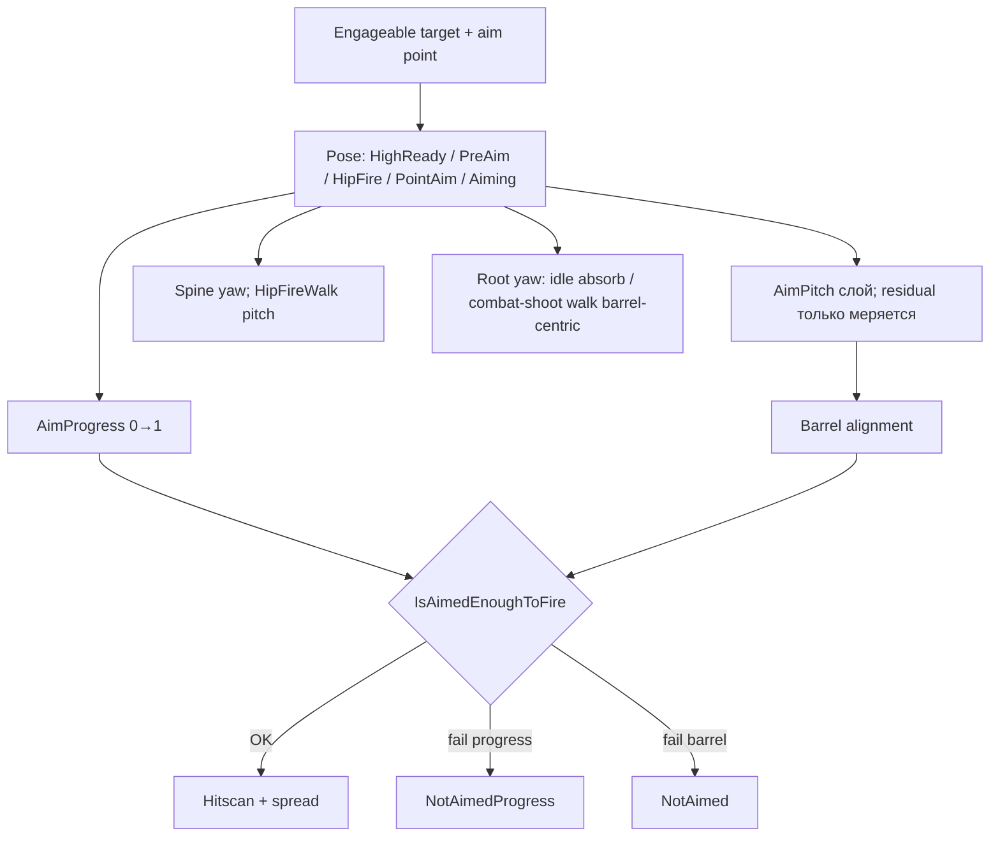

# Удержание, наведение и стрельба

Единственный документ для разбора системы **вне репозитория**. Снимок кода **16 августа 2026**. Ссылок на другие файлы проекта нет: ниже — иерархия, все позы, удержание, отдача, наведение, fire gate и **имена методов с формулами**. Peek (наклон корпуса вбок) в этот снимок не входит.

Не про поиск цели и vision scan — только «цель уже engageable → тело / руки / курок».

---

## Оглавление

0. [Инварианты](#0-инварианты)
1. [Три слоя](#1-три-слоя)
2. [Иерархия](#2-иерархия-и-системы-координат)
3. [Кадр](#3-кадр-кто-в-каком-порядке)
4. [Удержание vs отдача](#4-удержание-vs-отдача)
5. [Перечисления](#5-перечисления)
6. [Геймплей поз](#6-геймплей-когда-какое-состояние)
7. [Что даёт каждая поза](#7-на-что-влияет-каждое-состояние)
8. [Анимации](#8-анимации-базового-слоя)
9. [Hand IK](#9-hand-ik)
10. [Facing](#10-facing-корень-и-спина)
11. [Визуальное наведение](#11-визуальное-наведение)
12. [AimProgress и fire gate](#12-aimprogress-и-разрешение-выстрела)
13. [Огневая дисциплина](#13-weaponaimmode-и-дисциплина)
14. [Spread](#14-точность-spread)
15. [Ранги](#15-ранги)
16. [Runtime Tuner](#16-runtime-tuner)
17. [Логи WeaponSpin](#17-логи-weaponspin)
18. [Закрытые проблемы](#18-закрытые-проблемы)
19. [Текущие проблемы](#19-текущие-проблемы-16082026)
20. [Чеклист дёрганья](#20-чеклист-если-снова-дёргается)
21. [Карта скриптов и методов](#21-карта-скриптов-и-методов)
22. [Не подключено](#22-не-подключено-или-частично)
23. [Позы: как система работает в каждой](#23-позы-как-система-работает-в-каждой)
24. [Пайплайн удержания — методы](#24-пайплайн-удержания--методы)
25. [Пайплайн отдачи — методы](#25-пайплайн-отдачи--методы)
26. [Проблемные механики — методы и формулы](#26-проблемные-механики--методы-и-формулы)

---

## 0. Инварианты

**Frozen** (не открывать без явной задачи от Бориса):

| Запрещено | Контракт |
|-----------|----------|
| FromTo / upright yaw-pitch / recoilHold | `AllowsWeaponLocalAimCorrection()` = **false** |
| Weapon-local aim / recoil rotation | `AcceptsAimCorrectionCompose()` = **false**; `weapon.localRotation` = authored BASE |
| RightHand LateUpdate snap (пехота) | только soft OnAnimatorIK; петля `Hand_R` → оружие → IK |
| Visual recoil в Equipped_* | только `WeaponVisualRecoilApplicator` на `Hand_R` (200) |
| `AimPitch = −residualPitch/90` | AimPitch = цель в кадре корня, не отмена клипа |

Не ломать:

- Оружие — ребёнок `Hand_R`. Мир ствола = анимация кисти × authored local слота × overlay кисти.
- Левая IK следует ребёнку оружия.
- Shared `HandsMask` не мутировать. Не переименовывать `RifleCrouch_Move`.
- Hip-клипы не класть на слой `Aim_Point` / base.
- `AimQuality` ≠ `AimProgress`. Facing — **не** коррекция ствола в кисти.
- Не копировать руки AK на все стволы.

Вертикаль PointAim/Aiming: `Target → AimPitch → Arms/Hand_R → Weapon → Left IK`. Spine pitch на этом пути **нет** (walk cancel −8/−12 снят). HipFireWalk держит **neutral** world pitch closed-loop, не target pitch.

---

## 1. Три слоя

Система решает **две независимые задачи удержания** и **три независимые проверки выстрела**.

**Удержание**

| Задача | Что | Кто |
|--------|-----|-----|
| Поза оружия | local TRS префаба `Equipped_*` под `Hand_R` | `UnitEquippedWeaponPose` + `WeaponPoseDefinition` |
| Поза рук (IK) | кисти относительно оружия | `WeaponGripRig` / `WeaponGripResolver` / `AnimatorHandIk` |

**Выстрел** (все три плюс ammo, LOS, conscious)

| Слой | Что | Где |
|------|-----|-----|
| Визуальное | Тело/руки к точке. **Не** пишет weapon local | `UnitWeaponAiming` (AimPitch), `UnitSpineHorizontalAim`, root facing |
| Числовое | Достаточно ли долго навёлся | `UnitWeaponAimProgressController` → `AimProgress01` |
| Геометрическое | Ствол (`FireOriginTransform`) в допуске pose×stance×move | `UnitWeaponFireController.IsBarrelAlignedEnoughToFire` |



---

## 2. Иерархия и системы координат

```
Unit (root yaw = ноги; на combat-shoot walk — barrel-centric)
  └─ Animator Humanoid
       Spine_01  ← UnitSpineHorizontalAim (yaw; HipFireWalk pitch)
         Spine_02
           … плечо → предплечье →
             Hand_R                    ← якорь оружия; visual recoil overlay (200)
               Equipped_*              ← local pos/rot слота (BASE only)
                 Barrel / FireOrigin   ← hitscan и barrelYawErr
                 GripRig/
                   LeftHandIK          ← левая кисть snap сюда
                   RightHandIK/{Standing|Crouch|Vehicle}/{pose}
```

Legacy-имена на старых префабах: `Ready` (= PointAim), `NotReady` (= LowReady).

| Пространство | Что | Кто пишет |
|--------------|-----|-----------|
| World / root yaw | Ноги, маршрут, recenter | `UnitClickToMove` / `UnitNavLocomotionDriver` / `RtsUnitMember` |
| Spine parent | Грудь относительно корня, yaw **±35°** | `UnitSpineHorizontalAim` |
| `Hand_R` local | Visual punch/climb (rot+pos overlay) | `WeaponVisualRecoilApplicator` 200 |
| Weapon local в `Hand_R` | Authored слот (BASE) | `UnitEquippedWeaponPose` |
| World IK targets | Точки GripRig (едут с оружием) | префаб; выбирает `WeaponGripResolver` |

`wpnLocal=(x,y,z)` в логах — **euler localRotation** корня оружия в `Hand_R`, не мир. Типичный Aiming на текущем префабе: `(6.1, 92.8, -90.7)`. Если уезжает к `(-6, 97)` или `(15, 100)` — в local кто-то доворачивает.

Источники правды:

| Данные | Где |
|--------|-----|
| Поза оружия × стойка × режим | `WeaponPoseDefinition`, `Assets/GameData/WeaponPoses/` |
| IK правая (слоты × стойки) | Префаб → `GripRig/RightHandIK/{Standing\|Crouch\|Vehicle}/{…}` |
| IK левая | `GripRig/LeftHandIK` или `ForeGrip/LeftHandGrip` |
| Legacy fallback | Плоские поля `ItemDefinition` |

---

## 3. Кадр: кто в каком порядке

Unity: Animator → `OnAnimatorIK` → `Update`/`LateUpdate` по `DefaultExecutionOrder`.

| Order | Компонент | Роль |
|------:|-----------|------|
| −10 | `UnitSpineHorizontalAim` | Spine yaw ±35°; combat-shoot walk yaw→0; HipFireWalk pitch closed-loop. PointAim/Aiming walk spine pitch **0**. **Не** weapon local |
| 0 | `UnitSpineLean` | Peek roll. Не путать со spine yaw/pitch |
| 44 | `UnitEquippedWeaponPoseRuntimeTuner` | Play Mode калибровка (если вкл) |
| 50 | `UnitWeaponReadyHandsLayer` | Выбор режима, animator params |
| 50 | `UnitWeaponRecoil` | Compute punch/climb. **Не** пишет кости |
| 54 | `UnitWeaponReloadController` | Reload/bolt клипы на Aim_Point |
| 54 | `UnitWeaponFireDisciplineController` | AI серии (если есть) |
| 56 | `UnitWeaponFireController` | Курок, barrel gate |
| 57 | `UnitWeaponAimProgressController` | AimProgress 0…1 |
| 58 | `UnitWeaponRecoilController` | RecoilPenalty (spread), не кости |
| 64 | `UnitEquippedWeaponPose` | **Единственный writer** BASE local TRS |
| 65 | `UnitWeaponAiming` | AimPitch + residual + **AimBarrel** в WeaponSpin; **не** weapon local |
| 68 | `UnitEquippedWeaponPoseCommit` | FINAL: BASE, если compose не принят |
| 69 | `WeaponGripResolver` | IK-цели из GripRig |
| 200 | `WeaponVisualRecoilApplicator` | Overlay `Hand_R = animBase * recoilOffset` |
| 201 | `WeaponAimVisualBarrelSpinFlush` | Дописывает **VisualBarrel** / `visualError` в ту же строку WeaponSpin |
| 250 | `AnimatorHandIk` | OnAnimatorIK + LateUpdate snap **левой** |

WeaponSpin **копит** строку в 65 (`aimBarrelPitch`, `aimResidualPitch`, `recoilPitch`/`recoilYaw` из state) и **печатает** в 201 после overlay. `visualBarrelPitch` / `visualError` — ствол, который видит игрок в этом кадре. Если `recoilPitch=0` и `visualBarrel≈aimBarrel` — punch не виноват.

Почему порядок критичен:

1. Pose 64 пишет authored local.
2. Aiming 65 задаёт AimPitch и меряет residual — не пишет weapon local.
3. Recoil 200 крутит **родителя** `Hand_R`; слот остаётся BASE.
4. IK 250 ставит левую кисть на уже повёрнутом оружии.

---

## 4. Удержание vs отдача

### 4.1. Ownership

- **BASE** — authored blend слотов (`CurrentBaseWeaponLocalPosition/Rotation`). Пишет только `UnitEquippedWeaponPose`.
- **Compose** — временный слой поверх BASE. Геймплейный aim-correction **не принимается**. Tuner и bolt пишут трансформ напрямую. Visual recoil **не** compose.
- **FINAL commit** (68) — BASE, если compose отвергнут или пуст.
- **Visual recoil** — `WeaponVisualRecoilState` → applicator на `Hand_R` после анимации, до left IK.
- **Hand IK** — один `HandIkMode`; веса Current→Target (exp); левый LateUpdate snap только при весе ≥ порога.

Инвариант settled PointAim / Aiming / HipFire (нет blend/reload/bolt/tuner): `owner=base`, `composeΔ≈0`, `wpnLocalΔ≈0` при любом `handΔ` / `recoilΔ`.

Имена методов и формулы удержания — **§24**, отдачи — **§25**, поведение всех поз — **§23**, проблемные контуры — **§26**.

### 4.2. Удержание (hold)

Где оружие сидит в кисти, когда нет выстрела:

1. Animator пишет `Hand_R` (idle / `Walk_Aim_F_Loop` / `RifleCrouch_Move` / слой `Aim_Point_U90-D90`).
2. `UnitEquippedWeaponPose` (64) пишет **BASE** `Equipped_*.local` из слота. На шаге Aiming слот тот же, что стоя: типичный euler `(6.1, 92.8, -90.7)`.
3. Левая IK (250) клеится к `LeftHandGrip` на уже повёрнутом оружии.
4. Наведение **не** крутит local: корень + спина + `AimPitch`.

`UnitEquippedWeaponPose` каждый кадр: blend `CurrentPose → TargetPose` → base TRS → `ClearCompositionOverrides()` → commit. Без compose оружие жёстко в authored слоте. Анимация `Hand_R` двигает его в мире, local не меняется (`wpnLocalΔ=0`).

### 4.3. Два разных «recoil»

| Слой | Компонент | Кости | Что делает |
|------|-----------|-------|------------|
| Геймплейный | `UnitWeaponRecoilController` (58) | нет | `RecoilPenalty` → spread hitscan |
| Визуальный punch | `UnitWeaponRecoil` (50) + applicator (200) | **`Hand_R`**, не Equipped_* | Импульс pitch (потолок 8°) + yaw (bias вправо + Perlin). Затухание exp, во время очереди медленнее |
| Визуальный climb | тот же state | **`Hand_R`** | `PitchCurve(RecoilPenalty)` — устойчивый подъём очереди |
| Translation | applicator | **`Hand_R` pos** | Назад/вверх от punch |

Формула overlay: `Hand_R.localRotation = animBase * Euler(-(climb+punchPitch)*HandPitch, punchYaw*HandYaw, 0)`. Оружие — ребёнок кисти, слот не меняется.

Пока `fire=1`: `recoilPitch` / `recoilYaw` / `recoilΔ` ненулевые — **задумано**. После `FIRE-STOP` punch должен уйти за доли секунды; `wpnLocal` не должен уехать. Если после отпуска `visualBarrel` остаётся задранным при `recoilPitch=0` — это **не** overlay, а поза/клип.

`owner=recoilPunch` в settled огне — регрессия. Если при `fire=1` растут `wpnLocalΔ` и `composeΔ` — коррекция гоняется за отдачей.

---

## 5. Перечисления

### WeaponPoseState — фактическая поза (оружие + правая IK)

| Значение | Имя | Смысл |
|--------:|-----|-------|
| 0 | `LowReady` | Ствол вниз; огонь нет |
| 1 | `PointAim` | Поднято без ADS; ЛЦУ — модификатор, не обязателен |
| 2 | `HipFire` | От бедра (стоя, idle) |
| 3 | `Aiming` | Полный прицел / оптика |
| 4 | `NotReady` | Peaceful carry; Ctrl+E |
| 5 | `PreAim` | Почти на цели; **курок запрещён** (`CanShootFromPose=false`) |
| 6 | `HighReady` | Ствол вверх в сектор угрозы; **authored** слот; огонь и AimProgress запрещены |
| 7 | `NotReadyPatrol` | Как NotReady, свои координаты |
| 8 | `HipFireWalk` | HipFire на шаге стоя; свой слот; режим игрока остаётся HipFire |
| 9 | `HipFireCrouchWalk` | HipFire на шаге в приседе; свой слот |

`CanFireFromPose` — PreAim + HipFire / walk / PointAim / Aiming (накопление / «raised ready»).  
`CanShootFromPose` — только HipFire / HipFireWalk / HipFireCrouchWalk / PointAim / Aiming.  
`IsHipFireHold` — idle HipFire или walk-слоты (одинаковые fire/aim/facing).  
`IsWeaponRaised` — всё кроме NotReady / Patrol / LowReady (facing, не курок).  
`IsCombatPose` в коде сейчас HighReady / PreAim / PointAim / Aiming (**без** HipFire).

Путать `CanFire` и `CanShoot` — типичная ошибка логов (`fireBlend=0` в PreAim при цели).

### WeaponPoseMode — что выбирает игрок / AI

| Значение | Имя | В геймплее |
|--------:|-----|------------|
| 0 | `LowReady` | Да, цикл E |
| 1 | `PointAim` | Да, цикл E |
| 2 | `HipFire` | Да, **не** в цикле E |
| 3 | `Aiming` | Да, цикл E |
| 4 | `Auto` | AI / RTS |
| 5 | `PreAim` | Да, цикл E |
| 6 | `HighReady` | Да, цикл E |

Отдельного `WeaponPoseMode.NotReady` нет. Peaceful carry — флаг `m_IsPeacefulNotReady` + `m_PeacefulCarryPose`.

### WeaponStance

`Standing` / `Crouching` / `Vehicle`.

### Animator params (не путать)

| Param | Тип | Кто пишет | Назначение |
|-------|-----|-----------|------------|
| `WeaponReady` | bool | `UnitWeaponReadyHandsLayer` | Ветка клипов locomotion/idle, **не** «можно жать курок». HighReady/PreAim raised, но `CanShootFromPose=false` |
| `WeaponStandIdle` | int | тот же | **Какой standing idle**: `0` Aim, `1` Relaxed. Не то же, что `WeaponReady` |
| `WeaponMode` | int | `UnitAnimatorWeaponMode` | Unarmed / Rifle / Pistol |
| `Stance` | int | `UnitAnimatorStance` | Standing / Crouch / Prone |

`stance=1` в **WeaponSpin** — это **не crouch**. Это `UnitBusyState.StanceTransition`. Crouch смотри `Animator.Stance`.

---

## 6. Геймплей: когда какое состояние

### Ручной цикл (клавиша E)

```
LowReady → HighReady → PreAim → Aiming → PointAim → LowReady
```

HipFire в цикле E нет (отдельный режим). `Auto` в цикле нет. PointAim всегда в цикле (ЛЦУ не обязателен). Из peaceful / HipFire / Auto обычный E сначала ставит LowReady.

### Ctrl+E

Уже peaceful: `NotReady` ↔ `NotReadyPatrol`. Из боя (включая LowReady) — вход в `NotReady`. Из HighReady/Aiming/HipFire/PointAim Ctrl+E **уводит в peaceful**, не «ничего не делает».

### Auto (`WeaponPoseMode.Auto`)

`WeaponAutoPoseResolver` + baked preferred distances:

| Условие | Поза |
|---------|------|
| Нет цели, нет combat alert | `LowReady` |
| Нет цели, есть combat alert | `HighReady` |
| Цель ≤ HipFire preferred (~3.5–7 м, ранг) | `HipFire` |
| Цель ≤ PointAim preferred (~18–45 м + ЛЦУ) | `PointAim` |
| Иначе | `Aiming` |
| LowReady + цель ≤ 3 м | emergency `HipFire` |

Hysteresis ~15%. Auto **не** выбирает `NotReady`.

### Подавление готовности

| Триггер | Механизм |
|---------|----------|
| Sprint | `SuppressReadyForSprintIfNeeded` |
| Run | `SuppressReadyForRunIfNeeded` |
| Turn-in-place | `SuppressReadyForTurnIfNeeded` |
| Союзники вплотную | `UnitProximityReadyController` → `LowReady` |
| После выстрела РПГ | `ForceNotReadyAfterRocketLauncherFire` |
| AI патруль | `EnemyPatrolAI` → Auto |
| Fireman carry / unconscious / часть vehicle seats | `SetReadyWanted(false)` |

### Особые контексты

| Контекст | Поза |
|----------|------|
| **Prone** | Всегда `Aiming`; `WeaponReady = true`; spine aim off |
| **Vehicle fire seat** | `PointAim` / `LowReady` от `VehiclePassengerState.WantsReadyPose`; stance = `Vehicle` |
| **Vehicle turret** | Legacy IK на башне, не GripRig пехоты |
| **Rocket launcher order** | Свой root + IK |
| **Bolt cycle** | Оружие off `Hand_R`; IK только левая |
| **Reload / mag / grenade / heal / drag** | Hand IK **выкл** |

---

## 7. На что влияет каждое состояние

| `WeaponPoseState` | Слот оружия | Правая IK | Левая IK | `WeaponReady` | `WeaponStandIdle` | `CanShoot` | AimProgress | Aim_Point | Facing raised |
|-------------------|-------------|-----------|----------|---------------|-------------------|------------|-------------|-----------|---------------|
| `LowReady` | LowReady | `…/LowReady` | одна точка | false | 0 AimIdle | нет | нет | нет | нет |
| `HighReady` | **authored** HighReady | `…/HighReady` | одна точка | **true** | 0 | **нет** | **нет** | нет | **да** |
| `PreAim` | authored PreAim | `…/PreAim` | одна точка | true | 0 | **нет** | да (`CanFire`) | нет | да |
| `HipFire` | HipFire | `…/HipFire` | одна точка | true | **1 Relaxed** | да | да | нет | да |
| `HipFireWalk` / `HipFireCrouchWalk` | свои слоты | свои | одна точка | true | (локомоция, не idle) | да | да | нет | да |
| `PointAim` | PointAim | `…/PointAim` | одна точка | true | 0 | да | да | да | да |
| `Aiming` | Aiming | `…/Aiming` | одна точка | true | 0 | да | да | да | да |
| `NotReady` / `Patrol` | HoldNotReady / Patrol | `…/HoldNotReady` | одна точка | false | **1 Relaxed** | нет | нет | нет | нет |

`IsWeaponReadyToFire()` = `CanShootFromPose` (settled, оба конца бленда) + не sprint (+ turret).  
`IsWeaponEquippedAndReady()` = `CanFireFromPose` (PreAim+) или turret/rocket — для AimProgress, не для курка.  
`FireCapableBlend01` = lerp `CanShootFromPose(from/to)` по `PoseBlend01`. AimPitch **не** включается в HighReady/PreAim.

Левая рука: одна IK-точка, **не** переключается по pose.

Переходы оружия: матрица длительностей по парам pose. Звуки: `EnterLowReady`, `EnterHighReady`, `EnterHipFire`, `EnterPointAim`, `EnterAiming`.

Pose vs стрельба (числа):

| Pose | Скорость прицела (mult) | Spread mult (default) | Оптика в расчёте |
|------|-------------------------|----------------------|------------------|
| HighReady | — (progress нет) | — | — |
| HipFire | **×0.55** | **2.5** + distance | исключена |
| PointAim | **×0.85** | **1.5** + distance; ЛЦУ модификатор | исключена |
| Aiming | **×1.0** | **1.0** + слабая distance | учитывается |
| LowReady | — | 3.0 если как-то попадёт в evaluator | — |

Порог выстрела по pose (`HighReadyPoseUtility.GetPoseFireThreshold01`): HipFire 0.35, PointAim 0.65, Aiming 1.0. Ранг порог не меняет. HighReady в этой таблице исторически 0.45, но курок из HighReady сейчас запрещён.

---

## 8. Анимации базового слоя

Контроллер: `Assets/Animations/UnitAnimController.controller`.  
Выбор: `UnitAnimatorWeaponMode.ResolveBaseLayerIdleQualified` / `ResolveBaseLayerLocomotionQualified`.

### Standing idle (`NavSpeed < 0.055`)

| `WeaponStandIdle` | Клип |
|-------------------|------|
| **0** AimIdle | `Stand_Aim_Idle` |
| **1** RelaxedIdle | `Stand_Relaxed_Idle` |

| Effective pose | `WeaponStandIdle` | Idle clip |
|----------------|-------------------|-----------|
| LowReady, HighReady, PreAim, PointAim, Aiming | 0 | `Stand_Aim_Idle` |
| HipFire, NotReady, NotReadyPatrol | 1 | `Stand_Relaxed_Idle` |

### Crouch idle (rifle)

| `WeaponReady` | Клип |
|---------------|------|
| true | `RifleCrouch_Idle_Ready` |
| false | `RifleCrouch_Idle` |

### Locomotion standing (`NavSpeed ≥ 0.055`)

| `WeaponReady` | Tier | Клип |
|---------------|------|------|
| true | Walk | `Walk_Aim_F_Loop` |
| true | Run | `Jog_Aim_F_Loop` |
| false | Walk | `Walk_F_Loop` |
| false | Run | `Run_F_Loop` |
| false | Sprint | `Sprint_F_Loop` |

При смене `WeaponStandIdle` на месте: `ReplayLocomotionIdleCrossfade()`.

Слой `Aim_Point_U90-D90`: вертикаль рук (`AimPitch` −1…1 ↔ ±90°) и клипы reload/bolt. HipFire слой ради прицела **не** держит (`PoseWantsAimPointOverlay` = false).

---

## 9. Hand IK

- Один `HandIkMode` (`UnitHandIkModeResolver`): Frozen → Disabled → Reload → BoltHold → Transition → clip walk NotReady → SoftHold (run) → Hold. Не от `WeaponReady`.
- **Правая:** target weight ≈ 0.35, soft OnAnimatorIK. LateUpdate snap **запрещён**.
- **Левая:** target weight ≈ 0.9, LateUpdate two-bone snap если current weight ≥ ~0.85 и mode Hold/SoftHold/BoltHold. Цель — ребёнок оружия, позицию не сглаживать.
- Веса: Current → Target экспонентой, raise быстрее release. Reload exit не 0→1 за кадр.
- Правый target blend в **local оружия** (pose и stance). Left target не блендится.
- **Выкл** (веса → 0): tuner HandsFrozen, mag, heal, drag, carry, grenade, reload/LMG. Bolt: только левая.
- Бег: правая IK default 0; левая остаётся.
- Шаг standing NotReady / Patrol: левая IK 1 (рукоятка + snap), правая 0 — из `Walk_F_Loop`.

Что даёт дёрганье:

1. Pose blend меняет local → LeftHandIK в мире прыгает → левая догоняет snap.
2. Recoil крутит `Hand_R` → дерево оружия в мире → левая следует (**нормально**, двуручный хват).
3. Model FromTo крутит **local** в той же `Hand_R` → левая уезжает относительно правых пальцев. Сейчас FromTo в gameplay выкл.
4. Слой `Aim_Point` крутит руки (и `Hand_R`) по `AimPitch` — authored анимация, не local слота.

---

## 10. Facing: корень и спина

Намеренно **не** крутим ствол в кисти, чтобы попасть в цель, если это может сделать тело.

```
Цель (engageable aim point)
    ├─ 1. Root yaw     — idle recenter / combat-shoot walk barrel-centric
    ├─ 2. Spine yaw ±35° — idle; на shoot-walk → 0
    ├─ 3. Spine pitch  — HipFireWalk closed-loop к neutral; PointAim/Aiming walk = 0
    ├─ 4. AimPitch     — руки вверх-вниз (PointAim и Aiming); кадр = корень/горизонт
    └─ 5. Model corr   — local оружия; ВЫКЛ
```

Приоритет facing корня: граната/РПГ reload не поворачивают; run/sprint — в сторону движения; **видимая цель бьёт жёлтую стрелку**; Blue/Green hold-стрелки сильнее цели. LowReady/NotReady **не** engage-face.

### Корень

`UnitClickToMove.UpdateFacing` / `UnitNavLocomotionDriver.UpdateFacing` / RTS `UpdateFacingRotation`.

`IsCombatShootWalk` = `CanShootFromPose` + шаг (не run/sprint): HipFire / PointAim / Aiming.

- `TryApplyCombatWalkBarrelFacing` — yaw так, чтобы **ствол** смотрел в цель (authored offset тела относительно ствола). Во время `IsReloadBusy` **не** гоняемся за стволом.
- Recenter: если `|body→target| > 35°`, спина просит корень довернуть, пока спина сядет около 0°. Готово при остатке ≤ **2.5°**. Сглаживание **экспонента**, не SmoothDamp.
- На combat-shoot walk recenter по 35° **выкл** (намеренный ~18° offset тела).
- `CompensateSpineForRootYaw`: с ног снимается Δ со спины, чтобы грудь не улетела со стопами. На combat-shoot walk **не** peel'ить yaw со спины — корень уже владеет горизонталью.
- HighReady / PreAim walk **не** combat-shoot: спина absorb, `corr=moveHold`.

`spine=` в WeaponSpin — **только yaw**. Команда питча — `spinePitch=`.

### Спина (`UnitSpineHorizontalAim`, −10)

- Кости: Spine_01 (вес 0.35) + Spine_02 (0.65).
- Лимит суммарного yaw относительно корня: **35°**.
- Combat-shoot walk: spine **yaw → 0**.
- HipFire walk pitch: замкнутый контур к **neutral locomotion pitch** (`m_HipFireWalkBarrelLiftStand=4` / Crouch=5), не к elevation цели. Цель на +20° не поднимает бедро на 20°.
- PointAim/Aiming walk: spine pitch **0** (вертикаль = AimPitch). Во время pose blend и reload команда тоже **0** (PreAim muzzle-down не бьётся с Aiming raise).
- Выкл: run/sprint, prone, vehicle, drag, carry, ragdoll, grenade, stance transition, pose не raised, нет цели.
- HipFire standing без цели по-прежнему компенсирует yaw клипа.

Apply pitch: additive `bone.rotation = AngleAxis(pitch, unit.right) * bone.rotation` на Spine_01/02.

`ShouldKeepCombatWalkBodyAim` в `UnitWeaponAiming`: на PointAim/Aiming walk держит `gate=1` / `corr=bodyAim` или `authoredAiming`. Не пишет weapon local.

---

## 11. Визуальное наведение

### `UnitWeaponAiming` (65)

| Элемент | Назначение |
|---------|------------|
| Animator `AimPitch` | Вертикаль на слое `Aim_Point_U90-D90`. Кадр — **корень/горизонт**, не грудь (иначе двойной счёт Aim_Point). Величина ≈ `desiredPitch/90` |
| Layer weight | 0…1; 1 в PointAim/Aiming (и reload-клипы этого слоя) |
| Weapon local correction | **Выкл.** Residual только логируется |
| Residual / AimQuality | Угол ствол→цель после тела. `saturation=ArmPitch/ArmYaw` — руки не дотягивают бюджет |

`corr=` на settled Aiming: `authoredAiming`. На PreAim walk: `moveHold`. FromTo / upright / recoilHold в gameplay **не должны** появляться.

Сглаживание AimPitch ~0.08 с, при огне мягче ~0.2 с.

**Блокирует combat aim:** stance transition, reload/bolt (pitch solver), grenade, mag load, ragdoll, runtime tuner, bolt cycle hold.

**Reload:** вес aim layer **не** обнуляется (нужны animation events), chase ствола корнем на шаге выкл.

Исторически PointAim стоя делал FromTo ствол→цель в `Hand_R` (лимит ~18.6° 3D, не 5° yaw). Это ломало хват. Сейчас путь выкл для всех обычных поз.

### Связь с pose

`UnitEquippedWeaponPose` пишет только BASE. Compose aim не принимается. Pose blend 0.12–0.30 с. AimProgress от бленда **независим**.

`WeaponReady` ≠ AimProgress. `WeaponStandIdle` не влияет на fire gate.

---

## 12. AimProgress и разрешение выстрела

`TryFireSingleShotInternal` (упрощённо):

| # | Проверка | Fail |
|---|----------|------|
| 1 | Сознание | `Busy` |
| 2 | `IsWeaponReadyToFire()` — `CanShootFromPose`, не sprint | `NotReady` |
| 3–4 | Reload / grenade / rocket / stabilize | `Busy` |
| 5 | Engageable target (если `m_RequireVisibleTarget`) | `NoVisibleTarget` |
| 6 | **`HasRequiredAimProgressForFire()`** | **`NotAimedProgress`** |
| 6b | **`IsBarrelAlignedEnoughToFire()`** | **`NotAimed`** |
| 7 | Line of fire | `LineOfFireBlocked` |
| 8 | Ammo / RPM / chamber | разные |

### AimProgress

Пишет `UnitWeaponAimProgressController` (order **57**) в `EquippedWeaponTransientState.AimProgress01`.

```
если CanAccumulateAim:  progress += dt / CurrentAimTimeSeconds     → 1
иначе:                  progress -= (dt / CurrentAimTimeSeconds) × 1.65 → 0
```

Потеря в 1.65× быстрее набора.

`CanAccumulateAim`: экипировка + `IsWeaponEquippedAndReady()` + engageable target + не stance transition + не reload/bolt + не ручная зарядка.

```
fullAimTime = max(0.01,
    WeaponDefinition.AimTimeSeconds          // типично ~0.28 s
  × weaponDistanceMultiplier
  × PoseCapabilityCache.GetAimTimeMult(pose) // skills, attachments, pose
  × UnitStanceCombatModifiers)
```

Fallback без cache: `WeaponDistanceAimEvaluator` × skills × traits × moving × posture × poseScale.

Оптика: HipFire/PointAim attachments без оптики; Aiming — с оптикой.

### Barrel alignment

Угол `FireOrigin.forward` → `GetEngageableAimPointWorld()`. Считается **всегда**, кроме bolt empty-chamber. `IsMovingForBarrelAimGate` только выбирает колонку «ход», **не** skip.

`CanFire` / `CanShoot` / AimProgress **не** смешиваются со стволом:

| Условие | Результат |
|---------|-----------|
| AimProgress ниже порога | `NotAimedProgress` (14) |
| Ствол вне допуска | `NotAimed` (12) |
| progress=1 + error 15° (Aiming idle 3°) | `NotAimed` |
| progress=0.4 + error 2° | `NotAimedProgress` |

Стартовые допуски (не финал), idle / walk / crouch-walk:

| Поза | idle | walk | crouch-walk |
|------|------|------|-------------|
| Aiming | 3° | 8° | 9° |
| PointAim | 5° | 10° | 11° |
| HipFire (и walk-слоты) | 12° | 16° | 18° |

Crouch idle: Aiming 9°, PointAim 7°, HipFire 14°. Bolt (пустая chamber, магазин не пуст) — skip ствола.

Hitscan всё равно по стволу. `gate=0` не используется как «на ходу не стреляем».

---

## 13. WeaponAimMode и дисциплина

Игрок выбирает `WeaponFireDisciplineMode`, не AimMode напрямую.  
`MapToAimMode(discipline, distance)`:

| Дисциплина | Дистанция | AimMode |
|------------|-----------|---------|
| **Suppressive** | ≤ 35 m | SnapShot |
| | ≤ 90 m | QuickAim |
| | > 90 m | FullAim |
| **Precision** | ≤ 45 m | QuickAim |
| | > 45 m | FullAim |
| **Economical / default** | любая | FullAim |

| WeaponAimMode | Required `AimProgress01` | Min time to fire |
|---------------|--------------------------|------------------|
| SnapShot | **0.35** | **0.11 s** |
| QuickAim | **0.68** | **0.22 s** |
| FullAim | **1.00** | max(fullAimTime, **0.32 s** если fullAim < 0.15 s) |

```
requiredProgress = clamp01(requiredTimeSeconds / fullAimTimeSeconds)
requiredTimeSeconds = max(fullAimTime × baseProgress, minTimeForMode)
```

| Fire mode | AimProgress для выстрела |
|-----------|--------------------------|
| SemiAuto | **каждый** выстрел; после — reset в 0 |
| Burst / FullAuto | только **1-й** выстрел серии |

`UnitWeaponFireDisciplineController` (54): фаза Aiming копит progress с виртуальным спуском; Firing когда `AimProgress01 >= PlannedRequiredAimProgress01`. Planner может рандомизировать порог (×0.85 band).

Смена цели: FullAuto — полный сброс progress; Semi/Burst — carryover по углу (`max 0.8` при 0°, 0 при 25°).

---

## 14. Точность (spread)

`WeaponShotAccuracyEvaluator.Evaluate()` — полу-угол:

```
halfAngle = clamp(
  BaseShotDispersion × ammo × weaponDist × attachDist ×
  (1 + recoil × 0.22) × stance × movement × skills × traits × condition ×
  incompleteAimFactor × autoBurstFactor × poseSpread × 0.35°,
  0.04°, 12°)
```

Incomplete aim — только **первый** выстрел burst/auto:

| AimProgress | Spread mult (до distance scale) |
|-------------|--------------------------------|
| 1.0 | 1.0 |
| 0.85–1.0 | 1.15 → 1.0 |
| 0.68–0.85 | 1.45 → 1.15 |
| 0.35–0.68 | 2.20 → 1.45 |
| 0–0.35 | 3.00 → 2.20 |

Distance scale штрафа: **0.6×** на ≤10 m … **1.5×** на ≥100 m. Auto burst 2+: доп. **~0.87**. Stance/movement defaults: Crouch 0.9, Prone 0.75, Moving 1.35, Sprint 2.0.

Геймплейный recoil: `SpreadHalfAngle` также связан с `RecoilPenalty × 0.15` в hitscan-пути контроллера.

---

## 15. Ранги

`UnitCombatRankDefinition` → `UnitCombatStats` (+ traits ±10%):

| Навык | Влияет на |
|-------|-----------|
| Marksmanship | spread (`GetDispersionMultiplier`) |
| WeaponHandling | время прицеливания |
| RecoilControl | накопление/восстановление отдачи → косвенно точность |

`EvaluateSkillMultiplier`: `lerp(worst, best, skill/100)`. Skill 50 = 1.0. Marksmanship/Handling: skill 0 → 1.25, 100 → 0.75.

| Ранг | Marksmanship | Handling | Recoil | Spread mult | Aim time mult |
|------|-------------:|---------:|-------:|------------:|--------------:|
| Recruit | 35 | 40 | 35 | **1.08** | **1.05** |
| Soldier | 50 | 50 | 50 | **1.00** | **1.00** |
| Veteran (Corporal) | 58 | 56 | 58 | **0.96** | **0.97** |
| Specialist (Veteran) | 61 | 68 | 60 | **0.95** | **0.91** |
| Elite | 65 | 63 | 66 | **0.93** | **0.94** |

Ранг **не** меняет: пороги AimMode, barrel допуски 3–10°, pose spread, incomplete-aim curve. Косвенно сдвигает Auto pose ranges при bake cache.

Прочее на ранге (не aim): ReactionTime, VisionScanInterval, WeightPenaltyReduction.

---

## 16. Runtime Tuner

`UnitEquippedWeaponPoseRuntimeTuner` — только Play Mode, `m_EnableRuntimeTuning`.

| # | Dropdown | Буфер | Pose | IK правая |
|---|----------|-------|------|-----------|
| 0 | Hands Frozen | — (Hierarchy) | — | **выкл** |
| 1 | Не готов | HoldNotReady | NotReady | `…/HoldNotReady` |
| 2 | LowReady | LowReady | LowReady | `…/LowReady` |
| 3 | HipFire | HipFire | HipFire | `…/HipFire` |
| 4 | PointAim | PointAim | PointAim | `…/PointAim` |
| 5 | Aiming | Aiming | Aiming | `…/Aiming` |

Posture: Standing / Crouch / Vehicle. **HighReady и PreAim не в тюнере.**

NotReady в тюнере ставит `WeaponPoseMode.LowReady`, а оружие/IK — HoldNotReady: тело AimIdle vs pose NotReady — расхождение при калибровке.

Save: 5 слотов × 3 posture в SO; руки — в `GripRig` префаба.

AI Auto не переключает NotReady; тюнер — да (`IsNonAiTunerPose`).

---

## 17. Логи WeaponSpin

Флаг `UnitWeaponAiming.m_LogWeaponSpin` (prefab вкл). Фильтр Console: `WeaponSpin`. Интервал 0.1 с, окно после события 3 с. Тихие кадры (все Δ < 0.2°) пропускаются.

### Фазы

| Фаза | Смысл |
|------|--------|
| `POSE-START` / `BLEND` / `POSE-END` / `POSE-SNAP` | Смена слота |
| `MOVE-START` / `MOVE` / `MOVE-STOP` | `NavSpeed ≥ 0.055` |
| `FIRE-START` / `FIRE` / `FIRE-STOP` | `IsFiringCommandActive` |
| `RELOAD-*` | reload / mag / bolt |
| `TURN` | `rootΔ ≥ 2.5°` за интервал |
| `TICK` | спокойный кадр в окне |
| `SPIN-HAND` | local прыгнул сильнее кисти |
| `SPIN-BARREL` | мир ствола прыгнул без такой же кисти |
| `SPIN-COMPOSE` | compose прыгнул без кисти — в settled PointAim/Aiming **регрессия** |
| `SPIN-ERR` | yawErr или pitchErr ≥10° |
| `SPIN-ATTRACTOR` | коррекция в лимите, ошибка всё ещё большая |

### Поля

| Поле | Читать как |
|------|------------|
| `pose` `from→to` `t=` `blending=` | Слот и бленд |
| `reload mag bolt boltHeld settle` | Reload-пайплайн |
| `stance=` | **Busy StanceTransition**, не crouch |
| `nav=` `move=` | NavSpeed; move = порог 0.055 |
| `fire=` | Команда огня, не попадание |
| `lean=` | Spine lean |
| `rootYaw` `rootΔ` | Ноги |
| `spine` `spinePitch` `recenter` | `spine` = **yaw** торса. `spinePitch` = команда питча (PointAim/Aiming walk = **0**; HipFireWalk = closed-loop к neutral) |
| `arrow` | Override facing; `-` = нет |
| `handΔ` | Мир `Hand_R` за интервал |
| `wpnLocalΔ` | Local оружия |
| `barrelΔ` | Мир ствола |
| `localVsHand` | `wpnLocalΔ − handΔ`. ≈0 = оружие едет с рукой |
| `composeJump` | Прыжок compose относительно base |
| `wpnLocal=(x,y,z)` | Euler слота (+compose) |
| `mix=` | `animAimPitch`, `authoredEase`, `poseBlend`, `moveHold`, `reloadClip`, `reloadSettle` |
| `combatAim` | AimPitch логика вкл |
| `modelAim` | Weapon-local corr; сейчас **всегда 0** |
| `fireBlend` | 0 HighReady/PreAim, 1 HipFire/PointAim/Aiming |
| `gate` | 1 на Aiming/PointAim walk (`bodyAim`/`authoredAiming`); 0 PreAim/HighReady walk (`moveHold`) |
| `corr=` | `none` / `authoredAiming` / `bodyAim` / `moveHold` / `reloadSettle`. FromTo/upright не должны появляться |
| `AimPitch` `layerW` | AimPitch ≈ desiredPitch/90, **не** отмена клипа |
| `yawErr` `pitchErr` `applied*` `fromTo` | Внутренности коррекции (0 если выкл) |
| `aimBarrelPitch` | Мировой pitch ствола **до** overlay 200 (бывший `barrelPitch`) |
| `aimResidualPitch` | `aimBarrelPitch − targetPitch` (то же, что `residualPitch` на 65) |
| `barrelYawErr` | Горизонталь ствол↔цель, signed |
| `desiredYaw` `desiredPitch` | Цель в кадре корня/горизонта |
| `residualYaw` `residualPitch` | Ствол vs цель после тела, замер 65 |
| `aimQuality` `saturation` | 0 + ArmPitch = руки не закрыли вертикаль |
| `recoilPitch` `recoilYaw` `climbPitch` | Visual **state** (50), не кость. Punch во время огня — задумано |
| `visualBarrelPitch` `visualError` | Ствол **после** overlay 200. `visualError` = visualBarrel − targetPitch |
| `composeΔ=(x,y,z)` | Euler(inverse(base)*composed). **(0,0,0) = чистый слот** |
| `hasTarget` | Цель выбрана |

`mix=+moveHold` = «сейчас/недавно локомоция», не обязательно `corr=moveHold`.

Другие теги: `[Facing]` (`m_LogFacingSystem`), `[ReloadAim]`, `[HipFireAim]`, `[PoseAim]`, `UnitEquippedWeaponPose.m_LogStandingPoseSwitch`.

Как читать дёрганье:

1. `composeΔ≈0`, `wpnLocalΔ≈0`, большой `handΔ` — анимация/отдача/спина, слот честный.
2. `composeΔ` ползёт, `corr=barrel-FromTo` / `upright-*` — model corr в кисти. Регрессия.
3. `corr=recoilHold` и `wpnLocal` застыл, `barrelYawErr` скачет на шаге — заморозили стоячий local.
4. `stance=1`, `combatAim=0`, потом `SPIN-ERR` — stance transition выключил AimPitch.
5. `layerW` 0↔1 при `fireBlend=1` — Aim_Point кроссфейд.
6. LowReady `barrelYawErr=70°` при `hasTarget=1` — не баг: поза не целится.

---

## 18. Закрытые проблемы

Не открывать эти фиксы (FromTo, recoilHold, PreAim overlay, правый snap), пока Борис не попросит.

### HipFire: ствол уползает вбок после очереди

`corr=upright-yaw/pitch`, `composeΔ` → лимиты ±5° yaw / +18° pitch. HipFire без AimPitch, но FireCapableBlend включал world axes в `Hand_R` + отдача = attractor. **Фикс:** HipFire без model corr.

### Aiming стоя: винтовка «ломается в кисти»

FromTo каждый кадр в уже отдачей повёрнутой `Hand_R`. Ствол в мире в цели, local выкручен (~13°). **Фикс:** Aiming = authored + AimPitch. Hold local на огне чинил `wpnLocalΔ` во время очереди, но после отпуска FromTo доползал; hold на шаге давал `barrelYawErr` до −117°.

### Ходьба: оружие крутится в руках

Model corr в local, пока walk крутит кисть = спин. Контр-фикс `gate=0` на всём шаге глушил очередь (допуск 8°). **Сейчас:** model corr выкл; barrel gate на move intent пропускается.

### Рывок после reload / bolt в PointAim

Aim_Point клип кончался, combat aim с нуля догонял 20°+ SmoothDamp. **Фикс:** держать AimPitch в fire-позе с целью; 0.22 с settle; экспонента вместо SmoothDamp.

### Spine / facing: рывок торса

SmoothDamp yaw перелетал; recenter без компенсации уносил грудь. **Фикс:** экспонента; `CompensateSpineForRootYaw`; recenter до 2.5°; лимит 35°; LowReady не engage-face.

### PreAim не должен стрелять

`CanFireFromPose` включает PreAim, `CanShootFromPose` — нет. `FireCapableBlend` следует shoot.

### Два смысла `WeaponReady`

Animator bool = ветка клипов, не курок.

### Правый IK snap запрещён

Исторически snap обеих рук: recoil → оружие → RightHandIK → снова `Hand_R`.

### Combat-shoot walk yaw (закрыто 16.08)

Aiming/PointAim walk раньше сидел на `engageSpine` (`gate=0`, `corr=moveHold`): спина ~12°, walk clip добавлял yaw, residual ~18–21°. **Фикс:** barrel-centric корень + spine yaw 0. На settled Aiming walk `residualYaw≈0…2°`.

### Reload не chase bore (закрыто 16.08)

Оба драйвера `return false` из `TryApplyCombatWalkBarrelFacing` при `IsReloadBusy`. В логе #7 `rootYaw` держится; большой `handΔ`/`barrelPitch` — клип перезарядки.

---

## 19. Текущие проблемы (16.08.2026)

Не открывать weapon-local aim, PreAim overlay и правый IK snap. База логов — WeaponSpin **#6**. `owner=base`, `composeΔ=0`, `wpnLocal=(6.1, 92.8, -90.7)` не едет.

### 19.1. Вертикаль шага Aiming/PointAim — Variant B (AimPitch offset)

Spine pitch на PointAim/Aiming walk остаётся **0** (`EvaluateSpinePitchForCombatWalk`). Старый cancel вокруг `unit.right` (`m_AimWalkPitchCancel*`) удалён: он поднимал ствол до +9…+11°.

Play Mode (Борис, WeaponSpin #4–#13): idle Aiming — Variant A. Walk — постоянный clip bias, не отдача.

| Кейс | aimBarrel vs desired | residual после FIRE-STOP (`recoilPitch=0`) |
|------|----------------------|---------------------------------------------|
| Aiming idle (#4) | ≈ target | **−1.0 → 0°** |
| PointAim idle after reload (#7) | ≈ target | **0.0…0.3°** |
| Aiming stand walk (#5) | barrel +3…+4°, desired ~−1° | **+3.4…+5.2°** |
| PointAim stand walk (#6) | similar | **+2…+5.6°** |
| PointAim crouch walk (#8) | barrel +5.5…+6.9° | **+6.0…+7.5°** |
| Aiming crouch walk (#12–13) | barrel +4…+6° | **+4.7…+6.9°** |

`spinePitch=0`, `owner=base`, `wpnLocalΔ=0`. Bias — walk clip / Aim_Point vs idle, не punch.

**Variant B:** `AimPitch = (DesiredAimPitch + WalkPitchCompensation) / 90` через слой `Aim_Point_U90-D90`. Не spine, не `AimPitch = −residual/90`.

- Stand: `m_WalkPitchCompensationStandDegrees = −4.5`
- Crouch: `m_WalkPitchCompensationCrouchDegrees = −8.5`
- Общий offset для PointAim и Aiming
- Вес позы: lerp 0↔1 с overlay (PreAim→Aiming нарастает, Aiming↔PointAim держит 1)
- Стойка: lerp stand↔crouch по `HoldContext.StanceBlend01` (не по animator Stance integer)
- **0** на idle, reload, run/sprint, HipFire, prone, StanceTransition busy

Play Mode после Variant B (Борис, WeaponSpin #5–#12), `recoilPitch=0`:

| Кейс | walkComp | residual плато | Вердикт |
|------|----------|----------------|---------|
| Aiming stand walk (#5) | −4.5 | **−0.4…+2.0°** (было +3.4…+5.2) | ок, ±2° |
| PointAim stand walk (#6) | −4.5 | **−0.4…+1.7°** (было +2…+5.6) | ок |
| PointAim crouch walk (#6–7) | −6.5 | **+1.4…+2.4°** (было +6…+7.5) | ок на краю |
| Aiming crouch walk (#11–12) | −6.5 | **+1.2…+2.3°** (было +4.7…+6.9) | ок на краю |

Снап на crouch xfade: `walkComp` сразу −6.5 при `stanceBlend=0.06` → `aimBarrelPitch≈−17°`. Лечится lerp по StanceBlend01, не новым offset.

Не крутить punch / yaw. PoseSweep L-key 24/24 (чистый, без fire/wrap): stand walk −4.5 (PointAim −0.12°, Aiming +0.18°); crouch walk −8.5 (PointAim +0.90° / peak 1.88°, Aiming −0.26°). Offset общий, не closed loop. HipFire walk не scored (`walkComp=0`).

### 19.2. Отдача: punch vs плато позы

Overlay на `Hand_R` должен быть временным. Смотреть **два** ствола в одной строке:

- `aimBarrelPitch` / `aimResidualPitch` — до punch (65)
- `visualBarrelPitch` / `visualError` — после applicator (201)
- `recoilPitch` / `recoilYaw` — state, не кость

Инвариант: `wpnLocalΔ≈0`. Пока `fire=1`, `visualBarrel` может уехать на punch. После `recoilPitch=recoilYaw=0` должно быть `visualBarrel ≈ aimBarrel`. Если нет — искать walk / Aim_Point / pose, не applicator. `m_YawBias` / punch **не** крутить, пока вертикаль walk не подтверждена.

Матрица проверки (1 / 3 / 10 выстрелов × HipFire / PointAim / Aiming × idle / walk). Не редизайн overlay.

### 19.3. Отдача вбок во время очереди

`recoilYaw=0.67…1.20` при `fire=1` — заложенный punch (bias вправо + Perlin). После `FIRE-STOP` горизонталь снова ~0. Не compose.

### 19.4. Fire gate на шаге (закрыто)

Skip по `IsMovingForBarrelAimGate` снят. Допуск — таблица pose × stance × move. `NotAimed` = ствол; `NotAimedProgress` = AimProgress. Burst/FullAuto трактуют оба как «подождать», не как обрыв серии.

### 19.5. Stance / tuner / transitions

- Stance: слой Aim_Point **может** падать (`!stanceBlocks` на layer hold). `keepAimPitchDuringStance` держит float AimPitch — не 0→снова.
- PreAim→Aiming: spine/walk compensation = 0 пока `IsPoseBlendAnimating`.
- Reload/bolt: слой Aim_Point держать; spine pitch 0; корень не chase bore.
- Tuner: `SyncUnitBodyToActiveMode` для NotReady зовёт `SetPeacefulCarryPose`. Hands Frozen → тело LowReady — **ожидаемо** (overlay IK, не слот позы).
- `ResolveTransitionDuration` через cache `PoseSlotCount=10`; HipFire↔HipFireWalk 0.15 с (`IsHipFireHold`); PointAim↔Aiming 0.14 с; Aiming↔HipFire 0.18 с.

### 19.6. Цепочка методов (кадр Aiming-walk)

1. `UnitSpineHorizontalAim` (−10): yaw→0; PointAim/Aiming walk pitch **0**; HipFireWalk closed-loop к neutral. Skip pitch на reload и pose blend.
2. Animator: `Hand_R` + `Aim_Point_U90-D90` / `AimPitch`.
3. Pose 64: BASE local. Compose false.
4. Aiming 65: `AimPitch = desiredPitch/90`. Residual = AimBarrel. WeaponSpin копит строку.
5. Applicator 200: overlay `Hand_R`, если recoil active.
6. Flush 201: VisualBarrel в ту же строку.

Выстрел: progress → `NotAimedProgress`; ствол → `NotAimed`; иначе `ShotFired` → punch + RecoilPenalty.

### 19.7. Не делать

- Писать `Equipped_*.local` «чтобы ствол попал».
- LateUpdate-snap `Hand_R`.
- `AimPitch = −residualPitch/90` для отмены walk-клипа.
- Открывать FromTo / upright / recoilHold на шаге.
- Возвращать open-loop spine cancel −8/−12.
- Тюнить `m_YawBias` / punch до подтверждения вертикали walk.
- `gate=0` как «на ходу не стреляем».
- Копировать руки AK на все стволы.

---

## 20. Чеклист, если снова дёргается

1. Фильтр `WeaponSpin`, один юнит.
2. Записать: поза, стоя/шаг, огонь/reload.
3. `composeΔ` и `corr`: ненулевой compose в Aiming — регрессия.
4. `localVsHand` / `SPIN-HAND`: слот крутится отдельно от кисти.
5. Только `handΔ` при `wpnLocalΔ=0`: анимация, отдача, спина, AimPitch.
6. `stance=1` + провал `combatAim` — переход стойки.
7. Стрельба не идёт: `LastShotAttemptResult`, AimProgress, `m_DebugLastBarrelAimErrorDegrees`, `m_DebugLastAimGateFail` (`progress` vs `barrel`). `NotAimedProgress` ≠ `NotAimed`.
8. Не чинить картинку новым FromTo в `Hand_R`. Сначала facing + слот + клип.

---

## 21. Карта скриптов и методов

Имена файлов — ориентир; тела методов — §23–26, этого достаточно без репозитория.

| Скрипт | Ключевые методы |
|--------|-----------------|
| `WeaponPoseState.cs` | `CanShootFromPose`, `CanFireFromPose`, `IsHipFireHold`, `IsWeaponRaised` |
| `UnitWeaponReadyHandsLayer` | `GetNextCombatCycleMode`, `ComputePoseFromWantedMode`, `ResolveHipFireHoldPose`, `CanFireFromSettledCombatPose`, `WantsCombatTargetFacing` |
| `UnitEquippedWeaponPose` | `ApplyWeaponLocalPose`, `ComposeAimLocalRotation`, `AcceptsAimCorrectionCompose` (=false), `CommitFinalWeaponTransform`, `FireCapableBlend01` |
| `UnitWeaponAiming` | `ApplyAnimatorAimParameters`, `TickDesiredAim`, `TickAimResidualAfterBody`, `AllowsWeaponLocalAimCorrection` (=false), `ShouldKeepCombatWalkBodyAim`, `TickModelAimGate`, `TickWeaponSpinLog`, `FlushWeaponSpinLogAfterVisualRecoil` |
| `WeaponAimVisualBarrelSpinFlush` | LateUpdate 201: VisualBarrel в ту же строку WeaponSpin |
| `UnitSpineHorizontalAim` | `EvaluateRecenterFlag`, `EvaluateSpineYawAfterRootFacing`, `CompensateSpineForRootYaw`, `EvaluateSpinePitchForCombatWalk`, `ApplySpineYaw`, `ApplySpinePitch` |
| `UnitHorizontalFacingUtility` | `IsCombatShootWalk`, `IsWalkLocomotion`, `TryGetBodyBarrelYawOffset`, `ConvertBarrelYawToBodyYaw`, `ResolveHorizontalFacingBodyYaw` |
| `UnitClickToMove` / `UnitNavLocomotionDriver` | `TryApplyCombatWalkBarrelFacing` |
| `UnitWeaponRecoil` | `HandleShotFired`, `RebuildCurrentState`, `BuildHandRotationOffset`, `BuildHandLocalPunch` |
| `WeaponVisualRecoilApplicator` | `LateUpdate` overlay на `Hand_R` |
| `UnitWeaponRecoilController` | `HandleShotFired`, `CalculateRecoilAddedPerShot` |
| `UnitWeaponFireController` | `HasRequiredAimProgressForFire`, `IsBarrelAlignedEnoughToFire`, `ResolveMaxBarrelAimErrorDegrees`, `TryFireSingleShotInternal` |
| `AnimatorHandIk` | OnAnimatorIK; LateUpdate snap **только левая** |
| `WeaponGripResolver` | выбор LeftHandIK / RightHandIK слота |

---

## 22. Не подключено или частично

| Элемент | Статус |
|---------|--------|
| `WeaponPoseState.NotReady` | Ctrl+E; нет `WeaponPoseMode`; Auto не выбирает |
| HighReady / PreAim в тюнере | нет; HighReady — authored слот, не derived lerp |
| Transition table | `PoseSlotCount = 10`; `DefaultTransitionSeconds` через `IsHipFireHold` для HipFire↔HipFireWalk / PointAim↔Aiming / Aiming↔HipFire |
| Runtime GripRig bootstrap | `EnsureRightHandIkTreeRuntime` создаёт legacy Ready/NotReady; полное дерево — migrated prefab или тюнер |
| Левая рука | одна точка; нет per-pose left IK |
| Legacy `ItemDefinition` fields | fallback без `WeaponPoseDefinition` |
| Vehicle turret / RPG order / bolt reparent | свои пути, не infantry GripRig |
| `UnitWeaponAutoFireWhenAimed` | отключается, если есть FireDisciplineController |

Шпаргалка курка:

```
Engageable target
    ↓
Pose ∈ {HipFire / walk, PointAim, Aiming}     ← ReadyHands (CanShoot)
    ↓
AimProgress 0→1 @ dt/fullAimTime              ← AimProgressController
    ↓
AimProgress >= порог дисциплины / pose
    ↓
Barrel error <= допуск  (на шаге SKIP)
    ↓
TryFire → spread
```

Порядок величин: base aim **~0.28 s**; HipFire full **~0.15 s**; SnapShot ≥ **0.11 s** / progress **0.35**; FullAim progress **1.0**.

---

## 23. Позы: как система работает в каждой

Режим игрока (`WeaponPoseMode`) и фактический слот (`WeaponPoseState`) могут разойтись: HipFire + шаг → `HipFireWalk` / `HipFireCrouchWalk` (`UnitWeaponReadyHandsLayer.ResolveHipFireHoldPose` / `ShouldUseHipFireWalkHold`: NavSpeed ≥ 0.055, не run/sprint, не prone).

Общие константы: idle `NavSpeed < 0.055`; шаг ≥ 0.055; `WeaponReady` = ветка клипов, не курок.

| Поза | Слот local | `WeaponReady` / idle | Курок `CanShoot` | AimProgress `CanFire` | Слой Aim_Point | AimPitch на цель | Spine idle yaw | Шаг: корень | Шаг: spine yaw | Шаг: spine pitch | Visual recoil при огне | `corr=` settled |
|------|------------|----------------------|------------------|----------------------|----------------|------------------|----------------|-------------|----------------|------------------|------------------------|-----------------|
| NotReady / Patrol | HoldNotReady / Patrol | false / Relaxed | нет | нет | нет | нет → 0 | выкл (`notRaised`) | нос / маршрут | 0 | 0 | нет | none |
| LowReady | LowReady | false / AimIdle | нет | нет | нет | нет | выкл | не engage-face | 0 | 0 | нет | none |
| HighReady | authored HighReady | true / AimIdle | **нет** | **нет** | нет | нет (`fireBlend=0`) | absorb ±35° | idle recenter / walk **не** barrel-centric | absorb / `moveHold` | 0 | нет | `moveHold` на шаге |
| PreAim | authored PreAim | true / AimIdle | **нет** | **да** | нет | нет (`fireBlend=0`) | absorb ±35° | как HighReady | absorb | 0 | нет | `moveHold` на шаге; ствол authored ≈ −25° |
| HipFire (idle) | HipFire | true / Relaxed | да | да | нет | нет | absorb; без цели — yaw-компенс клипа | barrel-centric если цель | не walk | 0 | punch+climb на `Hand_R` | `authoredEase` |
| HipFireWalk | свой слот | true / Walk_Aim | да | да | нет | нет | yaw → 0 | `TryApplyCombatWalkBarrelFacing` | 0; без цели standing: `Clamp(-bodyBarrelYaw, ±14)` | **closed-loop к neutral** 4° / crouch 5°, не target pitch | punch+climb | `bodyAim` |
| HipFireCrouchWalk | свой слот | true / RifleCrouch_Move | да | да | нет | нет | yaw → 0 | barrel-centric | 0 | closed-loop, neutral 5° | punch+climb | как HipFireWalk |
| PointAim idle | PointAim | true / AimIdle | да | да | **да** вес 1 | `desiredPitch/90`, кадр корень | absorb ±35° | barrel-centric | absorb | 0 | punch+climb | `authoredAiming` |
| PointAim walk | тот же PointAim | true / Walk_Aim | да | да | да | `desiredPitch/90` (мир, не клип) | yaw → 0 | barrel-centric; reload — **нет** | 0 | **0** (AimPitch) | punch+climb | `authoredAiming` / `bodyAim`, `gate=1` |
| Aiming idle | Aiming, тип. `(6.1, 92.8, −90.7)` | true / AimIdle | да | да | да | `desiredPitch/90` | absorb ±35° | barrel-centric | absorb | 0 | punch+climb | `authoredAiming` |
| Aiming walk | тот же Aiming | true / Walk_Aim | да | да | да | `desiredPitch/90` | yaw → 0 | barrel-centric; reload — нет | 0 | **0** (AimPitch) | punch+climb | `authoredAiming` |
| Prone | forced Aiming | true | да | да | да | да | **выкл** (`prone`) | отдельно | 0 | 0 | punch+climb | — |
| Reload (из Aiming) | BASE слота не меняется | слой Aim_Point вес 1 | нет (busy) | блок | клип reload | pitch solver блок, значение hold | pitch → 0 | **не** chase bore | 0 | 0 (`IsReloadBusyNow`) | нет огня | `reloadClip` |
| Run / Sprint | слот позы | часто suppress → LowReady | sprint: `IsWeaponReadyToFire` false | может копиться если ready | — | — | выкл (`runSprint`) | в сторону движения | 0 | 0 | — | — |

`FireCapableBlend01` = lerp(`CanShootFromPose(from)`, `CanShootFromPose(to)`, `PoseBlend01`). PreAim→Aiming: 0→1 по бленду. Пока `blending=1`, spine pitch **0** (PreAim muzzle-down не бьётся с Aiming raise).

IK во всех пехотных позах: левая одна точка на оружии; правая soft ~0.35, LateUpdate snap запрещён. Reload/mag/heal/drag/grenade: IK веса → 0.

Weapon local **во всех** обычных позах: только BASE. `ComposeAimLocalRotation` отвергается. Visual recoil **никогда** не пишет Equipped_*.

---

## 24. Пайплайн удержания — методы

Мир ствола = `Hand_R` (аниматор ± recoil overlay) × `Equipped_*.local` (BASE слота) × (левая IK следует ребёнку оружия).

### Выбор позы — `UnitWeaponReadyHandsLayer` (order 50)

| Метод | Что делает |
|-------|------------|
| `GetNextCombatCycleMode` | E: LowReady → HighReady → PreAim → Aiming → PointAim → LowReady |
| `TogglePeacefulNotReady` | Ctrl+E: из боя → NotReady; уже peaceful → NotReady ↔ NotReadyPatrol |
| `ComputePoseFromWantedMode` | Mode → State; HipFire/Auto-HipFire → `ResolveHipFireHoldPose` |
| `ResolveHipFireHoldPose` | шаг и не fast → HipFireWalk / HipFireCrouchWalk, иначе HipFire |
| `ShouldUseHipFireWalkHold` | NavSpeed, не run/sprint, не prone |
| `WantsCombatTargetFacing` | `IsWeaponRaised` (HighReady…Aiming и HipFire hold) |
| `IsWeaponEquippedAndReady` | `CanFireFromPose` (PreAim+) — для AimProgress, не курок |
| `IsWeaponReadyToFire` | не sprint + `CanFireFromSettledCombatPose` |
| `CanFireFromSettledCombatPose` | оба конца бленда `CanShootFromPose`; иначе `TargetPose.CanShootFromPose` |
| `RefreshAnimatorPoseParameters` | пишет `WeaponReady`, `WeaponStandIdle` |

`WeaponPoseStateExtensions`: `CanShootFromPose`, `CanFireFromPose`, `CanAccumulateAimFromPose` (= CanFire), `IsHipFireHold`, `IsWeaponRaised`, `IsCombatPose` (HighReady / PreAim / PointAim / Aiming, **без HipFire**), `UsesRelaxedStandIdle`.

### Запись слота — `UnitEquippedWeaponPose` (64) + Commit (68)

| Метод | Что делает |
|-------|------------|
| `Update` | blend Current→Target → `ApplyWeaponLocalPose` → `ClearCompositionOverrides` → `CommitFinalWeaponTransform` |
| `ApplyWeaponLocalPose` | `WeaponPoseDefinition.GetBlended(stance, from, to, t)` или captured lerp; тюнер override; turret skip |
| `ComposeAimLocalRotation(rot, layer)` | пишет флаг только если `AcceptsAimCorrectionCompose()`; иначе сброс |
| `AcceptsAimCorrectionCompose` | **всегда false** |
| `CommitFinalWeaponTransform` | `localRotation = BASE`; recoil-compose position не используется визуальным kick |
| `GetWeaponLocalOwnerTag` | tuner / bolt / recoilPunch (unused compose) / pointAimCorr / **base** |
| `GetEffectivePoseForIk` | при подъёме в fire-позу часто сразу **target** |
| `FireCapableBlend01` | lerp CanShoot from/to |
| `AssertSettledAuthoredPoseMatchesBase` | Aiming/HipFire/PointAim settled: local ≈ BASE |

`WeaponPoseDefinition.GetBlended` — local pos/rot в пространстве `Hand_R` для Standing / Crouch / Vehicle × pose.

### IK

`WeaponGripResolver` (69): `LeftHandIK` (одна точка) и `RightHandIK/{stance}/{pose}`.  
`AnimatorHandIk` (250): `OnAnimatorIK` веса; LateUpdate two-bone **только левая** если weight ≥ ~0.85 и mode Hold/SoftHold/BoltHold. Правый snap запрещён.

---

## 25. Пайплайн отдачи — методы

Два независимых «recoil». Слот оружия не участвует.

### Геймплейный — `UnitWeaponRecoilController` (58)

| Метод | Формула / роль |
|-------|----------------|
| `HandleShotFired` | `RecoilPenalty += CalculateRecoilAddedPerShot` (weapon × fireMode × ammo × attachments × RecoilControl × traits × condition × posture) |
| `Update` | `MoveTowards(penalty, 0, recoveryPerSecond * dt)` |
| Hitscan | penalty → `(1 + recoil × 0.22)` в spread и/или `RecoilPenalty × 0.15` |

Кости не трогает. Visual climb читает этот же penalty.

### Визуальный compute — `UnitWeaponRecoil` (50)

Подписка: `UnitWeaponFireController.ShotFired`.

Defaults: `m_ShotPitch=3.75`, `m_ShotYawScale=0.3`, `m_YawBias=0.45` (вправо), `m_ShotSmoothTime=0.08`, `m_DecayWhileFiringMultiplier=1.75`, `m_MaxShotImpulsePitch=8`, `m_BackScale=0.008`, `m_UpScale=0.0035`, `m_HandPitch=1`, `m_HandYaw=0.85`, `m_PitchCurve` EaseInOut(0→0°, 60→7°).

| Метод | Формула |
|-------|---------|
| `HandleShotFired` | `shotPitchAmount = recoilPerShot * VisualRecoilKickScale * m_ShotPitch` |
| | `m_ShotImpulsePitch = min(prev + shotPitchAmount, 8)` |
| | `yawNoise = Perlin(seed, shotIndex*0.73)*2−1` |
| | `yawDir = clamp(m_YawBias + yawNoise*(1−\|bias\|), −1, 1)` — сторону каждый выстрел **не** переворачивает |
| | `m_ShotImpulseYaw += yawDir * shotPitchAmount * 0.3`, clamp ±8 |
| `Update` | `tau = 0.08`; если `IsFiringCommandActive` → `tau *= 1.75`; `impulse *= exp(-dt/tau)`; < 0.001 → 0 |
| `RebuildCurrentState` | `climbPitch = PitchCurve(RecoilPenalty) * scale * kickScale` |
| | `punchPitch/Yaw = impulses`; `back = punchPitch*0.008*HandBack`; `up = punchPitch*0.0035*HandUp` |
| `BuildHandRotationOffset` | `Euler( -(climb+punchPitch)*HandPitch, punchYaw*HandYaw, 0 )` |
| `BuildHandLocalPunch` | `(0, upOffset, −backOffset)` |
| `ShouldApplyOverlayThisFrame` | false: ragdoll, tuner, bolt hold, turret, нет оружия/руки |

Структура `WeaponVisualRecoilState`: `punchPitch`, `punchYaw`, `climbPitch`, `backOffset`, `upOffset`, `isActive`.

### Визуальный apply — `WeaponVisualRecoilApplicator` (200)

`LateUpdate`:

```
baseRot = Hand_R.localRotation          // уже после Animator
basePos = Hand_R.localPosition
finalRot = baseRot * BuildHandRotationOffset()
finalPos = basePos + baseRot * BuildHandLocalPunch()
Hand_R.localRotation = finalRot
Hand_R.localPosition = finalPos
```

Оружие — ребёнок кисти → ствол едет в мире, `Equipped_*.local` = BASE. Left IK (250) следует уже кикнутому дереву.

Пока `fire=1`: `recoilYaw` 0.7–1.2° — **этот punch**, не facing и не compose. После `FIRE-STOP` impulse → 0 за доли секунды. Если `visualBarrel` остаётся +10° при `recoilPitch=0` — это **не** этот пайплайн (§19.1 / §26.2).

WeaponSpin: AimBarrel в 65, VisualBarrel в 201. `recoilPitch` в строке — state; `visualError` — ствол после overlay.

---

## 26. Проблемные механики — методы и формулы

### 26.1. Кто считает «ствол vs цель»

`UnitWeaponAiming.TickAimResidualAfterBody` (LateUpdate 65), **до** recoil 200:

```
residualYaw   = SignedAngle(barrel.forward.xz, toTarget.xz, up)
bodyYawError  = SignedAngle(root.forward.xz, toTarget.xz, up)
barrelPitch   = Atan2(barrel.forward.y, horiz) * Rad2Deg
targetPitch   = Atan2(toTarget.y, horiz) * Rad2Deg
residualPitch = barrelPitch - targetPitch

yawBudget   = m_MaxArmAimYawDegrees    // default 5
pitchBudget = m_MaxArmAimPitchDegrees  // default 5
aimQuality  = 1 - max(|resYaw|/yawBudget, |resPitch|/pitchBudget)

saturation:
  WantsRootRecenter        → BodyRecenterRequired
  spine |yaw| ≥ 34.5       → Spine
  |resYaw| > 5             → ArmYaw
  |resPitch| > 5           → ArmPitch
```

`AimQuality` не AimProgress и не команда крутить оружие. В логах #6 `residualPitch≈13` > 5 → `ArmPitch`, quality 0.

`desiredPitch` пишет `TickDesiredAim`: origin = голова, **кадр = корень** (`m_UnitForwardSource`), не грудь (грудь уже в Aim_Point → двойной счёт вверх).

```
local = root.InverseTransformDirection(aimPoint - head)
rawPitch = clamp(Atan2(local.y, horiz), −90, 90)
AimPitch animator = SmoothExp(rawPitch / 90)
```

На Aiming walk `desiredPitch≈−2°` → `AimPitch≈−0.02`. Клип шага (+10°) сюда **не** входит.

`ApplyAnimatorAimParameters` включает AimPitch только если `combatAim` (`fireBlend>0` + цель + не stance/reload/throw/mag) или keep-during-reload/stance. HighReady/PreAim: `fireBlend=0` → AimPitch не на цель.

### 26.2. Вертикаль шага Aiming/PointAim (Variant A)

Скрипт `UnitSpineHorizontalAim`, `EvaluateSpinePitchForCombatWalk`. Поля: `m_MaxHipFireWalkPitchDegrees = 18`, `m_HipFireWalkBarrelLiftStand = 4`, `m_HipFireWalkBarrelLiftCrouch = 5`. Open-loop cancel **снят**.

```
targetPitch = 0
если не reload и не pose blend и IsHipFireWalkNow() и есть barrelPitch:
    desired = GetHipFireWalkNeutralPitchDegrees()     // 4° stand / 5° crouch, НЕ target elevation
    targetPitch = clamp(desired - barrelPitch, ±max)
SmoothSpinePitchToward(target)
ApplySpinePitch только если |pitch| > epsilon   // PointAim/Aiming walk → 0, кость не крутим
```

Почему Variant A: лог #6 на `POSE-END` ствол ≈0°; команда −8° **поднимала** дуло. HipFireWalk closed-loop оставлен, но цель — нейтральный locomotion pitch.

Не чинить: `AimPitch = −residualPitch/90`; FromTo; BASE; возврат −8/−12.

### 26.3. Горизонталь шага (закрыто; методы для контекста)

`UnitClickToMove.TryApplyCombatWalkBarrelFacing` и копия в `UnitNavLocomotionDriver`:

```
если !IsCombatShootWalk: return false
если UnitWeaponReloadController.IsReloadBusy: return false
desiredBarrelYaw = Atan2(toTarget.xz)
bodyYaw = ConvertBarrelYawToBodyYaw = desiredBarrelYaw - BodyBarrelOffset
root.rotation = SmoothDampAngle(current, bodyYaw)
mode log = "engageAimWalk"
```

`TryGetBodyBarrelYawOffset`: `SignedAngle(body.forward.xz, barrel.forward.xz, up)`.

Спина: `EvaluateSpineYawAfterRootFacing` при combat-shoot walk → yaw target 0. `CompensateSpineForRootYaw` при combat-shoot walk **не** снимает Δ корня со спины. `EvaluateRecenterFlag`: recenter выкл (иначе sticky на ~18° body↔target).

HighReady/PreAim walk сюда **не** попадают (`CanShootFromPose=false`) → absorb / `corr=moveHold`.

HipFire walk без цели, standing: `walkSpineTarget = clamp(-bodyBarrelYaw, ±14)` — отмена yaw клипа, чтобы ствол совпал с телом.

### 26.4. Отдача вверх и вбок

Вверх после очереди = §26.2 + punch, который **должен** уйти:

```
HandleShotFired: punchPitch += ~5.4 за первый выстрел, cap 8
FIRE-STOP: IsFiringCommandActive=false → tau=0.08, punch → 0
если visualBarrel всё ещё +10 при recoilPitch=0 → клип/Aim_Point, не applicator
```

Вбок во время очереди = **заложенный** yaw punch:

```
yawDir ≈ 0.45 + Perlin*(0.55)     // преимущественно вправо
impulseYaw += yawDir * shotPitchAmount * 0.3    // лог 0.67…1.20
Applicator: Hand_R *= Euler(−pitch, +yaw, 0)
```

После затухания `residualYaw` снова 0…2° на Aiming walk. Тюнинг визуала: `m_YawBias`, `m_ShotYawScale`, `m_HandYaw`. Это не баг compose.

### 26.5. Очередь мимо картинки

`TryFireSingleShotInternal` разделяет progress и ствол:

```
если нужен AimProgress и progress < порог: NotAimedProgress
если !m_RequireBarrelAlignedToFire: ствол OK
если ShouldSkipBarrelAlignmentForBoltCycle: ствол OK
error = Angle(FireOrigin.forward, toTarget)
max = таблица pose × stance × move     // Aiming 3/8/9, PointAim 5/10/11, HipFire 12/16/18
если error > max: NotAimed
```

`IsMovingForBarrelAimGate`: `HasMoveIntent` у ClickToMove или NavDriver. Только колонка walk, **не** skip. Drag → idle-колонка.

Hitscan всё равно из `FireOrigin.forward`.

### 26.6. Gate / mix (не пишет ствол)

`UnitWeaponAiming.TickModelAimGate`:

```
если locomotion:
    если ShouldKeepCombatWalkBodyAim(): gate = 1
    иначе gate = 0                         // HighReady/PreAim walk → corr=moveHold
```

`ShouldKeepCombatWalkBodyAim`: не run/sprint; `GetHipFirePoseWeight() ≥ 0.999` **или** EffectivePose PointAim/Aiming.

`AllowsWeaponLocalAimCorrection` = false. `ShouldApplyWeaponLocalOnlyForAim` / `ShouldApplyLeanTargetAim` из-за этого тоже false. Мёртвый FromTo (`ApplyWeaponModelAimCorrection`, `GetPointAimCorrectionWeight` для PointAim) **не исполняется**.

`PoseWantsAimPointOverlay`: только Aiming и PointAim. HipFire слой Aim_Point ради прицела не держит.

`ShouldHoldWeaponModelAim`: hold last local 0.22 с после огня / если рука прыгнула ≥ 2.5°; на locomotion **false**. Сейчас бессмысленно, потому что local corr выкл.

### 26.7. Что трогать при следующем фиксе

Play Mode: протокол §19.1. Если `aimBarrel ≈ target` — ничего. Если постоянный bias — `WalkPitchCompensation` к AimPitch, не spine.

Не трогать без явной задачи:

- `UnitEquippedWeaponPose.CommitFinalWeaponTransform` / BASE / `AcceptsAimCorrectionCompose`
- `AllowsWeaponLocalAimCorrection`
- `WeaponVisualRecoilApplicator` (кроме тюнинга yaw, если попросят слабее kick вбок)
- правый `AnimatorHandIk` snap
- `TickDesiredAim` кадр корня (не возвращать грудь)
- возврат skip fire gate на ходу

| Симптом | Слой | Методы | Статус |
|---------|------|--------|--------|
| Aiming walk ствол +10° выше цели | был open-loop spine −8 | `EvaluateSpinePitchForCombatWalk` = 0 | Variant A; ждать замер §19.1 |
| Очередь ещё выше, после отпуска не садится | visual punch + плато позы | `aimBarrel` vs `visualBarrel` | punch должен уйти; плато = строка 1 |
| Дуло вбок на очереди | visual yaw punch | `HandleShotFired` yawDir, `m_YawBias` | заложенный visual |
| Стреляет мимо на шаге | fire gate | `IsBarrelAlignedEnoughToFire`, таблица pose×stance×move | закрыто (skip снят) |
| Yaw на Aiming walk | root barrel-centric | `TryApplyCombatWalkBarrelFacing`, spine yaw 0 | закрыто |
| Reload крутит юнита за магазином | facing | `TryApplyCombatWalkBarrelFacing` + `IsReloadBusy` | закрыто |
| Слот крутится в кисти | compose | `AcceptsAimCorrectionCompose` | закрыто, не открывать |
